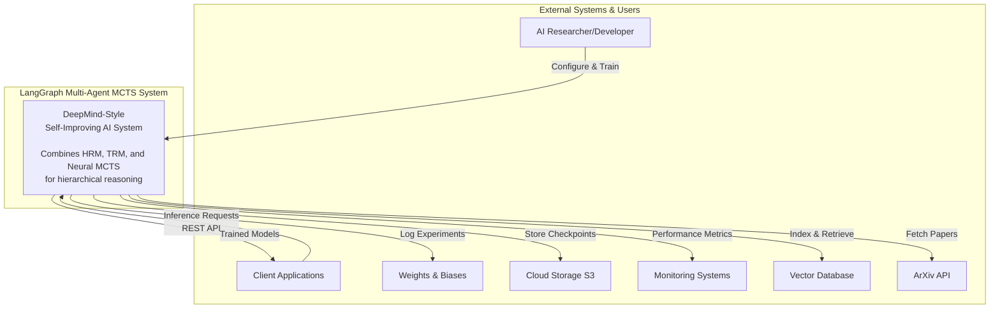
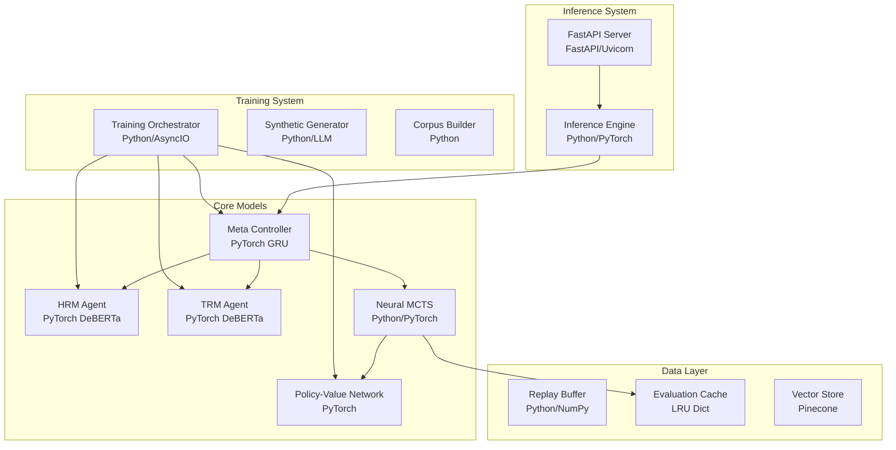

# Multi-Agent MCTS Implementation Template

> **Design Principle:** This template treats prompting as constraint programming, not instruction writing. Define the feasible region, objective function, and search parameters—then let the agent solve.

**Version:** 2.0
**Framework:** LangGraph Multi-Agent MCTS v0.2.0
**Test Status:** 88.4% passing (771/872 tests)

---

## Table of Contents

1. [Objective Function](#section-1-objective-function)
2. [Feasible Region](#section-2-feasible-region-constraints)
3. [Permission Architecture](#section-3-permission-architecture)
4. [Feedback Loop](#section-4-feedback-loop-specification)
5. [Context Persistence](#section-5-context-persistence)
6. [Execution Protocol](#section-6-execution-protocol)
7. [C4 Architecture](#section-7-c4-architecture)
8. [Sub-Agent Specifications](#section-8-sub-agent-specifications)
9. [Dynamic Component Patterns](#section-9-dynamic-component-patterns)
10. [Testing Framework](#section-10-testing-framework)
11. [Logging & Observability](#section-11-logging--observability)
12. [Enterprise Use Cases](#section-12-enterprise-use-cases)
13. [Quick Reference](#appendix-a-quick-reference)
14. [Anti-Patterns](#appendix-b-anti-patterns-to-avoid)

---

## SECTION 1: OBJECTIVE FUNCTION

### 1.1 System Intent

```
I am building: A production-ready DeepMind-style self-improving AI framework that combines:
- Hierarchical Reasoning (HRM) and Task Refinement (TRM) agents
- Neural MCTS with AlphaZero-style tree search
- Meta-Controller for dynamic task routing
- Enterprise integrations (Pinecone, Braintrust, W&B)
- LangGraph orchestration with checkpointing
```

### 1.2 Success Criteria (Mechanically Verifiable)

```
This succeeds when:
- [ ] All unit tests pass: `pytest tests/unit -v --tb=short`
- [ ] All integration tests pass: `pytest tests/integration -v`
- [ ] Type checking passes: `mypy src/ --strict`
- [ ] Linting passes: `ruff check src/ tests/`
- [ ] Code coverage ≥80% on core modules
- [ ] No hardcoded values (verified via: grep -r "api_key.*=.*['\"]" src/)
- [ ] All components use dependency injection
- [ ] Logging captures correlation IDs across async boundaries
- [ ] MCTS engine processes ≥100 iterations/second
- [ ] All sensitive data sanitized in logs (SecretStr masking)
- [ ] Configuration via Pydantic Settings with validation
```

### 1.3 Problem Description (The "Three Paragraphs")

```
COORDINATION LOGIC:
The system orchestrates multiple specialized AI agents (HRM for hierarchical reasoning,
TRM for task refinement, Neural Meta-Controller for routing) that collaborate to solve
complex multi-step problems. A Monte Carlo Tree Search engine explores decision spaces
strategically, using UCB1 selection, neural policy/value networks for guidance, and
progressive widening for action space management. The Meta-Controller routes incoming
queries to the most appropriate agent based on extracted features.

DATA FLOWS & STATE:
Queries flow: REST API → GraphBuilder → Meta-Controller → Agent(s) → LLM/Neural → Response.
State maintained in AgentState (TypedDict): query, agent_outputs, MCTS tree, confidence
scores, consensus status, iteration counters. Synchronization via LangGraph StateGraph
with checkpointing for conversation memory. MCTS state includes: node statistics (visits,
value), simulation cache (LRU), tree structure (parent/child with depth tracking).

FAILURE MODES & INVARIANTS:
- LLM provider failure: Retry with exponential backoff (tenacity), fallback to alternate
- MCTS timeout: Return best action found so far, log incomplete search
- Agent disagreement: Consensus threshold check, escalate to meta-controller arbitration
- Memory pressure: LRU cache eviction, progressive widening limits
- Network partition: Circuit breaker pattern, graceful degradation
Invariants: sum(node.visits for children) ≤ parent.visits; UCB1 ≥ 0; correlation_id present
```

---

## SECTION 2: FEASIBLE REGION (Constraints)

### 2.1 Hard Constraints (Violations = Failure)

```
LANGUAGE/RUNTIME:
- Python 3.10+ (type hints, asyncio, dataclasses)
- Async-first design (asyncio, httpx, aioboto3)

REQUIRED DEPENDENCIES:
- langgraph>=0.0.1 (graph orchestration)
- langchain>=0.1.0 (LLM abstraction)
- pydantic>=2.0.0, pydantic-settings (configuration, validation)
- openai>=1.0.0 (LLM provider)
- httpx>=0.25.0 (async HTTP)
- tenacity>=8.2.0 (retry logic)
- opentelemetry-api, opentelemetry-sdk (distributed tracing)

NEURAL DEPENDENCIES (Optional):
- torch>=2.0.0 (neural networks)
- transformers>=4.30.0 (DeBERTa, BERT)
- peft>=0.4.0 (LoRA adapters)

SECURITY:
- No hardcoded secrets (use SecretStr, environment variables)
- All inputs validated via Pydantic models
- Sensitive data sanitized in logs
- Rate limiting on API endpoints
```

### 2.2 Soft Constraints (Preferences)

```
STYLE:
- Google Python Style Guide
- Line length: 120 characters (Black formatter)
- Import ordering: isort with black profile

ARCHITECTURE:
- Prefer composition over inheritance
- Use Protocol classes for interfaces
- Dependency injection via constructor
- Factory pattern for component creation
- TypedDict for state containers

PERFORMANCE:
- Async I/O for all network operations
- LRU caching for expensive computations
- Semaphore for concurrent operation limits
- Progressive widening for MCTS action spaces

TESTING:
- pytest with asyncio_mode="auto"
- Markers: @pytest.mark.{unit,integration,e2e,slow,benchmark,neural,llm}
- Coverage threshold: 80% for core modules
```

### 2.3 Anti-Constraints (Explicit Freedoms)

```
You ARE permitted to:
- Restructure file organization within src/
- Add dependencies not explicitly listed
- Refactor adjacent code for consistency
- Choose neural network architectures
- Implement additional MCTS variants
- Add new agent types following patterns
- Create new test fixtures and scenarios
- Extend configuration with new Settings fields
- Add observability beyond minimum requirements
```

---

## SECTION 3: PERMISSION ARCHITECTURE

### 3.1 Scope (What You Can Touch)

```
IN SCOPE:
- src/**/*.py (all source code)
- tests/**/*.py (all test code)
- config/**/*.yaml, config/**/*.json
- pyproject.toml (dependencies, tool config)
- docs/**/*.md (documentation)

OUT OF SCOPE:
- .github/**/* (CI/CD workflows)
- kubernetes/**/* (deployment manifests)
- Files with header: # DO NOT MODIFY - GENERATED

RESTRICTED (modify with caution):
- src/config/settings.py (ensure backward compatibility)
- src/framework/graph.py (orchestration core)
```

### 3.2 Autonomy Level

```
AUTONOMOUS (proceed without asking):
- File creation/deletion within src/, tests/
- Dependency installation
- Running tests, linters, type checkers
- Refactoring for consistency
- Adding logging, metrics, tracing
- Bug fixes with clear root cause

CONFIRM FIRST (ask before proceeding):
- Architectural changes affecting >3 modules
- Breaking changes to public API
- New external service integrations
- Database schema modifications

PROHIBITED (do not attempt):
- Commits directly to main branch
- External API calls with side effects in tests
- Removing existing tests without replacement
- Disabling security features
- Adding hardcoded credentials
```

### 3.3 Resource Budget

```
- Max iterations before requesting guidance: 5
- Max files to modify in single pass: 25
- Time-boxed exploration: ≤15 min on research before asking
- Max test runtime for single test file: 60 seconds
- Max lines per function: 50
- Max cyclomatic complexity: 10
```

---

## SECTION 4: FEEDBACK LOOP SPECIFICATION

### 4.1 Verification Commands

```bash
# After writing code, run in this order:

# 1. Format code (auto-fix)
black src/ tests/ --line-length 120
isort src/ tests/ --profile black

# 2. Lint (must pass)
ruff check src/ tests/ --fix
ruff check src/ tests/

# 3. Type check (must pass)
mypy src/ --strict --ignore-missing-imports

# 4. Unit tests (must pass)
pytest tests/unit -v --tb=short -x

# 5. Integration tests (must pass)
pytest tests/integration -v --tb=short

# 6. Coverage check
pytest tests/ --cov=src --cov-report=term-missing --cov-fail-under=50

# 7. Security scan
bandit -r src/ -ll

# 8. Smoke test
python -c "from src.config.settings import get_settings; print(get_settings().safe_dict())"
```

### 4.2 Error Handling Protocol

```
ON LINT FAILURE:
→ Run `ruff check --fix` to auto-fix
→ Review remaining issues manually
→ Fix and re-run

ON TYPE ERROR:
→ Read error message carefully
→ Check if type stub is missing
→ Fix type annotations
→ Re-run mypy

ON TEST FAILURE:
→ Read failure output completely
→ Identify root cause (implementation vs test bug)
→ If implementation bug: fix implementation
→ If test bug: fix test with justification
→ Re-run

ON REPEATED FAILURE (same error 3x):
→ Stop and document findings
→ List attempted solutions
→ Request human guidance
```

### 4.3 Success Verification

```
Before reporting completion:
1. All verification commands pass (Section 4.1)
2. Manual smoke tests pass
3. Generate change summary
4. Known limitations documented
```

---

## SECTION 5: CONTEXT PERSISTENCE

### 5.1 Session Memory (CLAUDE.md)

See `CLAUDE.md` in project root for:
- Quick start commands
- Build commands
- Test commands
- Architecture decisions
- Known issues
- Environment variables

### 5.2 Information to Preserve

```
ALWAYS PRESERVE:
- Build/test commands that work
- Non-obvious environment setup steps
- Architectural decisions and rationale
- Gotchas discovered during implementation
- Test patterns for async code
```

### 5.3 Information That Can Be Re-derived

```
CAN BE RE-DERIVED:
- File structure (scan with glob)
- Dependency versions (pyproject.toml)
- Current test status (re-run pytest)
- Coverage numbers (re-run coverage)
```

---

## SECTION 6: EXECUTION PROTOCOL

### 6.1 Initial Actions (Always Do First)

```bash
# 1. Read project context
cat CLAUDE.md

# 2. Scan project structure
find src -name "*.py" -type f | head -30

# 3. Check configuration
cat pyproject.toml | head -50

# 4. Run existing tests to establish baseline
pytest tests/unit -v --tb=short -q 2>&1 | tail -20
```

### 6.2 Implementation Order

```
1. UNDERSTAND (read before write)
2. DESIGN (plan before code)
3. IMPLEMENT CORE (smallest working version)
4. ADD ERROR HANDLING
5. ADD LOGGING & OBSERVABILITY
6. WRITE TESTS
7. RUN VERIFICATION LOOP
8. REFACTOR IF NEEDED
9. UPDATE DOCUMENTATION
```

### 6.3 Completion Checklist

```
□ All success criteria met
□ All verification commands pass
□ No hardcoded values
□ Dependency injection used
□ Logging includes correlation IDs
□ Tests cover happy path and error cases
□ CLAUDE.md updated
□ Summary provided
```

---

## SECTION 7: C4 ARCHITECTURE

### Level 1: System Context



### Level 2: Container Diagram



### Level 3: Component Diagram (Core Models)

```mermaid
graph TB
    subgraph "HRM (Hierarchical Reasoning Module)"
        HRMBase[DeBERTa Base<br/>Pre-trained Transformer]
        HRMLoRA[LoRA Adapter<br/>Efficient fine-tuning]
        ACT[Adaptive Computation Time<br/>Dynamic depth]
        DecompHead[Decomposition Head<br/>Subtask generation]
    end

    subgraph "TRM (Task Refinement Module)"
        TRMBase[DeBERTa Base<br/>Pre-trained Transformer]
        TRMLoRA[LoRA Adapter<br/>Efficient fine-tuning]
        RecursiveBlock[Recursive Block<br/>Iterative refinement]
        DeepSupervision[Deep Supervision<br/>Intermediate outputs]
    end

    subgraph "Meta-Controller"
        FeatureExtractor[Feature Extractor<br/>Query analysis]
        RouterNetwork[Router Network<br/>Agent selection]
        GRUController[GRU Controller<br/>Sequential routing]
        BERTController[BERT Controller<br/>Semantic routing]
    end

    subgraph "Neural MCTS"
        StateEncoder[State Encoder<br/>Feature extraction]
        PolicyHead[Policy Head<br/>Action probabilities]
        ValueHead[Value Head<br/>Position evaluation]
        UCB1[UCB1 Selection<br/>Exploration/exploitation]
    end

    HRMBase --> HRMLoRA --> ACT --> DecompHead
    TRMBase --> TRMLoRA --> RecursiveBlock --> DeepSupervision
    FeatureExtractor --> RouterNetwork
    RouterNetwork --> GRUController
    RouterNetwork --> BERTController
    StateEncoder --> PolicyHead
    StateEncoder --> ValueHead
```



### Level 4: Key Classes

```
MCTS Core:
├── MCTSState (dataclass)
│   ├── state_id: str
│   ├── features: dict[str, Any]
│   └── to_hash_key() -> str (SHA256)
│
├── MCTSNode
│   ├── state: MCTSState
│   ├── parent: MCTSNode | None
│   ├── children: list[MCTSNode]
│   ├── visits: int
│   ├── value_sum: float
│   ├── select_child(exploration_weight) -> MCTSNode
│   └── is_fully_expanded() -> bool
│
└── MCTSEngine
    ├── __init__(seed, exploration_weight, ...)
    ├── select(node) -> MCTSNode
    ├── expand(node) -> MCTSNode
    ├── simulate(node) -> float
    ├── backpropagate(node, value) -> None
    └── _simulation_cache: OrderedDict (LRU)

Agents:
├── HRMAgent
│   ├── AdaptiveComputationTime (nn.Module)
│   ├── forward() -> HRMOutput
│   └── SubProblem (dataclass)
│
├── TRMAgent
│   ├── RecursiveBlock (nn.Module)
│   ├── DeepSupervisionHead (nn.Module)
│   └── forward() -> TRMOutput
│
└── HybridAgent
    ├── DecisionSource (Enum)
    ├── HybridConfig (dataclass)
    └── CostSavings tracking
```

---

## SECTION 8: SUB-AGENT SPECIFICATIONS

### 8.1 Hierarchical Reasoning Module (HRM)

```yaml
name: "HRM Agent"
location: "src/agents/hrm_agent.py"
purpose: "Hierarchical problem decomposition with adaptive computation time"

architecture:
  base_model: "DeBERTa-v3"
  adapter: "LoRA (Low-Rank Adaptation)"
  key_component: "AdaptiveComputationTime"

inputs:
  - query: str
  - context: dict
  - max_recursion_depth: int

outputs:
  HRMOutput:
    final_state: torch.Tensor
    subproblems: list[SubProblem]
    halt_step: int
    total_ponder_cost: float
    convergence_path: list[float]

configuration:
  HRM_ENABLED: true
  HRM_MAX_DEPTH: 5
  HRM_CONFIDENCE_THRESHOLD: 0.7
  HRM_PONDER_COST_WEIGHT: 0.1

pattern: |
  from src.agents.hrm_agent import HRMAgent, HRMConfig

  config = HRMConfig(
      max_depth=settings.HRM_MAX_DEPTH,
      confidence_threshold=settings.HRM_CONFIDENCE_THRESHOLD,
  )
  agent = HRMAgent(config=config, logger=logger)
  result = agent.forward(input_tensor)
```

### 8.2 Task Refinement Module (TRM)

```yaml
name: "TRM Agent"
location: "src/agents/trm_agent.py"
purpose: "Iterative solution refinement with deep supervision"

architecture:
  base_model: "DeBERTa-v3"
  adapter: "LoRA"
  key_component: "RecursiveBlock with residual connections"
  supervision: "Deep supervision at every recursion level"

inputs:
  - initial_solution: torch.Tensor
  - context: dict
  - max_iterations: int

outputs:
  TRMOutput:
    final_prediction: torch.Tensor
    intermediate_predictions: list[torch.Tensor]
    recursion_depth: int
    converged: bool
    convergence_step: int
    residual_norms: list[float]

configuration:
  TRM_ENABLED: true
  TRM_MAX_ITERATIONS: 10
  TRM_CONVERGENCE_THRESHOLD: 0.01
  TRM_RESIDUAL_SCALE: 0.1

pattern: |
  from src.agents.trm_agent import TRMAgent, TRMConfig

  config = TRMConfig(
      max_iterations=settings.TRM_MAX_ITERATIONS,
      convergence_threshold=settings.TRM_CONVERGENCE_THRESHOLD,
  )
  agent = TRMAgent(config=config, logger=logger)
  result = agent.forward(input_tensor)
```

### 8.3 Neural Meta-Controller

```yaml
name: "Meta Controller"
location: "src/agents/meta_controller/"
purpose: "Dynamic routing of queries to optimal agents"

implementations:
  - RNNMetaController: "GRU-based sequential routing"
  - BERTMetaController: "DeBERTa-based semantic routing"
  - HybridMetaController: "Combines multiple approaches"
  - AssemblyRouter: "Assembly theory-based routing"

inputs:
  MetaControllerFeatures:
    hrm_confidence: float
    trm_confidence: float
    mcts_value: float
    consensus_score: float
    last_agent: str
    iteration: int
    query_length: int
    has_rag_context: bool
    rag_relevance_score: float
    is_technical_query: bool

outputs:
  MetaControllerPrediction:
    selected_agent: str  # "hrm" | "trm" | "mcts"
    confidence: float
    reasoning: str

configuration:
  META_CONTROLLER_TYPE: "hybrid"  # rnn | bert | hybrid | assembly
  META_CONTROLLER_TEMPERATURE: 1.0
  META_CONTROLLER_TOP_K: 3

pattern: |
  from src.agents.meta_controller import create_meta_controller

  controller = create_meta_controller(
      controller_type=settings.META_CONTROLLER_TYPE,
      config=meta_config,
      logger=logger,
  )
  features = controller.extract_features(state)
  prediction = controller.predict(features)
```

### 8.4 Neural MCTS Engine

```yaml
name: "MCTS Engine"
location: "src/framework/mcts/core.py"
purpose: "AlphaZero-style tree search with neural guidance"

components:
  - MCTSState: "Hashable state representation"
  - MCTSNode: "Tree node with UCB1 scoring"
  - MCTSEngine: "Main search engine"
  - MCTSConfig: "Configuration with presets"

phases:
  1. Selection: "UCB1-based tree traversal"
  2. Expansion: "Progressive widening for actions"
  3. Simulation: "Neural policy/value evaluation"
  4. Backpropagation: "Update statistics"

configuration:
  MCTS_ENABLED: true
  MCTS_IMPL: "neural"  # baseline | neural
  MCTS_ITERATIONS: 100
  MCTS_C: 1.414  # UCB1 exploration constant
  MCTS_PROGRESSIVE_WIDENING_K: 1.0
  MCTS_PROGRESSIVE_WIDENING_ALPHA: 0.5
  MCTS_MAX_PARALLEL_ROLLOUTS: 4
  MCTS_CACHE_SIZE_LIMIT: 10000

presets:
  fast: {iterations: 50, exploration: 1.0}
  balanced: {iterations: 100, exploration: 1.414}
  thorough: {iterations: 500, exploration: 2.0}

pattern: |
  from src.framework.mcts.core import MCTSEngine, MCTSConfig

  config = MCTSConfig.from_preset("balanced")
  config.seed = settings.SEED
  config.num_iterations = settings.MCTS_ITERATIONS

  engine = MCTSEngine(
      seed=config.seed,
      exploration_weight=config.exploration_weight,
      progressive_widening_k=config.progressive_widening_k,
      cache_size_limit=config.cache_size_limit,
  )

  # Run search
  result = await engine.search(initial_state)
```

### 8.5 Hybrid LLM-Neural Agent

```yaml
name: "Hybrid Agent"
location: "src/agents/hybrid_agent.py"
purpose: "Cost-optimized blending of neural and LLM decisions"

decision_sources:
  - POLICY_NETWORK: "Neural policy prediction"
  - VALUE_NETWORK: "Neural value estimation"
  - LLM: "Primary LLM reasoning"
  - LLM_FALLBACK: "Fallback to LLM on low confidence"
  - BLENDED: "Weighted combination"

modes:
  - auto: "Automatic selection based on confidence"
  - neural_only: "Only use neural networks"
  - llm_only: "Only use LLM"
  - adaptive: "Dynamic switching based on query"

configuration:
  HYBRID_MODE: "auto"
  HYBRID_POLICY_CONFIDENCE_THRESHOLD: 0.8
  HYBRID_VALUE_CONFIDENCE_THRESHOLD: 0.7
  HYBRID_NEURAL_COST_PER_CALL: 0.000001
  HYBRID_LLM_COST_PER_1K_TOKENS: 0.03
  HYBRID_BLEND_WEIGHTS: {"neural": 0.3, "llm": 0.7}

pattern: |
  from src.agents.hybrid_agent import HybridAgent, HybridConfig

  config = HybridConfig(
      mode=settings.HYBRID_MODE,
      policy_confidence_threshold=settings.HYBRID_POLICY_CONFIDENCE_THRESHOLD,
      track_costs=True,
  )
  agent = HybridAgent(
      config=config,
      policy_network=policy_net,
      value_network=value_net,
      llm_client=llm_client,
      logger=logger,
  )
  result = await agent.decide(state, available_actions)
```

### 8.6 LangGraph GraphBuilder

```yaml
name: "GraphBuilder"
location: "src/framework/graph.py"
purpose: "LangGraph orchestration of multi-agent workflow"

state_schema:
  AgentState:
    query: str
    use_mcts: bool
    use_rag: bool
    rag_context: Optional[str]
    hrm_results: Optional[dict]
    trm_results: Optional[dict]
    mcts_root: Optional[MCTSNode]
    mcts_best_action: Optional[str]
    confidence_scores: dict[str, float]
    consensus_reached: bool
    iteration: int
    max_iterations: int
    final_response: Optional[str]

nodes:
  - entry: "Initialize state"
  - retrieve_context: "RAG lookup"
  - route_decision: "Meta-Controller routing"
  - parallel_agents: "HRM + TRM in parallel"
  - hrm_agent: "Hierarchical reasoning"
  - trm_agent: "Task refinement"
  - mcts_simulator: "MCTS exploration"
  - symbolic_agent: "Neuro-symbolic reasoning"
  - aggregate_results: "Combine outputs"
  - evaluate_consensus: "Check agreement"

pattern: |
  from src.framework.graph import GraphBuilder, AgentState

  builder = GraphBuilder(
      hrm_agent=hrm_agent,
      trm_agent=trm_agent,
      model_adapter=llm_client,
      logger=logger,
      vector_store=pinecone_store,
      mcts_config=mcts_config,
      meta_controller_config=meta_config,
  )

  graph = builder.build_graph()

  # Execute
  initial_state: AgentState = {
      "query": user_query,
      "use_mcts": True,
      "use_rag": True,
      "iteration": 0,
      "max_iterations": settings.FRAMEWORK_MAX_ITERATIONS,
  }

  result = await graph.ainvoke(initial_state)
```

---

## SECTION 9: DYNAMIC COMPONENT PATTERNS

### 9.1 Configuration Pattern (No Hardcoded Values)

```python
# src/config/settings.py - Pydantic Settings v2
from pydantic import Field, SecretStr, field_validator
from pydantic_settings import BaseSettings, SettingsConfigDict

class Settings(BaseSettings):
    """All configuration via environment with validation."""

    model_config = SettingsConfigDict(
        env_file=".env",
        env_file_encoding="utf-8",
        case_sensitive=True,
        extra="ignore",
        validate_default=True,
    )

    # LLM Provider (validated against enum)
    LLM_PROVIDER: LLMProvider = Field(
        default=LLMProvider.OPENAI,
        description="LLM provider to use"
    )

    # API Keys (SecretStr for masking)
    OPENAI_API_KEY: SecretStr | None = Field(
        default=None,
        description="OpenAI API key"
    )

    # MCTS with bounds validation
    MCTS_ITERATIONS: int = Field(
        default=100, ge=1, le=10000,
        description="MCTS iterations (1-10000)"
    )

    MCTS_C: float = Field(
        default=1.414, ge=0.0, le=10.0,
        description="UCB1 exploration weight"
    )

    @field_validator("OPENAI_API_KEY")
    @classmethod
    def validate_openai_key(cls, v: SecretStr | None) -> SecretStr | None:
        if v is not None:
            secret = v.get_secret_value()
            if not secret.startswith("sk-"):
                raise ValueError("OpenAI key must start with 'sk-'")
        return v

    def safe_dict(self) -> dict:
        """Return settings with secrets masked."""
        data = self.model_dump()
        for field in ["OPENAI_API_KEY", "ANTHROPIC_API_KEY"]:
            if field in data and data[field]:
                data[field] = "***MASKED***"
        return data

# Global singleton with lazy loading
_settings: Settings | None = None

def get_settings() -> Settings:
    global _settings
    if _settings is None:
        _settings = Settings()
    return _settings

def reset_settings() -> None:
    """Reset for testing."""
    global _settings
    _settings = None
```

### 9.2 Factory Pattern (Dependency Injection)

```python
# src/framework/factories.py
from typing import Protocol

class LLMClientFactory:
    """Factory for creating LLM clients with settings injection."""

    def __init__(self, settings: Settings | None = None) -> None:
        self.settings = settings or get_settings()

    def create(
        self,
        provider: str | None = None,
        model: str | None = None,
        timeout: float | None = None,
        **kwargs
    ) -> LLMClient:
        provider = provider or self.settings.LLM_PROVIDER.value
        timeout = timeout or self.settings.HTTP_TIMEOUT_SECONDS

        if provider == "openai":
            return OpenAIClient(
                api_key=self.settings.get_api_key(),
                model=model or "gpt-4",
                timeout=timeout,
                **kwargs
            )
        elif provider == "anthropic":
            return AnthropicClient(
                api_key=self.settings.get_api_key(),
                model=model or "claude-3-5-sonnet-20241022",
                timeout=timeout,
                **kwargs
            )
        elif provider == "lmstudio":
            return LMStudioClient(
                base_url=self.settings.LMSTUDIO_BASE_URL,
                model=model or self.settings.LMSTUDIO_MODEL,
                timeout=timeout,
                **kwargs
            )
        else:
            raise ValueError(f"Unknown provider: {provider}")

    def create_from_settings(self) -> LLMClient:
        """Create client using current settings."""
        return self.create()


class MCTSEngineFactory:
    """Factory for MCTS engines."""

    def __init__(self, settings: Settings | None = None) -> None:
        self.settings = settings or get_settings()

    def create(
        self,
        preset: str | None = None,
        **overrides
    ) -> MCTSEngine:
        if preset:
            config = MCTSConfig.from_preset(preset)
        else:
            config = MCTSConfig(
                seed=self.settings.SEED or 42,
                num_iterations=self.settings.MCTS_ITERATIONS,
                exploration_weight=self.settings.MCTS_C,
            )

        # Apply overrides
        for key, value in overrides.items():
            if hasattr(config, key):
                setattr(config, key, value)

        return MCTSEngine(
            seed=config.seed,
            exploration_weight=config.exploration_weight,
            progressive_widening_k=config.progressive_widening_k,
            progressive_widening_alpha=config.progressive_widening_alpha,
            max_parallel_rollouts=config.max_parallel_rollouts,
            cache_size_limit=config.cache_size_limit,
        )
```

### 9.3 Protocol-Based Interfaces

```python
# src/adapters/llm/base.py
from typing import Protocol, runtime_checkable

@runtime_checkable
class LLMClient(Protocol):
    """Provider-agnostic LLM interface using structural typing."""

    async def generate(
        self,
        *,
        messages: list[dict] | None = None,
        prompt: str | None = None,
        temperature: float = 0.7,
        max_tokens: int | None = None,
        tools: list[dict] | None = None,
        stream: bool = False,
        **kwargs
    ) -> LLMResponse | AsyncIterator[str]:
        """Generate response from LLM."""
        ...


@runtime_checkable
class AgentProtocol(Protocol):
    """Interface for all agents."""

    async def process(self, query: str, context: dict) -> AgentResult:
        """Process query and return result."""
        ...

    def get_confidence(self) -> float:
        """Return confidence score for last result."""
        ...


@runtime_checkable
class MetaControllerProtocol(Protocol):
    """Interface for meta-controllers."""

    def extract_features(self, state: dict) -> MetaControllerFeatures:
        """Extract features from state."""
        ...

    def predict(self, features: MetaControllerFeatures) -> MetaControllerPrediction:
        """Predict best agent for query."""
        ...
```

### 9.4 Agent Pattern with DI

```python
# src/agents/base.py
from dataclasses import dataclass
import logging

@dataclass
class AgentConfig:
    """Base agent configuration - no hardcoded values."""
    confidence_threshold: float = 0.7
    max_retries: int = 3
    timeout_seconds: float = 30.0

class BaseAgent:
    """Base agent with dependency injection."""

    def __init__(
        self,
        config: AgentConfig,
        llm_client: LLMClient,
        logger: logging.Logger | None = None,
    ) -> None:
        self._config = config
        self._llm = llm_client
        self._logger = logger or logging.getLogger(self.__class__.__name__)
        self._last_confidence: float = 0.0

    async def process(self, query: str, context: dict) -> AgentResult:
        """Process with logging and error handling."""
        correlation_id = get_correlation_id()

        self._logger.info(
            "Processing query",
            extra={
                "correlation_id": correlation_id,
                "query_length": len(query),
                "agent": self.__class__.__name__,
            }
        )

        try:
            result = await self._do_process(query, context)
            self._last_confidence = result.confidence
            return result
        except Exception as e:
            self._logger.error(
                "Agent processing failed",
                extra={"correlation_id": correlation_id, "error": str(e)},
                exc_info=True,
            )
            raise

    async def _do_process(self, query: str, context: dict) -> AgentResult:
        """Override in subclass."""
        raise NotImplementedError

    def get_confidence(self) -> float:
        return self._last_confidence
```

### 9.5 Reusable MCTS Components

```python
# src/framework/mcts/policies.py
from enum import Enum
import math

class SelectionPolicy(Enum):
    MAX_VISITS = "max_visits"
    MAX_VALUE = "max_value"
    UCB1 = "ucb1"

def ucb1(node: MCTSNode, exploration_weight: float) -> float:
    """UCB1 selection formula: Q/N + c * sqrt(ln(parent_N)/N)"""
    if node.visits == 0:
        return float("inf")

    exploitation = node.value_sum / node.visits
    exploration = exploration_weight * math.sqrt(
        math.log(node.parent.visits) / node.visits
    )
    return exploitation + exploration

def select_child(
    node: MCTSNode,
    policy: SelectionPolicy,
    exploration_weight: float = 1.414
) -> MCTSNode:
    """Select child based on policy."""
    if policy == SelectionPolicy.UCB1:
        return max(
            node.children,
            key=lambda c: ucb1(c, exploration_weight)
        )
    elif policy == SelectionPolicy.MAX_VISITS:
        return max(node.children, key=lambda c: c.visits)
    elif policy == SelectionPolicy.MAX_VALUE:
        return max(
            node.children,
            key=lambda c: c.value_sum / max(c.visits, 1)
        )
    else:
        raise ValueError(f"Unknown policy: {policy}")
```

---

## SECTION 10: TESTING FRAMEWORK

### 10.1 Test Categories

```yaml
unit_tests:
  location: "tests/unit/"
  purpose: "Test individual functions in isolation"
  patterns:
    - Mock all external dependencies
    - Test single behavior per test
    - Name: test_<function>_<scenario>_<expected>
  coverage_target: "90%"
  run: "pytest tests/unit -v"

integration_tests:
  location: "tests/integration/"
  purpose: "Test component interactions"
  patterns:
    - Use real components where feasible
    - Mock only external services
    - Test data flow between components
  coverage_target: "70%"
  run: "pytest tests/integration -v"

e2e_tests:
  location: "tests/e2e/"
  purpose: "Test complete user scenarios"
  patterns:
    - Simulate real API calls
    - Use test fixtures for consistent data
  coverage_target: "50%"
  run: "pytest tests/e2e -v"

property_tests:
  location: "tests/property/"
  purpose: "Test invariants with random inputs"
  patterns:
    - Use hypothesis for property-based testing
    - Focus on MCTS invariants
  run: "pytest tests/property -v"

benchmark_tests:
  location: "tests/benchmark/"
  purpose: "Measure performance"
  patterns:
    - Use pytest-benchmark
    - Track iterations/second
  run: "pytest tests/benchmark --benchmark-only"
```

### 10.2 Root conftest.py Pattern

```python
# tests/conftest.py
import asyncio
import logging
import os
from unittest.mock import AsyncMock, MagicMock, patch
import pytest

# Graceful imports
try:
    from src.config.settings import Settings, get_settings, reset_settings
    SETTINGS_AVAILABLE = True
except ImportError:
    SETTINGS_AVAILABLE = False

try:
    from src.adapters.llm.base import LLMClient, LLMResponse
    LLM_AVAILABLE = True
except ImportError:
    LLM_AVAILABLE = False

try:
    from src.framework.mcts.core import MCTSEngine, MCTSNode, MCTSState
    from src.framework.mcts.config import MCTSConfig
    MCTS_AVAILABLE = True
except ImportError:
    MCTS_AVAILABLE = False


def pytest_configure(config):
    """Register custom markers."""
    markers = [
        "unit: Fast, isolated unit tests",
        "integration: Component interaction tests",
        "e2e: End-to-end scenario tests",
        "slow: Tests taking >10 seconds",
        "benchmark: Performance benchmarks",
        "property: Property-based tests",
        "neural: Neural network tests (requires PyTorch)",
        "llm: LLM integration tests",
    ]
    for marker in markers:
        config.addinivalue_line("markers", marker)


def pytest_collection_modifyitems(config, items):
    """Conditionally skip tests."""
    skip_slow = pytest.mark.skip(reason="Use --runslow to include")
    skip_neural = pytest.mark.skip(reason="PyTorch not available")
    skip_llm = pytest.mark.skip(reason="No API key")

    for item in items:
        if "slow" in item.keywords and not config.getoption("--runslow", False):
            item.add_marker(skip_slow)

        if "neural" in item.keywords:
            try:
                import torch  # noqa
                if os.environ.get("SKIP_NEURAL") == "1":
                    item.add_marker(skip_neural)
            except ImportError:
                item.add_marker(skip_neural)

        if "llm" in item.keywords:
            no_keys = not os.environ.get("OPENAI_API_KEY")
            if os.environ.get("SKIP_LLM") == "1" or no_keys:
                item.add_marker(skip_llm)


def pytest_addoption(parser):
    parser.addoption("--runslow", action="store_true", help="Run slow tests")


# Session-scoped fixtures
@pytest.fixture(scope="session")
def event_loop_policy():
    return asyncio.DefaultEventLoopPolicy()


@pytest.fixture(scope="session")
def test_logger() -> logging.Logger:
    logger = logging.getLogger("test")
    logger.setLevel(logging.DEBUG)
    logger.addHandler(logging.NullHandler())
    return logger


@pytest.fixture(scope="session")
def torch_device() -> str:
    try:
        import torch
        if torch.cuda.is_available():
            return "cuda"
        elif hasattr(torch.backends, "mps") and torch.backends.mps.is_available():
            return "mps"
    except ImportError:
        pass
    return "cpu"


# Settings fixtures
@pytest.fixture
def test_settings():
    if not SETTINGS_AVAILABLE:
        pytest.skip("Settings not available")

    reset_settings()
    with patch.dict(os.environ, {
        "LLM_PROVIDER": "openai",
        "OPENAI_API_KEY": "sk-test-key-for-testing-only",
        "MCTS_ENABLED": "true",
        "MCTS_ITERATIONS": "10",
        "SEED": "42",
    }):
        settings = get_settings()
        yield settings
    reset_settings()


# LLM fixtures
@pytest.fixture
def mock_llm_response():
    if not LLM_AVAILABLE:
        pytest.skip("LLM not available")
    return LLMResponse(
        content="Test response",
        model="gpt-4-test",
        usage={"prompt_tokens": 10, "completion_tokens": 20, "total_tokens": 30},
        finish_reason="stop",
    )


@pytest.fixture
def mock_llm_client(mock_llm_response):
    if not LLM_AVAILABLE:
        pytest.skip("LLM not available")
    client = AsyncMock(spec=LLMClient)
    client.generate.return_value = mock_llm_response
    client.model = "gpt-4-test"
    client.provider = "openai"
    return client


# MCTS fixtures
@pytest.fixture
def mcts_config():
    if not MCTS_AVAILABLE:
        pytest.skip("MCTS not available")
    return MCTSConfig(
        seed=42,
        num_iterations=10,
        exploration_weight=1.414,
        max_rollout_depth=5,
        cache_size=100,
    )


@pytest.fixture
def mcts_engine(mcts_config):
    if not MCTS_AVAILABLE:
        pytest.skip("MCTS not available")
    return MCTSEngine(
        seed=mcts_config.seed,
        exploration_weight=mcts_config.exploration_weight,
    )


@pytest.fixture
def simple_mcts_state():
    if not MCTS_AVAILABLE:
        pytest.skip("MCTS not available")
    return MCTSState(
        state_id="test_state_001",
        features={"query": "test", "depth": 0},
    )


# Agent fixtures
@pytest.fixture
def mock_hrm_agent():
    agent = MagicMock()
    agent.forward.return_value = MagicMock(
        final_state=MagicMock(),
        subproblems=[],
        halt_step=3,
        total_ponder_cost=0.5,
    )
    return agent


@pytest.fixture
def mock_trm_agent():
    agent = MagicMock()
    agent.forward.return_value = MagicMock(
        final_prediction=MagicMock(),
        recursion_depth=5,
        converged=True,
    )
    return agent


# Cleanup
@pytest.fixture(autouse=True)
def cleanup_after_test():
    yield
    if SETTINGS_AVAILABLE:
        try:
            reset_settings()
        except Exception:
            pass
```

### 10.3 Test Examples

```python
# tests/unit/test_mcts_core.py
import pytest
from src.framework.mcts.core import MCTSEngine, MCTSState, MCTSNode

@pytest.mark.unit
def test_mcts_engine_initializes_with_seed(mcts_config):
    """Test MCTS engine initializes with deterministic seed."""
    engine1 = MCTSEngine(seed=42)
    engine2 = MCTSEngine(seed=42)

    # Same seed should give same initial random state
    assert engine1.rng.random() == engine2.rng.random()


@pytest.mark.unit
def test_mcts_node_ucb1_selection(mcts_engine, simple_mcts_state):
    """Test UCB1-based child selection."""
    root = MCTSNode(state=simple_mcts_state, rng=mcts_engine.rng)

    # Add children with different visit counts
    child1 = root.add_child(action="a", state=MCTSState("s1", {}))
    child2 = root.add_child(action="b", state=MCTSState("s2", {}))

    # Simulate visits
    root.visits = 10
    child1.visits = 5
    child1.value_sum = 2.5
    child2.visits = 3
    child2.value_sum = 2.0

    # UCB1 should consider both exploitation and exploration
    selected = root.select_child(exploration_weight=1.414)
    assert selected in [child1, child2]


@pytest.mark.unit
def test_mcts_state_hashing():
    """Test state produces deterministic hash."""
    state1 = MCTSState("id1", {"key": "value"})
    state2 = MCTSState("id1", {"key": "value"})

    assert state1.to_hash_key() == state2.to_hash_key()


@pytest.mark.unit
@pytest.mark.asyncio
async def test_mcts_engine_search(mcts_engine, simple_mcts_state):
    """Test MCTS search returns valid result."""
    result = await mcts_engine.search(
        initial_state=simple_mcts_state,
        num_iterations=10,
    )

    assert result.best_action is not None or result.iterations_completed == 10
    assert result.stats["total_nodes"] >= 1


# tests/unit/test_llm_adapters.py
@pytest.mark.unit
@pytest.mark.asyncio
async def test_llm_client_generate(mock_llm_client):
    """Test LLM client generates response."""
    response = await mock_llm_client.generate(
        messages=[{"role": "user", "content": "Hello"}]
    )

    assert response.content == "Test response"
    assert response.model == "gpt-4-test"
    mock_llm_client.generate.assert_called_once()


# tests/integration/test_graph_builder.py
@pytest.mark.integration
@pytest.mark.asyncio
async def test_graph_builder_executes_workflow(
    mock_llm_client,
    mock_hrm_agent,
    mock_trm_agent,
    test_settings,
):
    """Test graph builder executes complete workflow."""
    from src.framework.graph import GraphBuilder

    builder = GraphBuilder(
        hrm_agent=mock_hrm_agent,
        trm_agent=mock_trm_agent,
        model_adapter=mock_llm_client,
        logger=logging.getLogger("test"),
    )

    graph = builder.build_graph()

    result = await graph.ainvoke({
        "query": "Test query",
        "use_mcts": False,
        "use_rag": False,
        "iteration": 0,
        "max_iterations": 3,
    })

    assert result["iteration"] > 0 or result.get("final_response")
```

### 10.4 pyproject.toml Test Configuration

```toml
[tool.pytest.ini_options]
testpaths = ["tests"]
asyncio_mode = "auto"
timeout = 300
markers = [
    "unit: Unit tests",
    "integration: Integration tests",
    "e2e: End-to-end tests",
    "slow: Slow tests (>10s)",
    "benchmark: Performance benchmarks",
    "property: Property-based tests",
    "neural: Neural network tests",
    "llm: LLM integration tests",
]
filterwarnings = [
    "ignore::DeprecationWarning",
]

[tool.coverage.run]
source = ["src"]
omit = ["*/tests/*", "*/__pycache__/*"]

[tool.coverage.report]
fail_under = 50
show_missing = true
exclude_lines = [
    "pragma: no cover",
    "if TYPE_CHECKING:",
    "raise NotImplementedError",
]
```

---

## SECTION 11: LOGGING & OBSERVABILITY

### 11.1 Structured Logging Pattern

```python
# src/observability/logging.py
import logging
import json
import re
from contextvars import ContextVar
from datetime import datetime
from typing import Any

# Async-safe correlation ID tracking
_correlation_id: ContextVar[str | None] = ContextVar("correlation_id", default=None)
_request_metadata: ContextVar[dict | None] = ContextVar("request_metadata", default=None)

def get_correlation_id() -> str | None:
    return _correlation_id.get()

def set_correlation_id(cid: str | None) -> None:
    _correlation_id.set(cid)

# Sensitive data patterns
SENSITIVE_PATTERNS = [
    (re.compile(r'api[_-]?key["\']?\s*[:=]\s*["\']?[\w-]+', re.I), "api_key=***"),
    (re.compile(r'password["\']?\s*[:=]\s*["\']?[\w-]+', re.I), "password=***"),
    (re.compile(r'secret["\']?\s*[:=]\s*["\']?[\w-]+', re.I), "secret=***"),
    (re.compile(r'token["\']?\s*[:=]\s*["\']?[\w-]+', re.I), "token=***"),
    (re.compile(r'sk-[a-zA-Z0-9]{20,}', re.I), "sk-***"),
    (re.compile(r'sk-ant-[a-zA-Z0-9]{20,}', re.I), "sk-ant-***"),
]

SENSITIVE_KEYS = {
    "api_key", "apikey", "password", "secret", "token",
    "authorization", "auth", "credential", "private_key",
}

def sanitize_message(message: str) -> str:
    """Remove secrets from log message."""
    for pattern, replacement in SENSITIVE_PATTERNS:
        message = pattern.sub(replacement, message)
    return message

def sanitize_dict(data: dict) -> dict:
    """Recursively redact sensitive fields."""
    result = {}
    for key, value in data.items():
        if key.lower() in SENSITIVE_KEYS:
            result[key] = "***REDACTED***"
        elif isinstance(value, dict):
            result[key] = sanitize_dict(value)
        elif isinstance(value, list):
            result[key] = [
                sanitize_dict(v) if isinstance(v, dict) else v
                for v in value
            ]
        else:
            result[key] = value
    return result


class JSONFormatter(logging.Formatter):
    """JSON log formatter with correlation ID."""

    def format(self, record: logging.LogRecord) -> str:
        log_obj = {
            "timestamp": datetime.utcnow().isoformat() + "Z",
            "level": record.levelname,
            "logger": record.name,
            "message": sanitize_message(record.getMessage()),
            "correlation_id": get_correlation_id(),
        }

        # Add extra fields
        if hasattr(record, "extra"):
            log_obj.update(sanitize_dict(record.extra))

        # Add exception info
        if record.exc_info:
            log_obj["exception"] = self.formatException(record.exc_info)

        return json.dumps(log_obj)


def setup_logging(
    level: str = "INFO",
    json_format: bool = True,
) -> logging.Logger:
    """Configure structured logging."""
    logger = logging.getLogger("langgraph_mcts")
    logger.setLevel(getattr(logging, level))

    handler = logging.StreamHandler()
    if json_format:
        handler.setFormatter(JSONFormatter())
    else:
        handler.setFormatter(logging.Formatter(
            "%(asctime)s - %(name)s - %(levelname)s - %(message)s"
        ))

    logger.addHandler(handler)
    return logger


class StructuredLogger:
    """Convenience wrapper for structured logging."""

    def __init__(self, name: str) -> None:
        self._logger = logging.getLogger(name)

    def _log(self, level: int, message: str, **extra: Any) -> None:
        extra["correlation_id"] = get_correlation_id()
        self._logger.log(level, message, extra=sanitize_dict(extra))

    def debug(self, message: str, **extra: Any) -> None:
        self._log(logging.DEBUG, message, **extra)

    def info(self, message: str, **extra: Any) -> None:
        self._log(logging.INFO, message, **extra)

    def warning(self, message: str, **extra: Any) -> None:
        self._log(logging.WARNING, message, **extra)

    def error(self, message: str, **extra: Any) -> None:
        self._log(logging.ERROR, message, **extra)

    def log_timing(self, operation: str, duration_ms: float) -> None:
        self.info(f"Operation completed: {operation}",
                  timing_ms=duration_ms, operation=operation)

    def log_memory(self, component: str, memory_mb: float) -> None:
        self.debug(f"Memory usage: {component}",
                   memory_mb=memory_mb, component=component)
```

### 11.2 Metrics Collection

```python
# src/observability/metrics.py
from dataclasses import dataclass, field
from collections import defaultdict
import time

try:
    from prometheus_client import Counter, Histogram, Gauge
    PROMETHEUS_AVAILABLE = True
except ImportError:
    PROMETHEUS_AVAILABLE = False

@dataclass
class MCTSMetrics:
    """MCTS performance metrics."""
    iterations: int = 0
    total_simulations: int = 0
    tree_depth: int = 0
    total_nodes: int = 0
    ucb_scores: list[float] = field(default_factory=list)
    selection_times_ms: list[float] = field(default_factory=list)
    expansion_times_ms: list[float] = field(default_factory=list)
    simulation_times_ms: list[float] = field(default_factory=list)
    backprop_times_ms: list[float] = field(default_factory=list)
    cache_hits: int = 0
    cache_misses: int = 0

@dataclass
class AgentMetrics:
    """Agent performance metrics."""
    name: str
    executions: int = 0
    total_time_ms: float = 0.0
    avg_confidence: float = 0.0
    confidence_scores: list[float] = field(default_factory=list)
    success_count: int = 0
    error_count: int = 0

class MetricsCollector:
    """Central metrics collection."""

    def __init__(self) -> None:
        self._mcts_metrics: dict[str, MCTSMetrics] = defaultdict(MCTSMetrics)
        self._agent_metrics: dict[str, AgentMetrics] = {}

        if PROMETHEUS_AVAILABLE:
            self._setup_prometheus()

    def _setup_prometheus(self) -> None:
        self.mcts_iterations = Counter(
            "mcts_iterations_total",
            "Total MCTS iterations",
            ["search_id"]
        )
        self.agent_execution_time = Histogram(
            "agent_execution_seconds",
            "Agent execution time",
            ["agent_name"]
        )
        self.confidence_gauge = Gauge(
            "agent_confidence",
            "Agent confidence score",
            ["agent_name"]
        )

    def record_mcts_iteration(
        self,
        search_id: str,
        phase_times: dict[str, float],
        ucb_score: float | None = None,
    ) -> None:
        metrics = self._mcts_metrics[search_id]
        metrics.iterations += 1

        if "selection" in phase_times:
            metrics.selection_times_ms.append(phase_times["selection"])
        if "expansion" in phase_times:
            metrics.expansion_times_ms.append(phase_times["expansion"])
        if "simulation" in phase_times:
            metrics.simulation_times_ms.append(phase_times["simulation"])
        if "backprop" in phase_times:
            metrics.backprop_times_ms.append(phase_times["backprop"])
        if ucb_score is not None:
            metrics.ucb_scores.append(ucb_score)

        if PROMETHEUS_AVAILABLE:
            self.mcts_iterations.labels(search_id=search_id).inc()

    def record_agent_execution(
        self,
        agent_name: str,
        duration_ms: float,
        confidence: float,
        success: bool = True,
    ) -> None:
        if agent_name not in self._agent_metrics:
            self._agent_metrics[agent_name] = AgentMetrics(name=agent_name)

        metrics = self._agent_metrics[agent_name]
        metrics.executions += 1
        metrics.total_time_ms += duration_ms
        metrics.confidence_scores.append(confidence)
        metrics.avg_confidence = sum(metrics.confidence_scores) / len(metrics.confidence_scores)

        if success:
            metrics.success_count += 1
        else:
            metrics.error_count += 1

        if PROMETHEUS_AVAILABLE:
            self.agent_execution_time.labels(agent_name=agent_name).observe(duration_ms / 1000)
            self.confidence_gauge.labels(agent_name=agent_name).set(confidence)

    @property
    def summary(self) -> dict:
        """Get metrics snapshot."""
        return {
            "mcts": {k: vars(v) for k, v in self._mcts_metrics.items()},
            "agents": {k: vars(v) for k, v in self._agent_metrics.items()},
        }

# Global collector
_metrics_collector: MetricsCollector | None = None

def get_metrics_collector() -> MetricsCollector:
    global _metrics_collector
    if _metrics_collector is None:
        _metrics_collector = MetricsCollector()
    return _metrics_collector
```

### 11.3 Distributed Tracing

```python
# src/observability/tracing.py
from contextlib import asynccontextmanager
from typing import AsyncGenerator
import time

try:
    from opentelemetry import trace
    from opentelemetry.sdk.trace import TracerProvider
    from opentelemetry.sdk.trace.export import BatchSpanProcessor
    OTEL_AVAILABLE = True
except ImportError:
    OTEL_AVAILABLE = False

class TracingManager:
    """OpenTelemetry tracing integration."""

    def __init__(self, service_name: str = "langgraph-mcts") -> None:
        self.service_name = service_name
        self._tracer = None

        if OTEL_AVAILABLE:
            self._setup_tracer()

    def _setup_tracer(self) -> None:
        provider = TracerProvider()
        trace.set_tracer_provider(provider)
        self._tracer = trace.get_tracer(self.service_name)

    @asynccontextmanager
    async def span(
        self,
        name: str,
        attributes: dict | None = None,
    ) -> AsyncGenerator[None, None]:
        """Create a tracing span."""
        if not self._tracer:
            yield
            return

        with self._tracer.start_as_current_span(
            name,
            attributes=attributes or {},
        ) as span:
            try:
                yield
            except Exception as e:
                span.record_exception(e)
                raise

    def add_event(self, name: str, attributes: dict | None = None) -> None:
        """Add event to current span."""
        if not OTEL_AVAILABLE:
            return

        span = trace.get_current_span()
        if span:
            span.add_event(name, attributes=attributes or {})
```

### 11.4 Debugging Checklist

```markdown
When debugging issues:

1. [ ] Check logs with correlation ID: grep <correlation_id> logs/
2. [ ] Verify configuration: settings.safe_dict()
3. [ ] Check MCTS tree state: engine.get_tree_stats()
4. [ ] Verify agent confidence: agent.get_confidence()
5. [ ] Check async task status: asyncio.all_tasks()
6. [ ] Review metrics: /metrics endpoint
7. [ ] Check distributed trace: LangSmith/Jaeger
8. [ ] Verify rate limits: check 429 responses
9. [ ] Check cache stats: engine.cache_hits, engine.cache_misses
10. [ ] Memory profiling: tracemalloc.get_traced_memory()
```

### 11.5 Performance Profiling

```python
# src/observability/profiling.py
import asyncio
import functools
import time
import tracemalloc
from dataclasses import dataclass

@dataclass
class ProfileResult:
    """Profiling result."""
    duration_ms: float
    peak_memory_mb: float
    current_memory_mb: float

def profile_async(func):
    """Decorator for async function profiling."""
    @functools.wraps(func)
    async def wrapper(*args, **kwargs):
        tracemalloc.start()
        start = time.perf_counter()

        try:
            result = await func(*args, **kwargs)
            return result
        finally:
            duration = (time.perf_counter() - start) * 1000
            current, peak = tracemalloc.get_traced_memory()
            tracemalloc.stop()

            # Log profile result
            from src.observability.logging import StructuredLogger
            logger = StructuredLogger(func.__module__)
            logger.debug(
                f"Profile: {func.__name__}",
                duration_ms=duration,
                peak_memory_mb=peak / 1024 / 1024,
                current_memory_mb=current / 1024 / 1024,
            )

    return wrapper


class MemoryTracker:
    """Track memory usage over time."""

    def __init__(self) -> None:
        self._snapshots: list[tuple[float, int]] = []
        self._tracking = False

    def start(self) -> None:
        tracemalloc.start()
        self._tracking = True
        self._snapshots = []

    def snapshot(self) -> None:
        if self._tracking:
            current, _ = tracemalloc.get_traced_memory()
            self._snapshots.append((time.time(), current))

    def stop(self) -> ProfileResult:
        if not self._tracking:
            return ProfileResult(0, 0, 0)

        current, peak = tracemalloc.get_traced_memory()
        tracemalloc.stop()
        self._tracking = False

        duration = (
            self._snapshots[-1][0] - self._snapshots[0][0]
            if len(self._snapshots) >= 2 else 0
        ) * 1000

        return ProfileResult(
            duration_ms=duration,
            peak_memory_mb=peak / 1024 / 1024,
            current_memory_mb=current / 1024 / 1024,
        )
```

---

## SECTION 12: ENTERPRISE USE CASES

### 12.1 M&A Due Diligence Platform

```yaml
use_case: "Autonomous M&A Due Diligence Platform"
domain: "ma_due_diligence"

agents_required:
  - DocumentAnalysisAgent: "Extract key terms from contracts"
  - RiskIdentificationAgent: "Identify hidden risks"
  - SynergyExplorationAgent: "Explore potential synergies"
  - ComplianceCheckAgent: "Verify regulatory compliance"

mcts_configuration:
  state_space: "Due diligence pathways"
  actions: ["deep_dive", "cross_reference", "escalate_risk"]
  reward: "information_gain + risk_discovery + timeline_efficiency"

configuration:
  MA_DD_ENABLED: true
  MA_DD_MAX_MCTS_ITERATIONS: 100
  MA_DD_RISK_THRESHOLD: 0.6
  MA_DD_DOCUMENT_STORAGE_BUCKET: "s3://deal-documents"
```

### 12.2 Clinical Trial Design Optimizer

```yaml
use_case: "Clinical Trial Design Optimizer"
domain: "clinical_trial"

agents_required:
  - CohortStrategyAgent: "Define patient criteria"
  - EndpointOptimizationAgent: "Select endpoints"
  - RegulatoryAlignmentAgent: "Ensure FDA/EMA compliance"
  - StatisticalPowerAgent: "Calculate sample sizes"

mcts_configuration:
  state_space: "Trial design parameters"
  actions: ["modify_criteria", "add_endpoint", "adjust_sample"]
  reward: "approval_probability * (-cost) * (-timeline)"

configuration:
  CLINICAL_TRIAL_ENABLED: true
  CLINICAL_TRIAL_MIN_STATISTICAL_POWER: 0.8
  CLINICAL_TRIAL_MAX_DURATION_MONTHS: 36
  CLINICAL_TRIAL_REGULATORY_VERSION: "FDA-2024"
```

### 12.3 Regulatory Compliance Automation

```yaml
use_case: "Enterprise Regulatory Compliance"
domain: "regulatory_compliance"

agents_required:
  - RegulatoryMappingAgent: "Map applicable regulations"
  - GapAnalysisAgent: "Identify compliance gaps"
  - EnforcementPredictionAgent: "Predict enforcement priorities"
  - RemediationPlannerAgent: "Generate remediation plans"

mcts_configuration:
  state_space: "Compliance posture across jurisdictions"
  actions: ["implement_control", "document_evidence", "request_exemption"]
  reward: "risk_reduction * (-cost) * urgency"

configuration:
  REG_COMPLIANCE_ENABLED: true
  REG_COMPLIANCE_JURISDICTIONS: ["US", "EU", "UK"]
  REG_COMPLIANCE_RISK_TOLERANCE: "moderate"
  REG_COMPLIANCE_UPDATE_FREQUENCY: "weekly"
```

---

## APPENDIX A: QUICK REFERENCE

### Command Cheatsheet

```bash
# Setup
pip install -e ".[dev,neural]"
cp .env.example .env

# Development
black src/ tests/ --line-length 120
ruff check src/ tests/ --fix
mypy src/

# Testing
pytest tests/unit -v
pytest tests/ -k "mcts"
pytest tests/ --cov=src
pytest tests/ -m "not slow"

# Running
python -m src.api.server
python -m src.cli query "test"
```

### File Locations

```
Configuration:    src/config/settings.py
Logging:          src/observability/logging.py
MCTS Core:        src/framework/mcts/core.py
Graph Builder:    src/framework/graph.py
Agents:           src/agents/{hrm,trm,hybrid}_agent.py
Meta-Controller:  src/agents/meta_controller/
LLM Adapters:     src/adapters/llm/
Test Fixtures:    tests/conftest.py
```

### Environment Variables

```bash
# Required
LLM_PROVIDER=openai|anthropic|lmstudio
OPENAI_API_KEY=sk-...
# or
ANTHROPIC_API_KEY=sk-ant-...

# Optional
LOG_LEVEL=INFO
MCTS_ENABLED=true
MCTS_ITERATIONS=100
MCTS_C=1.414
SEED=42
LANGSMITH_API_KEY=ls-...
PINECONE_API_KEY=...
```

---

## APPENDIX B: ANTI-PATTERNS TO AVOID

```python
# ❌ WRONG: Hardcoded values
class BadAgent:
    def __init__(self):
        self.api_key = "sk-123"       # Never!
        self.max_retries = 3          # Should be configurable
        self.model = "gpt-4"          # Should come from settings

# ✅ CORRECT: Dependency injection
class GoodAgent:
    def __init__(self, config: AgentConfig, llm_client: LLMClient):
        self._config = config
        self._llm = llm_client

# ❌ WRONG: Global state
_global_client = None
def get_client():
    global _global_client
    if _global_client is None:
        _global_client = Client()
    return _global_client

# ✅ CORRECT: Factory with explicit lifecycle
class ClientFactory:
    def __init__(self, settings: Settings):
        self._settings = settings

    def create(self) -> Client:
        return Client(config=self._settings)

# ❌ WRONG: Logging secrets
logger.info(f"Using API key: {api_key}")

# ✅ CORRECT: Sanitize before logging
logger.info(f"Using API key: {sanitize_dict({'key': api_key})}")

# ❌ WRONG: Sync I/O in async context
async def bad_fetch():
    response = requests.get(url)  # Blocks event loop

# ✅ CORRECT: Async I/O
async def good_fetch():
    async with httpx.AsyncClient() as client:
        response = await client.get(url)

# ❌ WRONG: No error handling
async def bad_process():
    return await llm.generate(prompt)

# ✅ CORRECT: Proper error handling with retry
@retry(stop=stop_after_attempt(3), wait=wait_exponential())
async def good_process():
    try:
        return await llm.generate(prompt)
    except RateLimitError:
        logger.warning("Rate limited, retrying...")
        raise
```

---

**Template Version:** 2.0
**Last Updated:** 2025-01
**Aligned with:** LangGraph Multi-Agent MCTS v0.2.0
