# C4 Architecture Diagrams: DeepMind-Style Self-Improving AI System

This document provides C4 architecture diagrams (Context, Container, Component, and Code levels) for the LangGraph Multi-Agent MCTS framework with DeepMind-style learning.

## Table of Contents

1. [Level 1: System Context Diagram](#level-1-system-context-diagram)
2. [Level 2: Container Diagram](#level-2-container-diagram)
3. [Level 3: Component Diagrams](#level-3-component-diagrams)
4. [Level 4: Code Diagrams](#level-4-code-diagrams)
5. [Deployment Architecture](#deployment-architecture)
6. [Data Flow Diagrams](#data-flow-diagrams)

---

## Level 1: System Context Diagram

Shows the system in its environment with external actors and systems.

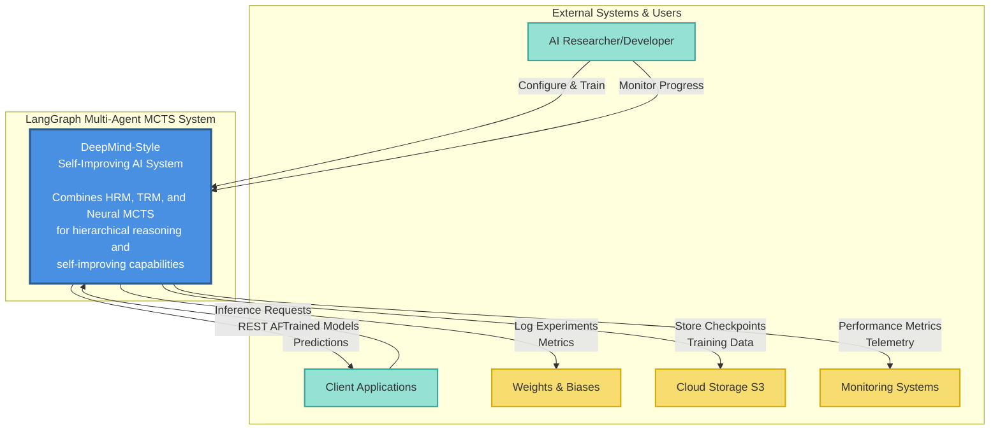

### Key Relationships

| From | To | Description |
|------|-----|-------------|
| **AI Researcher** | System | Configures training parameters, monitors experiments |
| **Client Applications** | System | Makes inference requests via REST API |
| **System** | Weights & Biases | Logs training metrics, experiments, model performance |
| **System** | Cloud Storage | Persists checkpoints, training data, replay buffer |
| **System** | Monitoring | Sends telemetry, performance metrics, alerts |

---

## Level 2: Container Diagram

Shows the high-level technical building blocks (applications, data stores, services).

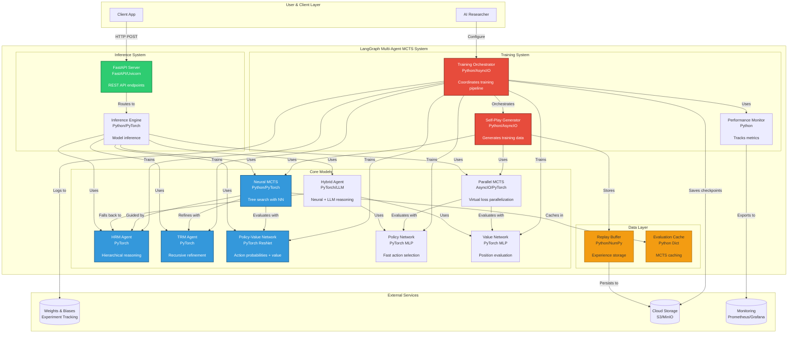

### Container Descriptions

| Container | Technology | Responsibility |
|-----------|-----------|----------------|
| **Training Orchestrator** | Python, PyTorch, AsyncIO | Coordinates complete training pipeline |
| **Self-Play Generator** | Python, AsyncIO | Generates training data through self-play |
| **HRM Agent** | PyTorch, Transformers | Hierarchical problem decomposition |
| **TRM Agent** | PyTorch, GRU | Recursive solution refinement |
| **Neural MCTS** | Python, NumPy, PyTorch | Tree search with neural guidance |
| **Parallel MCTS** | Python, AsyncIO, PyTorch | Parallelized tree search with virtual loss |
| **Policy-Value Network** | PyTorch, ResNet | Predicts action probabilities and values |
| **Policy Network** | PyTorch, MLP | Fast action probability prediction |
| **Value Network** | PyTorch, MLP | Fast position value estimation |
| **Hybrid Agent** | PyTorch, LLM | Cost-optimized neural+LLM reasoning |
| **FastAPI Server** | FastAPI, Uvicorn | REST API for inference |
| **Inference Engine** | PyTorch | Model inference and prediction |
| **Replay Buffer** | Python, NumPy | Stores and samples experiences |
| **Evaluation Cache** | Python Dict, LRU | Caches MCTS evaluations |

---

## Level 3: Component Diagrams

### 3.1 Training Orchestrator Components

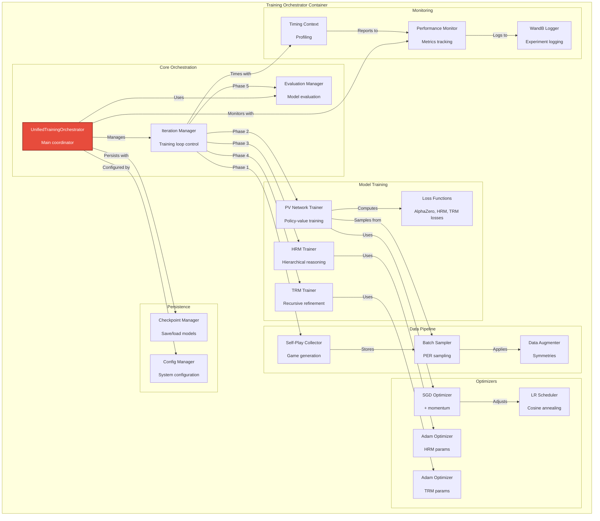

### 3.2 Neural MCTS Components

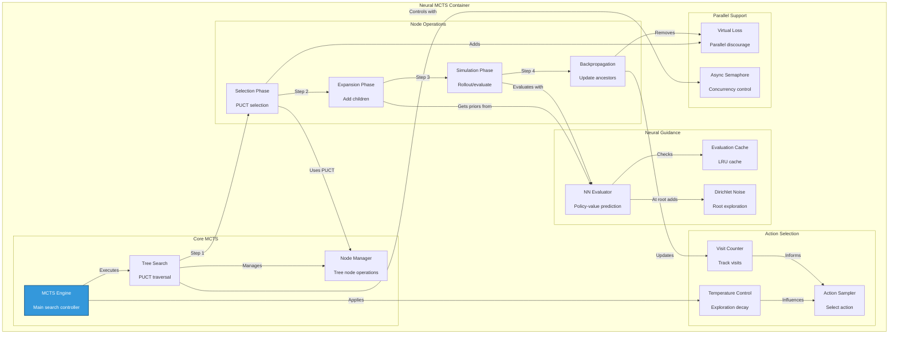

### 3.3 Inference API Components

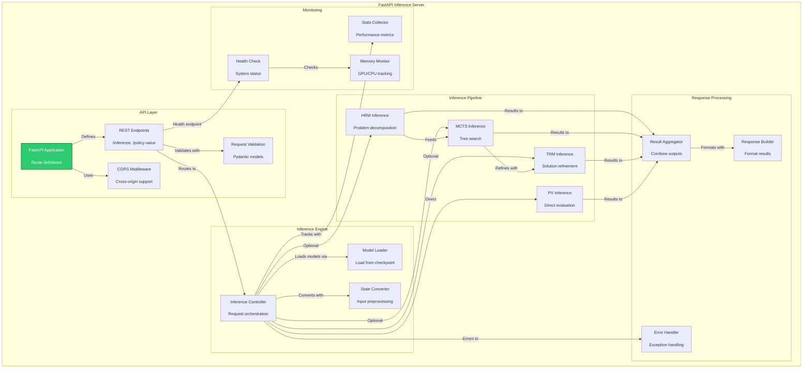

### 3.4 HRM Agent Components

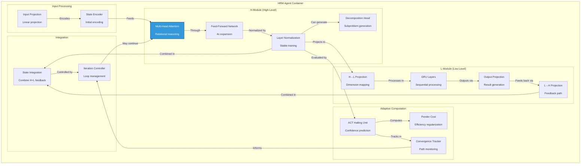

### 3.5 Advanced MCTS Components (Module 8)

```mermaid
graph TB
    subgraph "Advanced MCTS Container"
        subgraph "Parallel MCTS Engine"
            ParEngine[Parallel MCTS Engine<br/><br/>AsyncIO coordination]
            VirtualLossCtrl[Virtual Loss Controller<br/><br/>Collision prevention]
            WorkerPool[Worker Pool<br/><br/>Concurrent simulations]
        end

        subgraph "Virtual Loss Mechanism"
            VLNode[Virtual Loss Node<br/><br/>Extended MCTS node]
            VLAdd[Add Virtual Loss<br/><br/>Pessimistic value]
            VLRevert[Revert Virtual Loss<br/><br/>Restore true value]
            CollisionTrack[Collision Tracker<br/><br/>Monitor conflicts]
        end

        subgraph "Progressive Widening"
            PWEngine[Progressive Widening Engine<br/><br/>Adaptive expansion]
            PWCriterion[Expansion Criterion<br/><br/>N(s) > k * |C(s)|^α]
            AdaptiveK[Adaptive K Tuner<br/><br/>Variance-based]
            ActionFilter[Action Filter<br/><br/>Prune unpromising]
        end

        subgraph "RAVE (Rapid Action Value Estimation)"
            RAVENode[RAVE Node<br/><br/>AMAF statistics]
            RAVEBackprop[RAVE Backpropagation<br/><br/>All-Moves-As-First]
            BetaDecay[Beta Decay<br/><br/>UCB-RAVE mixing]
            HybridSelect[Hybrid Selection<br/><br/>(1-β)*UCB + β*RAVE]
        end

        subgraph "Parallelization Strategies"
            TreePar[Tree Parallelization<br/><br/>Shared tree + VL]
            RootPar[Root Parallelization<br/><br/>Independent trees]
            LeafPar[Leaf Parallelization<br/><br/>Parallel rollouts]
        end
    end

    ParEngine -->|Manages| WorkerPool
    ParEngine -->|Uses| VirtualLossCtrl

    VirtualLossCtrl -->|Creates| VLNode
    VLNode -->|Adds pessimism| VLAdd
    VLNode -->|Restores value| VLRevert
    VLAdd -->|Tracked by| CollisionTrack

    PWEngine -->|Evaluates| PWCriterion
    PWCriterion -->|Adjusts| AdaptiveK
    PWEngine -->|Applies| ActionFilter

    RAVENode -->|Stores| RAVEBackprop
    RAVEBackprop -->|Computes| BetaDecay
    BetaDecay -->|Influences| HybridSelect

    ParEngine -->|Strategy 1| TreePar
    ParEngine -->|Strategy 2| RootPar
    ParEngine -->|Strategy 3| LeafPar

    style ParEngine fill:#9B59B6,stroke:#6C3483,stroke-width:2px,color:#fff
    style PWEngine fill:#9B59B6,stroke:#6C3483,stroke-width:2px,color:#fff
```

### 3.6 Neural Network Components (Module 9)

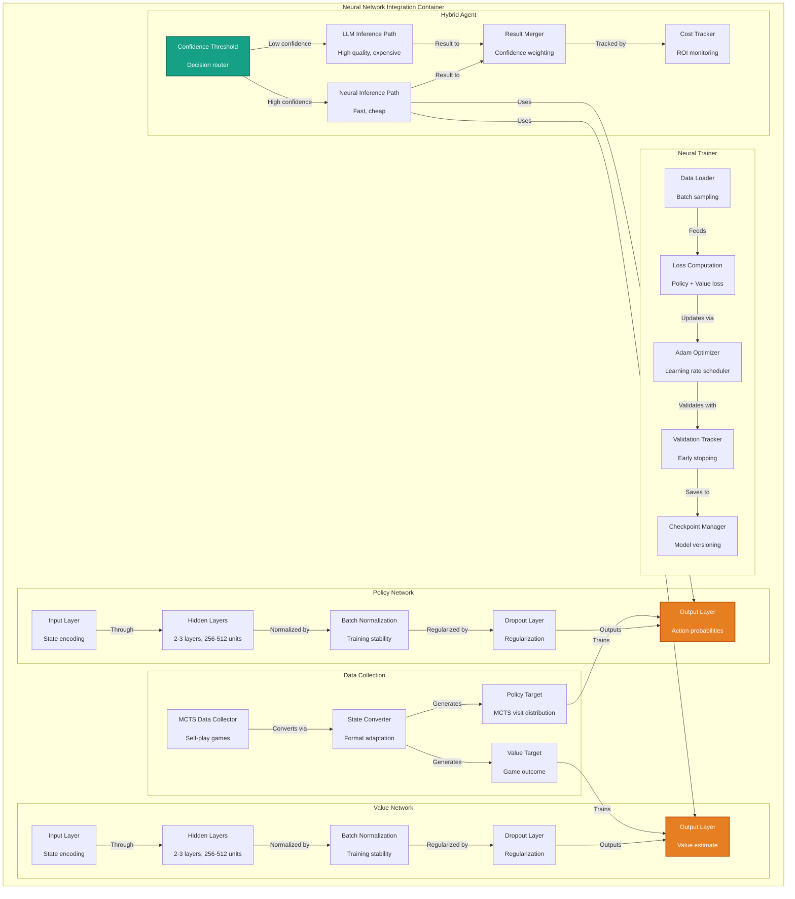

### 3.7 TRM Agent Components

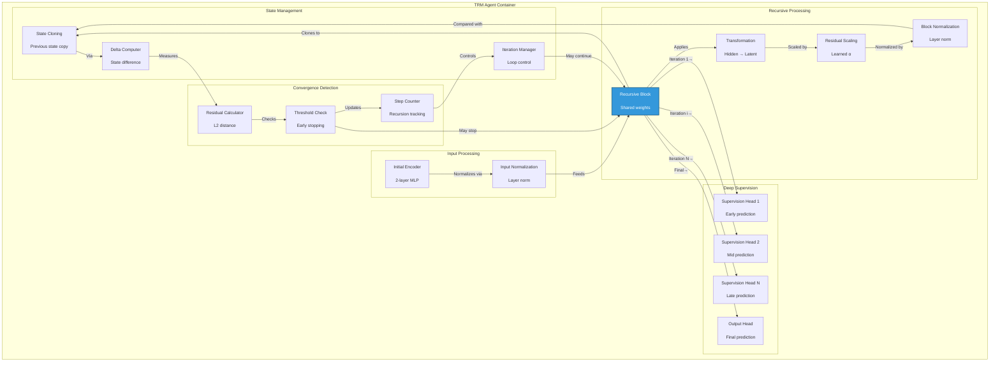

---

## Level 4: Code Diagrams

### 4.1 HRM Agent Class Structure

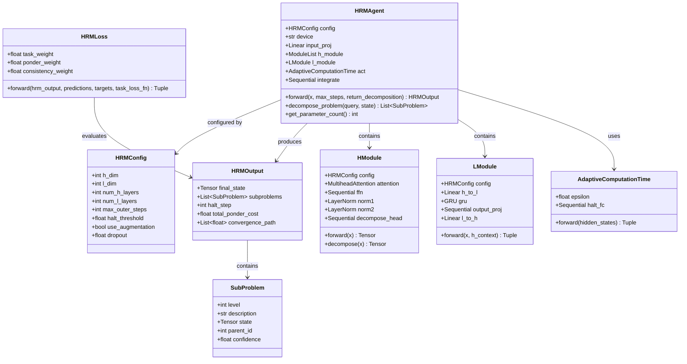

### 4.2 TRM Agent Class Structure

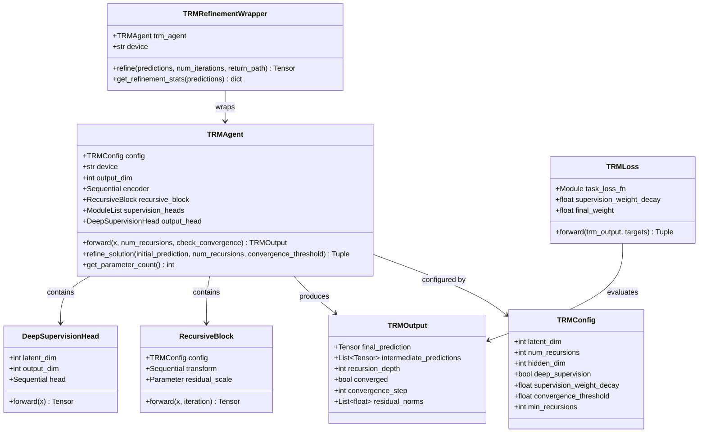

### 4.3 Neural MCTS Class Structure

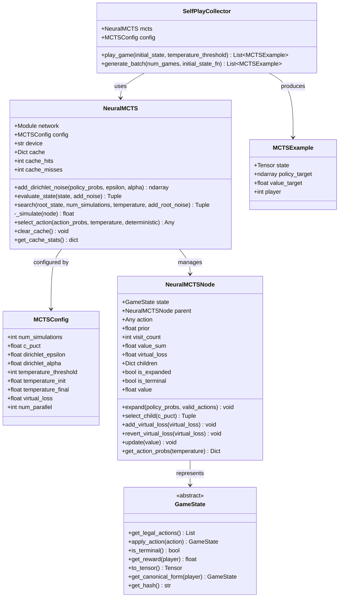

### 4.4 Policy-Value Network Class Structure

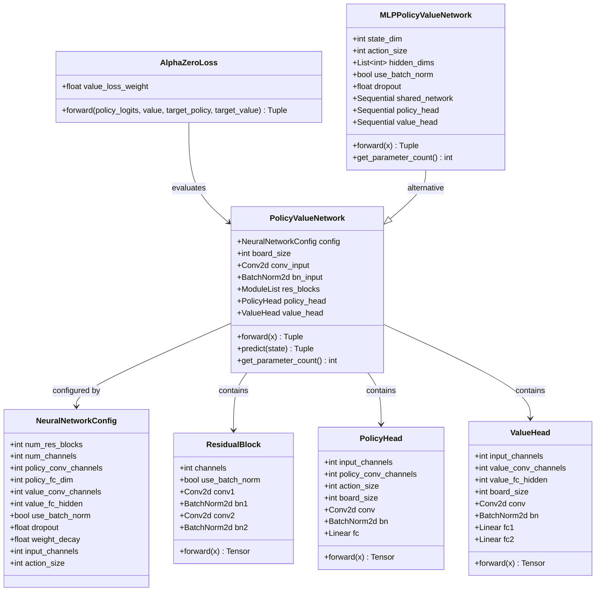

### 4.5 Training Orchestrator Class Structure

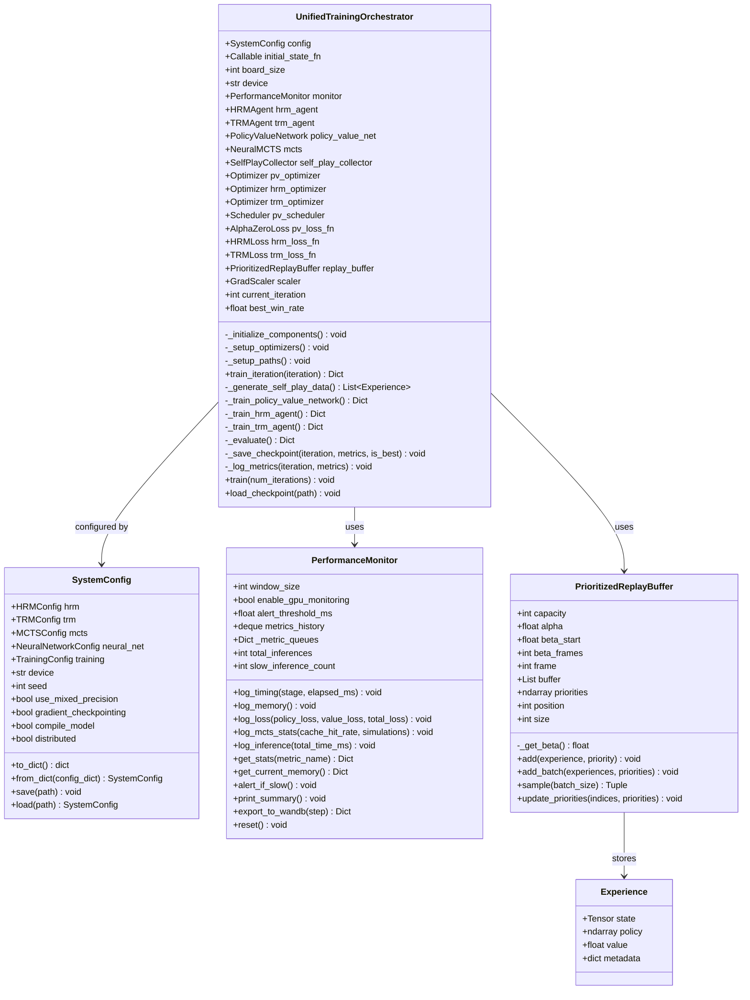

---

## Deployment Architecture

### Production Deployment Diagram

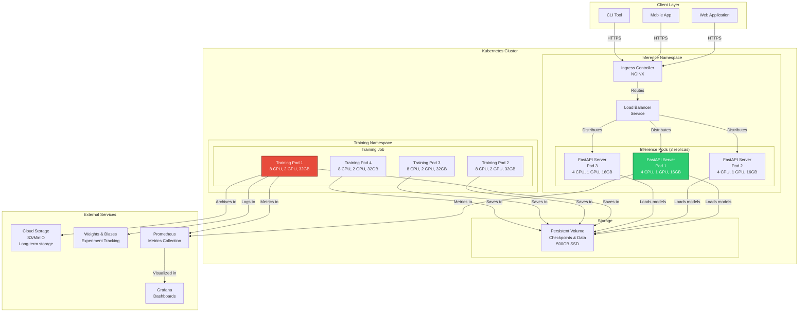

---

## Data Flow Diagrams

### Training Data Flow

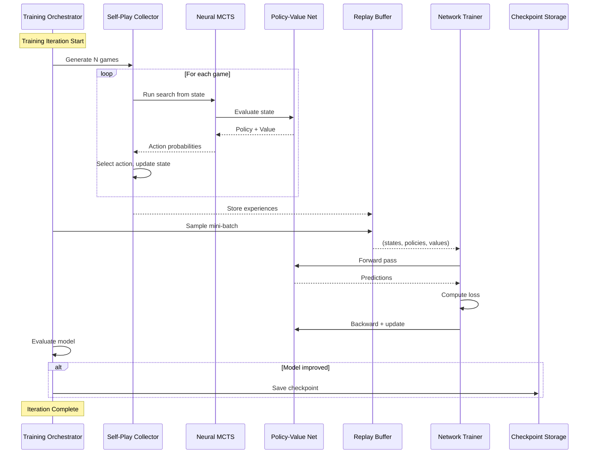

### Inference Data Flow

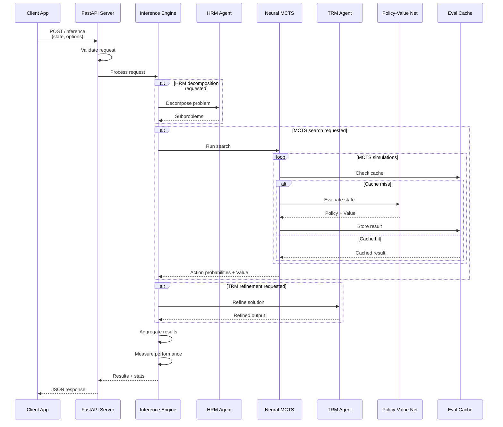

### Self-Play Game Flow

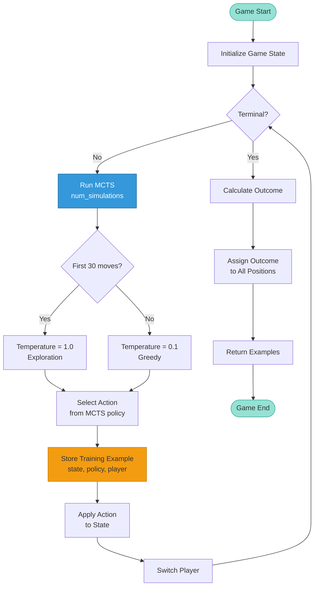

---

## Summary

This C4 architecture documentation provides:

1. **Context Diagram**: System boundaries and external interactions
2. **Container Diagram**: High-level technical components
3. **Component Diagrams**: Detailed internal structure of each container
4. **Code Diagrams**: Class structures and relationships
5. **Deployment Architecture**: Production deployment on Kubernetes
6. **Data Flow Diagrams**: Request/response and training flows

### Key Architectural Patterns

- **Microservices**: Separate training and inference services
- **Event-Driven**: Async training pipeline with callbacks
- **Repository**: Centralized checkpoint and config management
- **Strategy**: Pluggable MCTS policies and loss functions
- **Observer**: Performance monitoring and experiment tracking
- **Factory**: Component creation with configuration
- **Singleton**: Shared cache and monitoring instances

### Technology Stack Summary

| Layer | Technologies |
|-------|-------------|
| **Core ML** | PyTorch 2.1+, NumPy, SciPy |
| **Orchestration** | Python AsyncIO, LangGraph |
| **API** | FastAPI, Uvicorn, Pydantic |
| **Storage** | S3/MinIO, Persistent Volumes |
| **Monitoring** | Weights & Biases, Prometheus, Grafana |
| **Testing** | pytest, pytest-asyncio |
| **Deployment** | Kubernetes, Docker |
| **Code Quality** | Black, Ruff, MyPy, pre-commit |
