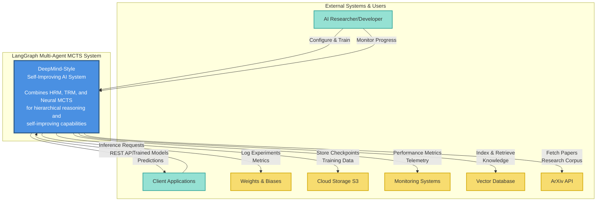
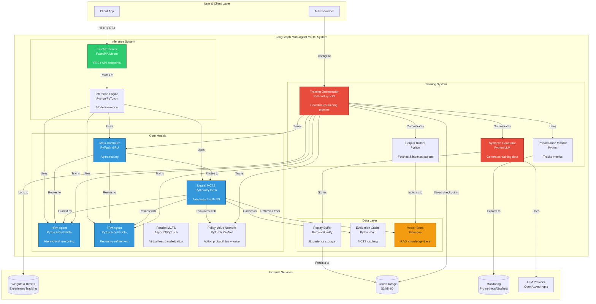
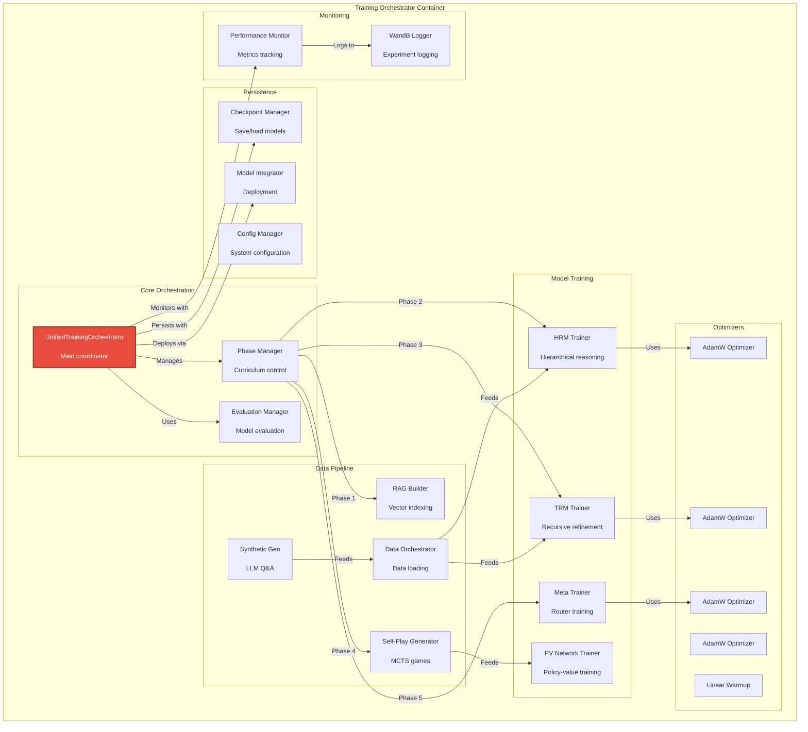
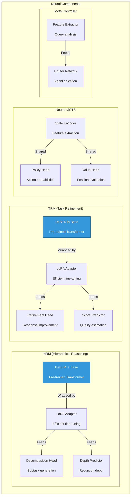
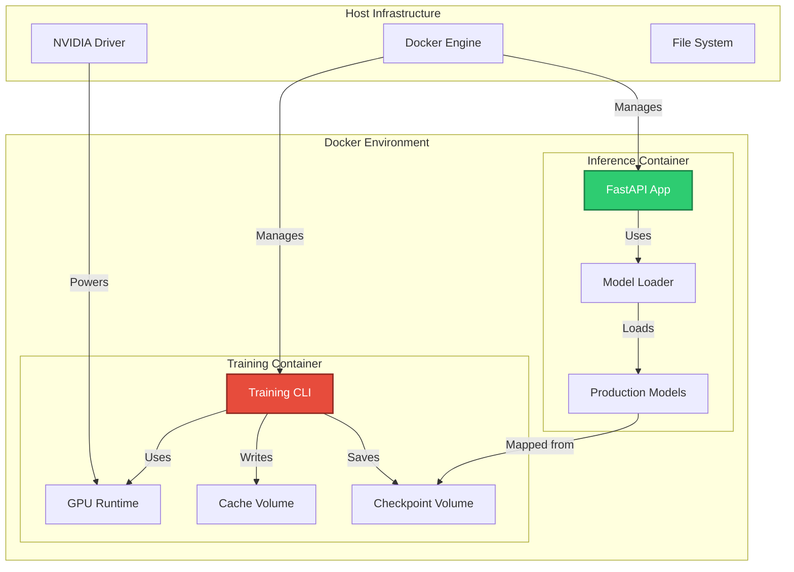

# C4 Architecture Diagrams: DeepMind-Style Self-Improving AI System

This document provides C4 architecture diagrams (Context, Container, Component, and Code levels) for the LangGraph Multi-Agent MCTS framework with DeepMind-style learning.

## Table of Contents

1. [Level 1: System Context Diagram](#level-1-system-context-diagram)
2. [Level 2: Container Diagram](#level-2-container-diagram)
3. [Level 3: Component Diagrams](#level-3-component-diagrams)
4. [Level 4: Code Diagrams](#level-4-code-diagrams)
5. [Deployment Architecture](#deployment-architecture)
6. [Data Flow Diagrams](#data-flow-diagrams)

---

## Level 1: System Context Diagram

Shows the system in its environment with external actors and systems.

### Key Relationships

| From | To | Description |
|------|-----|-------------|
| **AI Researcher** | System | Configures training parameters, monitors experiments |
| **Client Applications** | System | Makes inference requests via REST API |
| **System** | Weights & Biases | Logs training metrics, experiments, model performance |
| **System** | Cloud Storage | Persists checkpoints, training data, replay buffer |
| **System** | Monitoring | Sends telemetry, performance metrics, alerts |
| **System** | Pinecone | Stores/Retrieves vector embeddings for RAG |
| **System** | ArXiv API | Fetches research papers for knowledge corpus |

---

## Level 2: Container Diagram

Shows the high-level technical building blocks (applications, data stores, services).

### Container Descriptions

| Container | Technology | Responsibility |
|-----------|-----------|----------------|
| **Training Orchestrator** | Python, PyTorch, AsyncIO | Coordinates complete training pipeline, curriculum learning |
| **Synthetic Generator** | Python, LLM | Generates high-quality Q&A pairs for training |
| **Corpus Builder** | Python | Fetches arXiv papers and builds vector index |
| **HRM Agent** | PyTorch, DeBERTa | Hierarchical problem decomposition |
| **TRM Agent** | PyTorch, DeBERTa | Recursive solution refinement |
| **Neural MCTS** | Python, NumPy, PyTorch | Tree search with neural guidance |
| **Meta Controller** | PyTorch, GRU | Dynamic routing of queries to optimal agents |
| **Policy-Value Network** | PyTorch, ResNet | Predicts action probabilities and values |
| **FastAPI Server** | FastAPI, Uvicorn | REST API for inference |
| **Inference Engine** | PyTorch | Model inference and prediction |
| **Replay Buffer** | Python, NumPy | Stores and samples experiences |
| **Vector Store** | Pinecone | RAG knowledge base for retrieval |

---

## Level 3: Component Diagrams

### 3.1 Training Orchestrator Components

### 3.2 Neural Network Components (DeepMind Implementation)

---

## Deployment Architecture

### Docker & Production Deployment

---

## Summary

This updated C4 architecture reflects the **current state** of the application, incorporating:

1.  **Neural Networks**: Explicit integration of HRM, TRM, MCTS, and Meta-Controller models with LoRA adapters.
2.  **Training Pipeline**: Comprehensive orchestration including synthetic data generation and corpus building.
3.  **RAG Integration**: Pinecone vector database for retrieval-augmented generation.
4.  **Docker Deployment**: Containerized training and inference workflows.
5.  **External Services**: Integration with W&B, S3, and ArXiv.

### Technology Stack

| Layer | Technologies |
|-------|-------------|
| **Core ML** | PyTorch 2.1+, Transformers, PEFT, NumPy |
| **Models** | DeBERTa-v3, ResNet, GRU |
| **Orchestration** | Python AsyncIO, LangGraph |
| **Data** | Pinecone, ArXiv API, OpenAI API |
| **Monitoring** | Weights & Biases, Prometheus |
| **Deployment** | Docker, Docker Compose |
