# C4 Architecture Diagrams - Multi-Agent MCTS Platform

> Complete C4 model representation using Mermaid diagrams
> Version: 2.0 | Last Updated: January 28, 2026

---

## Table of Contents

1. [Level 1: System Context](#level-1-system-context)
2. [Level 2: Container Diagram](#level-2-container-diagram)
3. [Level 3: Component Diagrams](#level-3-component-diagrams)
4. [Level 4: Code Diagrams](#level-4-code-diagrams)
5. [Sequence Diagrams](#sequence-diagrams)
6. [State Machine Diagrams](#state-machine-diagrams)
7. [Data Flow Diagrams](#data-flow-diagrams)

---

## Level 1: System Context

### Primary System Context

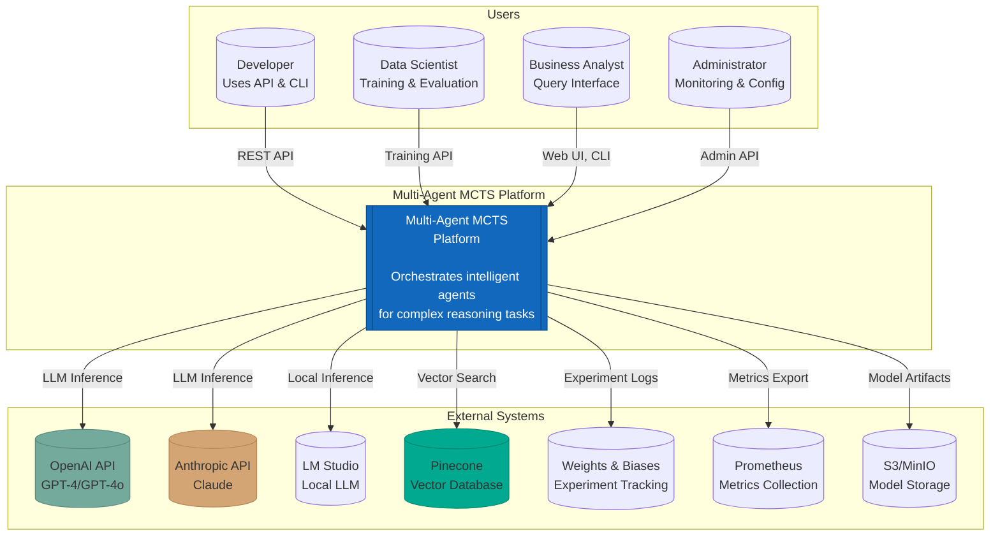

### Extended Context with Data Flows

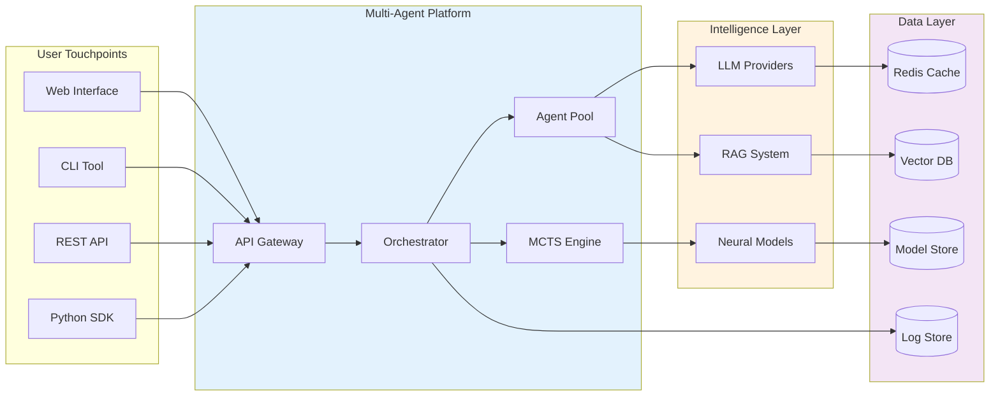

---

## Level 2: Container Diagram

### Main Container Architecture

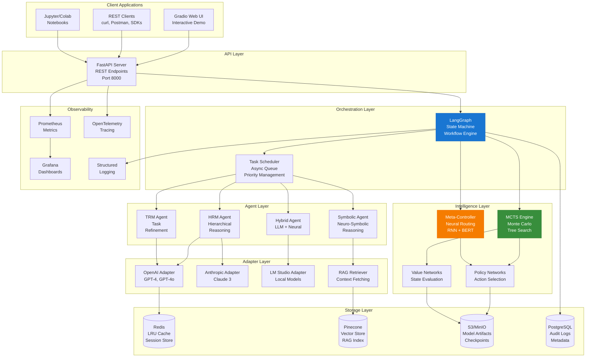

### Container Communication Matrix

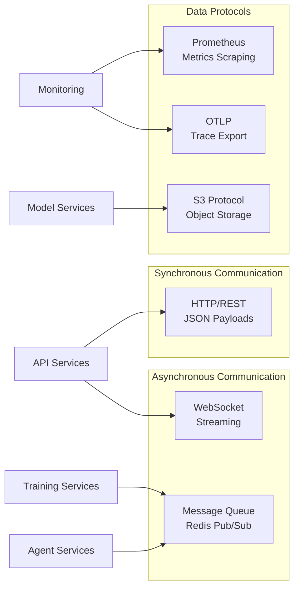

---

## Level 3: Component Diagrams

### 3.1 MCTS Engine Components

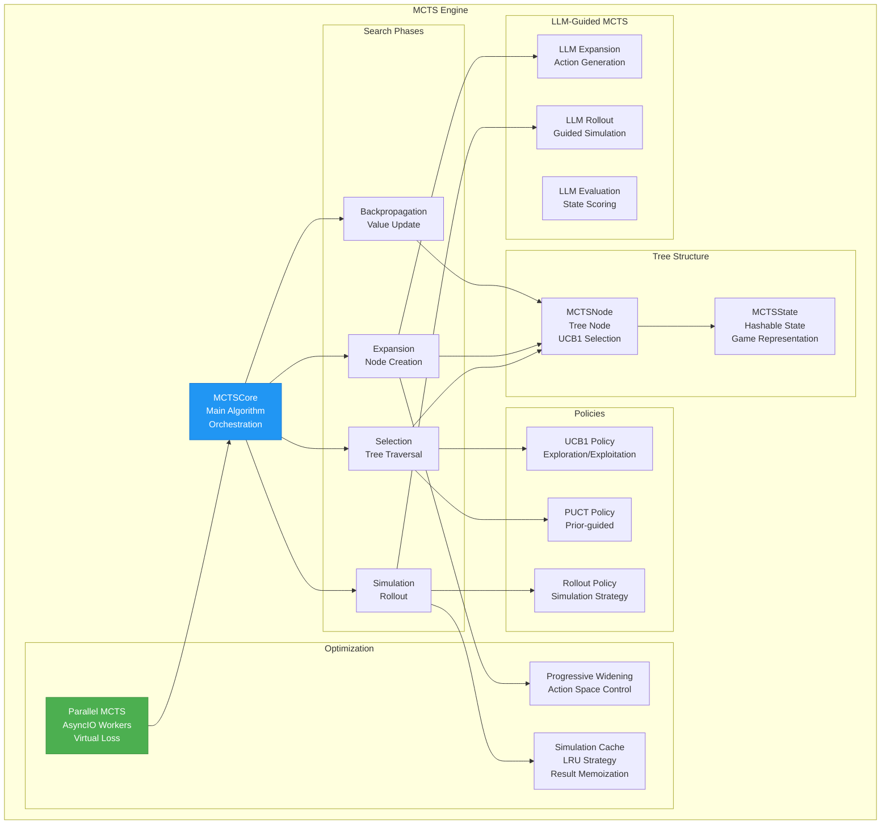

### 3.2 Agent Layer Components

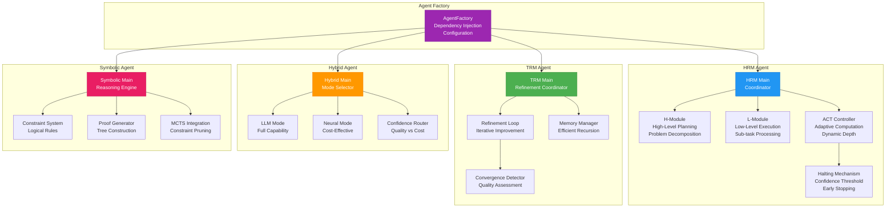

### 3.3 Meta-Controller Components

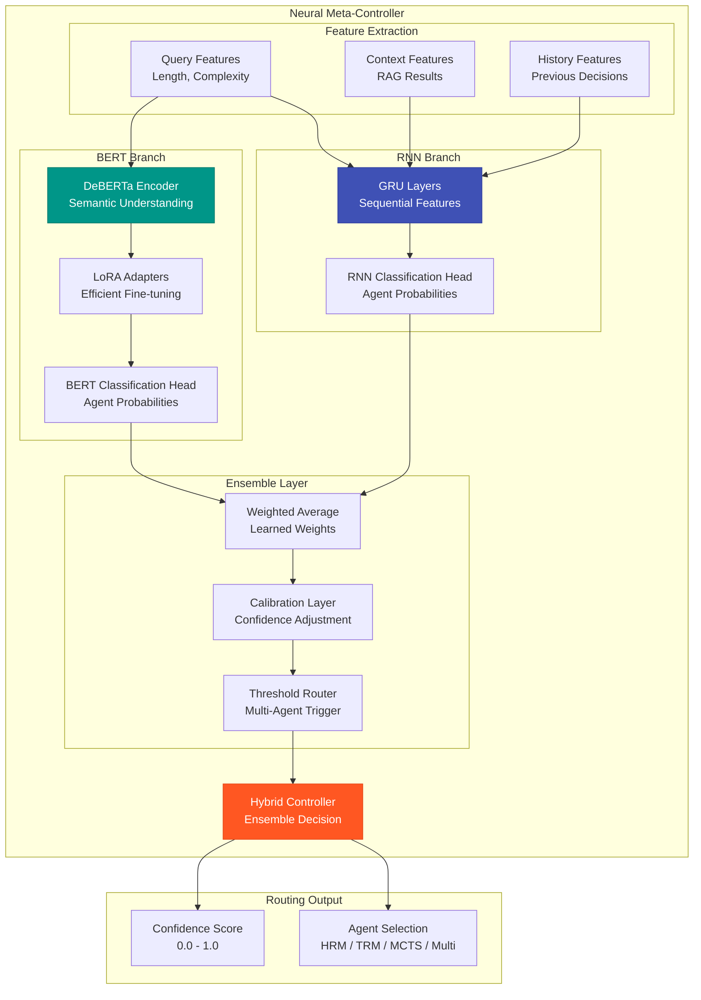

### 3.4 LangGraph Orchestration Components

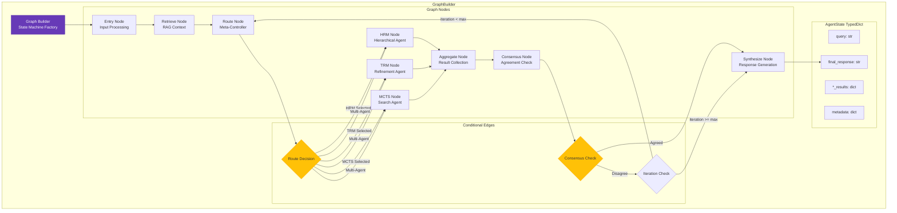

---

## Level 4: Code Diagrams

### 4.1 MCTS Core Classes

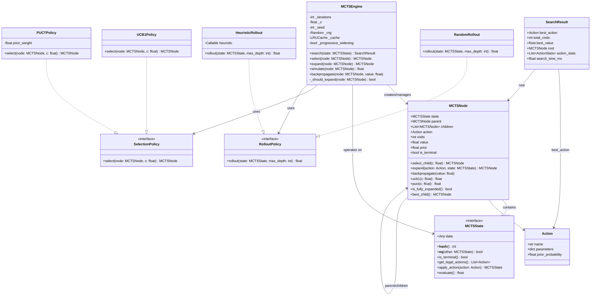

### 4.2 Agent Interfaces

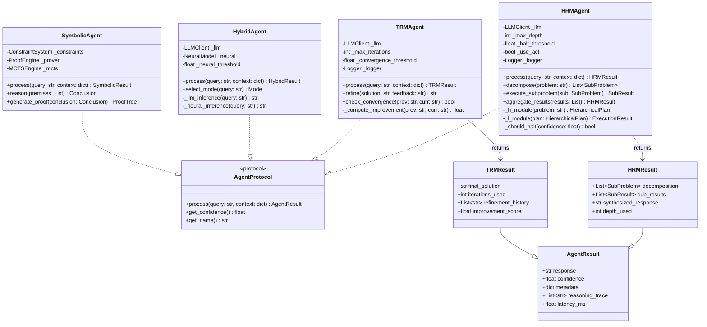

### 4.3 Configuration Classes

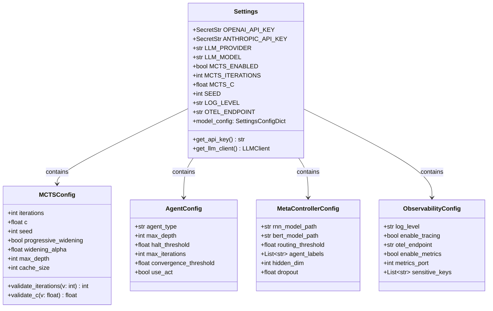

---

## Sequence Diagrams

### Query Processing Sequence

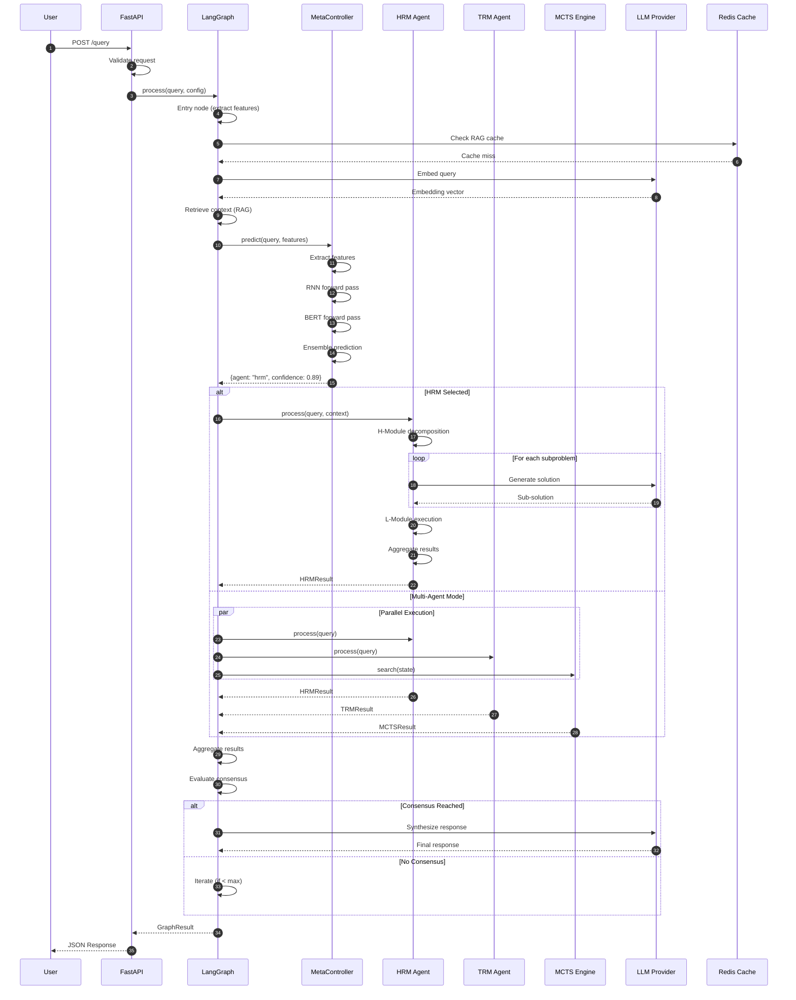

### MCTS Search Sequence

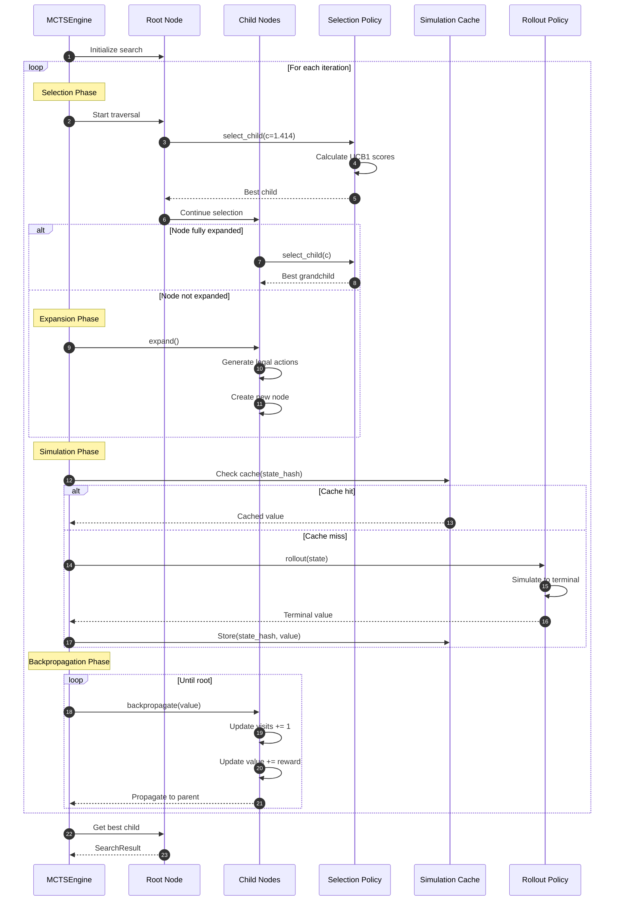

### Training Pipeline Sequence

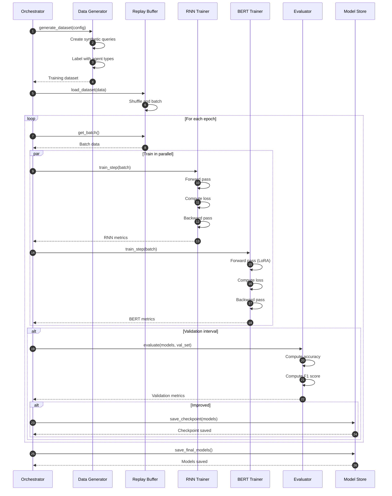

---

## State Machine Diagrams

### LangGraph State Machine

```mermaid
stateDiagram-v2
    [*] --> Entry: Query Received

    Entry --> ValidateInput: Parse Request
    ValidateInput --> Error: Invalid Input
    ValidateInput --> ExtractFeatures: Valid Input

    Error --> [*]: Return Error Response

    ExtractFeatures --> RetrieveContext: Features Extracted

    state RetrieveContext {
        [*] --> CheckCache
        CheckCache --> CacheHit: Found
        CheckCache --> EmbedQuery: Not Found
        EmbedQuery --> VectorSearch
        VectorSearch --> CacheResult
        CacheHit --> [*]
        CacheResult --> [*]
    }

    RetrieveContext --> RouteDecision: Context Retrieved

    state RouteDecision {
        [*] --> MetaController
        MetaController --> HighConfidence: conf > 0.7
        MetaController --> LowConfidence: conf <= 0.7
        HighConfidence --> SingleAgent
        LowConfidence --> MultiAgent
        SingleAgent --> [*]
        MultiAgent --> [*]
    }

    RouteDecision --> AgentExecution: Routing Complete

    state AgentExecution {
        [*] --> SelectAgents

        state SingleAgentMode {
            [*] --> RunSelected
            RunSelected --> [*]
        }

        state MultiAgentMode {
            [*] --> Fork
            Fork --> RunHRM
            Fork --> RunTRM
            Fork --> RunMCTS
            RunHRM --> Join
            RunTRM --> Join
            RunMCTS --> Join
            Join --> [*]
        }

        SelectAgents --> SingleAgentMode: Single
        SelectAgents --> MultiAgentMode: Multi
        SingleAgentMode --> CollectResults
        MultiAgentMode --> CollectResults
        CollectResults --> [*]
    }

    AgentExecution --> EvaluateConsensus: Results Collected

    state EvaluateConsensus {
        [*] --> ComputeAgreement
        ComputeAgreement --> Agreed: score > threshold
        ComputeAgreement --> Disagreed: score <= threshold
        Agreed --> [*]
        Disagreed --> CheckIteration
        CheckIteration --> CanIterate: iter < max
        CheckIteration --> ForceConsensus: iter >= max
        CanIterate --> [*]
        ForceConsensus --> [*]
    }

    EvaluateConsensus --> Synthesize: Consensus/Forced
    EvaluateConsensus --> RouteDecision: Iterate

    state Synthesize {
        [*] --> CombineResults
        CombineResults --> GenerateResponse
        GenerateResponse --> AddMetadata
        AddMetadata --> [*]
    }

    Synthesize --> [*]: Return Response
```

### Meta-Controller State Machine

```mermaid
stateDiagram-v2
    [*] --> Idle

    Idle --> FeatureExtraction: Query Received

    state FeatureExtraction {
        [*] --> ExtractQueryFeatures
        ExtractQueryFeatures --> ExtractContextFeatures
        ExtractContextFeatures --> ExtractHistoryFeatures
        ExtractHistoryFeatures --> CombineFeatures
        CombineFeatures --> [*]
    }

    FeatureExtraction --> RNNInference: Features Ready

    state RNNInference {
        [*] --> EmbedSequence
        EmbedSequence --> GRUForward
        GRUForward --> ClassificationHead
        ClassificationHead --> [*]
    }

    state BERTInference {
        [*] --> Tokenize
        Tokenize --> DeBERTaForward
        DeBERTaForward --> LoRAAdaptation
        LoRAAdaptation --> ClassificationHead2
        ClassificationHead2 --> [*]
    }

    RNNInference --> BERTInference: RNN Complete
    BERTInference --> Ensemble: BERT Complete

    state Ensemble {
        [*] --> WeightedAverage
        WeightedAverage --> Calibration
        Calibration --> ThresholdCheck
        ThresholdCheck --> [*]
    }

    Ensemble --> OutputDecision: Ensemble Complete

    state OutputDecision {
        [*] --> HighConfidence: conf > 0.7
        [*] --> LowConfidence: conf <= 0.7
        HighConfidence --> SingleAgentOutput
        LowConfidence --> MultiAgentOutput
        SingleAgentOutput --> [*]
        MultiAgentOutput --> [*]
    }

    OutputDecision --> Idle: Decision Made
```

---

## Data Flow Diagrams

### Request Data Flow

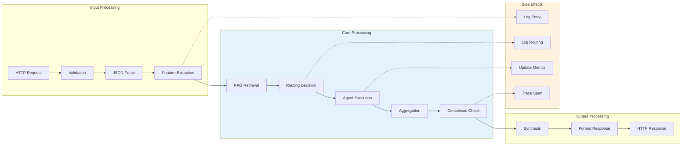

### Training Data Flow

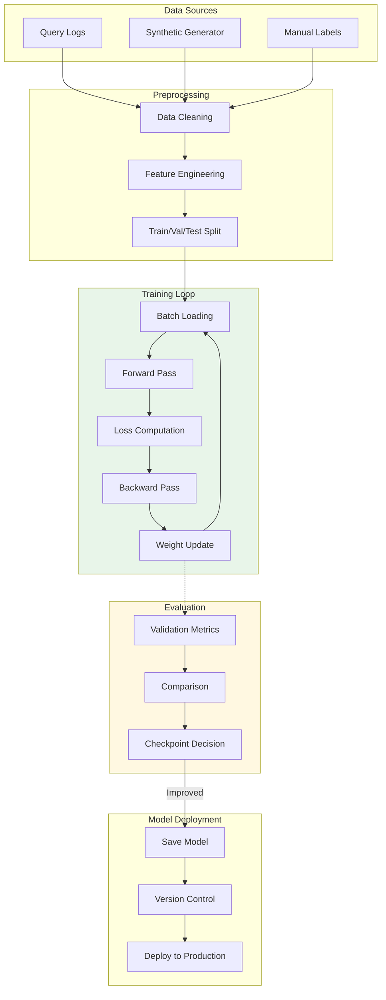

### Observability Data Flow

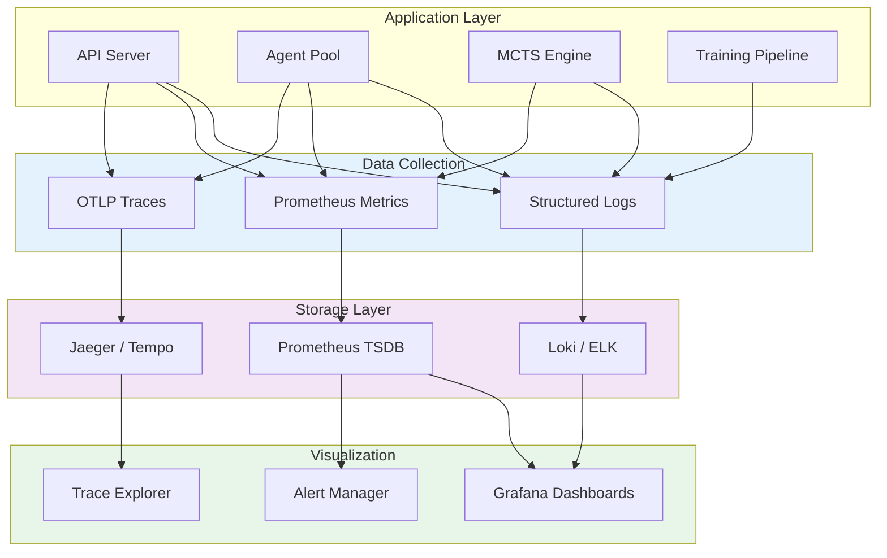

---

## Deployment Architecture

### Kubernetes Deployment

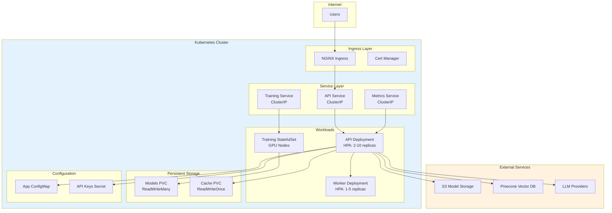

---

*Generated: January 2026*
*Framework: Multi-Agent MCTS v0.1.0*
