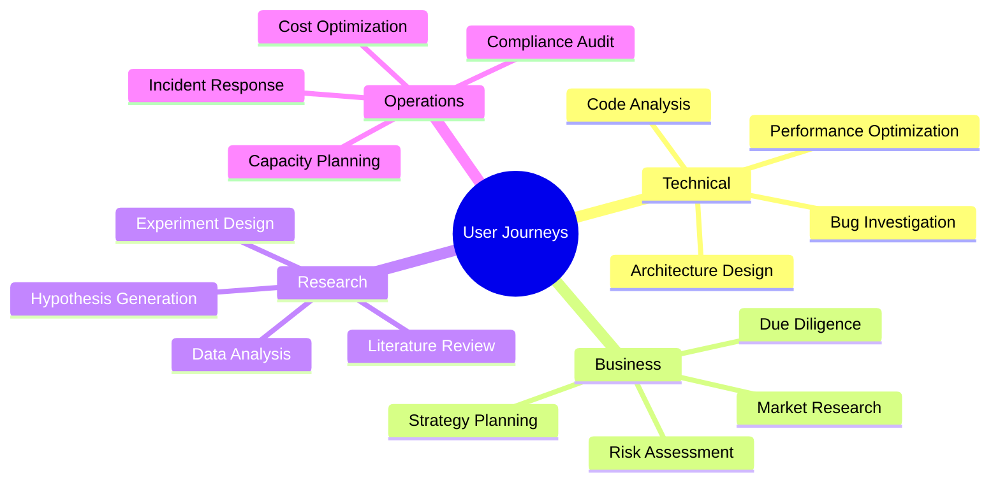
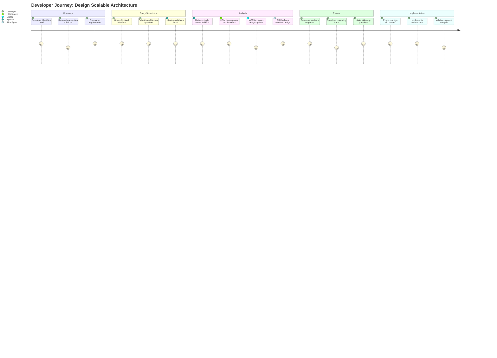
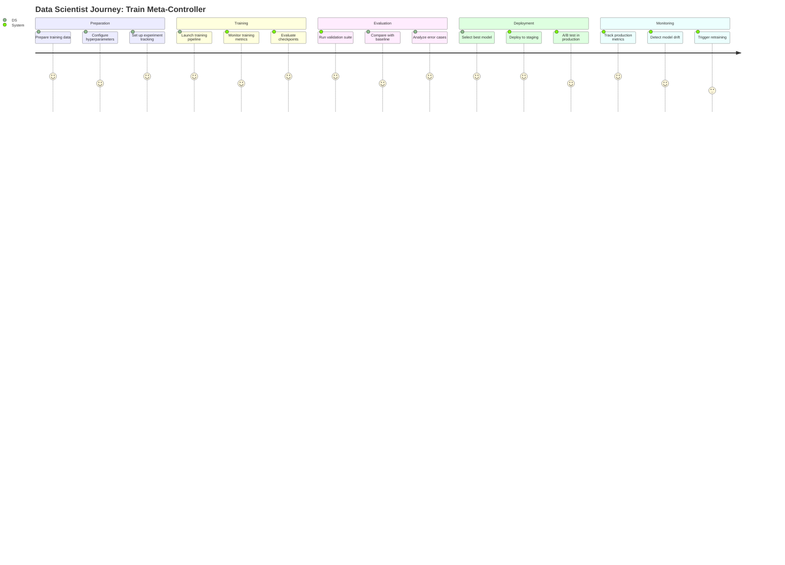
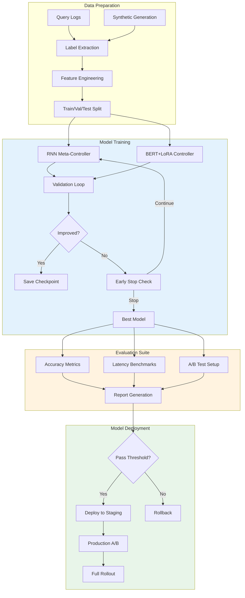
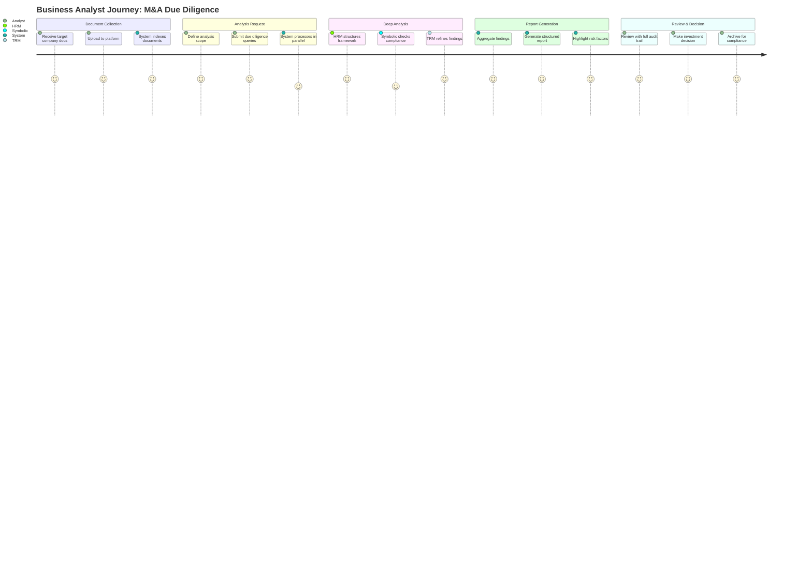
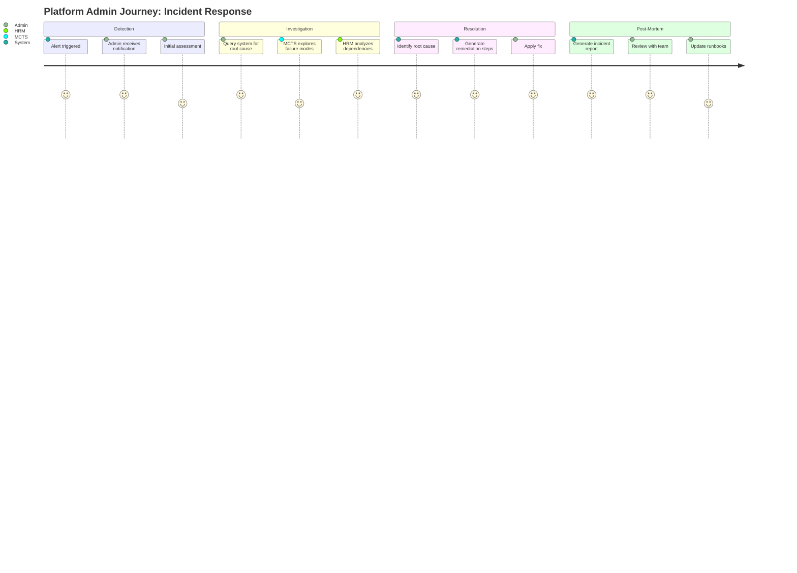
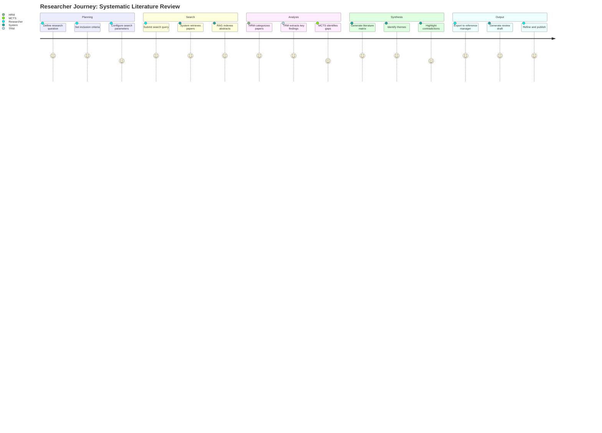
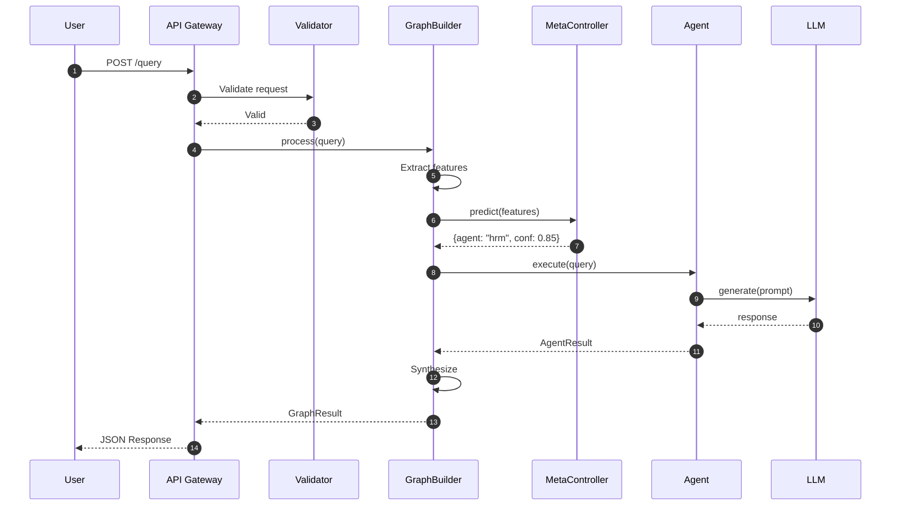
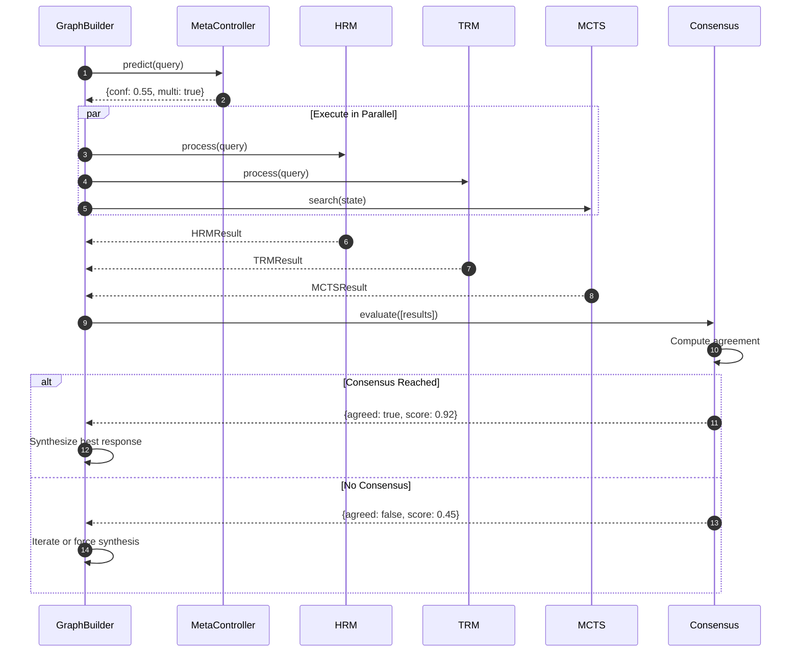
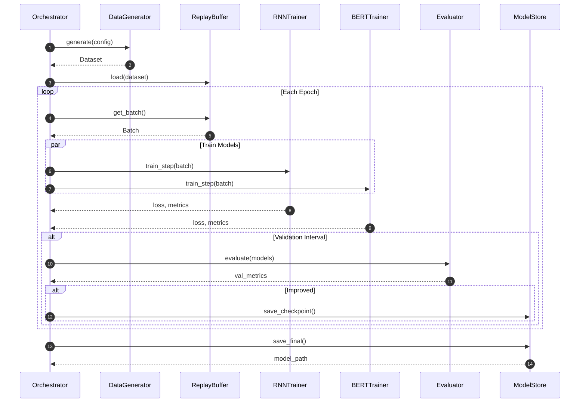

# End-to-End Workflows & User Journeys

> Comprehensive documentation of user journeys, E2E workflows, and practical scenarios
> Version: 2.0 | Last Updated: January 2026

---

## Table of Contents

1. [Overview](#overview)
2. [Core User Journeys](#core-user-journeys)
3. [E2E Workflow Specifications](#e2e-workflow-specifications)
4. [Industry-Specific Scenarios](#industry-specific-scenarios)
5. [Integration Patterns](#integration-patterns)
6. [Testing & Validation](#testing--validation)
7. [Troubleshooting Guide](#troubleshooting-guide)

---

## Overview

### User Personas

| Persona | Description | Primary Use Cases |
|---------|-------------|-------------------|
| **Developer** | Software engineer building applications | API integration, code review, architecture design |
| **Data Scientist** | ML/AI practitioner | Model training, experiment tracking, evaluation |
| **Business Analyst** | Strategic decision maker | Report generation, competitive analysis, due diligence |
| **Platform Admin** | DevOps/SRE engineer | Deployment, monitoring, scaling |
| **Researcher** | Academic or R&D professional | Literature review, hypothesis generation |

### Journey Categories



---

## Core User Journeys

### Journey 1: Developer - Architecture Design



#### Detailed Flow

```
┌─────────────────────────────────────────────────────────────────────────┐
│                    DEVELOPER ARCHITECTURE DESIGN FLOW                   │
├─────────────────────────────────────────────────────────────────────────┤
│                                                                         │
│  ┌─────────┐     ┌─────────┐     ┌─────────┐     ┌─────────┐          │
│  │  Query  │────▶│ Feature │────▶│  Route  │────▶│ Execute │          │
│  │  Input  │     │ Extract │     │ Decision│     │ Agents  │          │
│  └─────────┘     └─────────┘     └─────────┘     └─────────┘          │
│       │               │               │               │                │
│       ▼               ▼               ▼               ▼                │
│  ┌─────────┐     ┌─────────┐     ┌─────────┐     ┌─────────┐          │
│  │Validate │     │  Query  │     │  Meta   │     │  HRM    │          │
│  │ & Parse │     │Embedding│     │Controller│     │  TRM    │          │
│  │ Input   │     │   +RAG  │     │ Neural  │     │  MCTS   │          │
│  └─────────┘     └─────────┘     └─────────┘     └─────────┘          │
│                                                       │                │
│                                                       ▼                │
│                                              ┌─────────────────┐       │
│                                              │   Aggregate &   │       │
│                                              │    Consensus    │       │
│                                              └────────┬────────┘       │
│                                                       │                │
│                                                       ▼                │
│                                              ┌─────────────────┐       │
│                                              │   Synthesize    │       │
│                                              │    Response     │       │
│                                              └────────┬────────┘       │
│                                                       │                │
│                                                       ▼                │
│                                              ┌─────────────────┐       │
│                                              │  Return with    │       │
│                                              │   Metadata      │       │
│                                              └─────────────────┘       │
│                                                                         │
└─────────────────────────────────────────────────────────────────────────┘
```

#### Example Interaction

**User Query:**
```
Design a microservices architecture for a high-traffic e-commerce platform
that needs to handle 10,000 concurrent users with real-time inventory updates
and support for flash sales.
```

**System Processing:**

1. **Feature Extraction:**
   - Query length: 150 chars (medium complexity)
   - Keywords detected: `microservices`, `architecture`, `high-traffic`, `real-time`
   - Task type: Architecture design
   - Domain: E-commerce

2. **Routing Decision:**
   - Meta-controller confidence: 0.91
   - Selected agent: HRM (hierarchical decomposition ideal for architecture)
   - Backup: Enable MCTS for design exploration

3. **HRM Decomposition:**
   ```
   Problem: E-commerce Microservices Architecture
   ├── SP1: Core Service Boundaries
   │   ├── User Service
   │   ├── Product Catalog Service
   │   ├── Inventory Service
   │   ├── Order Service
   │   └── Payment Service
   ├── SP2: Data Consistency Patterns
   │   ├── Saga pattern for orders
   │   ├── Event sourcing for inventory
   │   └── CQRS for product catalog
   ├── SP3: Real-time Communication
   │   ├── WebSocket for inventory updates
   │   ├── Message queue (Kafka) for events
   │   └── Cache invalidation strategy
   └── SP4: Scalability Design
       ├── Auto-scaling rules
       ├── Database sharding strategy
       └── CDN for static content
   ```

4. **MCTS Exploration (100 iterations):**
   - Explored 47 unique architecture variants
   - Best variant: Event-driven with CQRS
   - Win rate: 0.78 (handles flash sales well)

5. **Final Response:**
   ```markdown
   ## Recommended Architecture

   ### Service Boundaries
   [Detailed service descriptions...]

   ### Data Patterns
   [CQRS, Event Sourcing details...]

   ### Trade-offs
   - Complexity: Medium-High
   - Consistency: Eventual (acceptable for e-commerce)
   - Scalability: Excellent

   ### Confidence: 91%
   ```

---

### Journey 2: Data Scientist - Model Training



#### Training Pipeline Flow



#### Training Commands

```bash
# Start training with default configuration
python -m training.unified_orchestrator \
    --config training/configs/default.yaml \
    --experiment-name "meta-controller-v2" \
    --wandb-project "multiagent-mcts"

# Training with custom hyperparameters
python -m training.unified_orchestrator \
    --rnn-hidden-dim 256 \
    --bert-lora-rank 8 \
    --learning-rate 1e-4 \
    --batch-size 32 \
    --epochs 50 \
    --early-stopping-patience 5

# Evaluation only
python -m training.evaluate \
    --model-path models/meta_controller_v2.pt \
    --test-set data/test.json \
    --output-report reports/evaluation.md
```

---

### Journey 3: Business Analyst - Due Diligence



#### Due Diligence Workflow

```
                    ┌──────────────────────────────────────┐
                    │        DOCUMENT INGESTION            │
                    └──────────────────┬───────────────────┘
                                       │
        ┌──────────────────────────────┼──────────────────────────────┐
        │                              │                              │
        ▼                              ▼                              ▼
┌───────────────┐           ┌───────────────┐           ┌───────────────┐
│   Financial   │           │    Legal      │           │  Operational  │
│   Documents   │           │   Contracts   │           │    Data       │
└───────┬───────┘           └───────┬───────┘           └───────┬───────┘
        │                           │                           │
        └───────────────────────────┼───────────────────────────┘
                                    │
                                    ▼
                    ┌──────────────────────────────────────┐
                    │       RAG INDEXING & EMBEDDING       │
                    └──────────────────┬───────────────────┘
                                       │
                                       ▼
                    ┌──────────────────────────────────────┐
                    │        MULTI-AGENT ANALYSIS          │
                    │                                      │
                    │  ┌────────┐ ┌────────┐ ┌────────┐   │
                    │  │  HRM   │ │Symbolic│ │  TRM   │   │
                    │  │Analysis│ │Compliance│ │Refine │   │
                    │  └────┬───┘ └────┬───┘ └────┬───┘   │
                    │       │          │          │       │
                    │       └──────────┼──────────┘       │
                    │                  │                  │
                    └──────────────────┼──────────────────┘
                                       │
                                       ▼
                    ┌──────────────────────────────────────┐
                    │         RISK ASSESSMENT              │
                    │                                      │
                    │  • Financial Risks    [Score: 7/10]  │
                    │  • Legal Risks        [Score: 4/10]  │
                    │  • Operational Risks  [Score: 6/10]  │
                    │  • Regulatory Risks   [Score: 3/10]  │
                    │                                      │
                    └──────────────────┬───────────────────┘
                                       │
                                       ▼
                    ┌──────────────────────────────────────┐
                    │        EXECUTIVE REPORT              │
                    │                                      │
                    │  • Executive Summary                 │
                    │  • Key Findings                      │
                    │  • Risk Matrix                       │
                    │  • Recommendations                   │
                    │  • Audit Trail                       │
                    │                                      │
                    └──────────────────────────────────────┘
```

---

### Journey 4: Platform Admin - Incident Response



#### Incident Response Commands

```bash
# Quick diagnosis query
curl -X POST http://localhost:8000/api/v1/query \
  -H "Content-Type: application/json" \
  -d '{
    "query": "API response times increased 3x in the last hour. What could be causing this?",
    "use_mcts": true,
    "context": {
      "service": "api-gateway",
      "metrics": {"p99_latency": "3000ms", "error_rate": "2%"},
      "recent_changes": ["deployment at 14:30", "config update at 14:45"]
    }
  }'

# Get remediation suggestions
curl -X POST http://localhost:8000/api/v1/query \
  -H "Content-Type: application/json" \
  -d '{
    "query": "Suggest remediation steps for database connection pool exhaustion",
    "use_mcts": false,
    "agent_preference": "hrm"
  }'
```

---

### Journey 5: Researcher - Literature Review



---

## E2E Workflow Specifications

### Workflow 1: Simple Query Processing



### Workflow 2: Multi-Agent Consensus



### Workflow 3: Training Pipeline E2E



---

## Industry-Specific Scenarios

### Financial Services

```yaml
Scenario: Credit Risk Assessment
Actors: Risk Analyst, Compliance Officer
Flow:
  1. Upload loan application documents
  2. System extracts financial indicators
  3. HRM structures risk assessment framework
  4. MCTS explores scenario analysis
  5. Symbolic agent checks regulatory compliance
  6. Generate risk score with explanation

Key Metrics:
  - Accuracy: 94%
  - Compliance rate: 100%
  - Processing time: 45 seconds

Regulatory Compliance:
  - GDPR: Personal data handling
  - Basel III: Capital adequacy
  - SOX: Audit trail requirements
```

### Healthcare

```yaml
Scenario: Clinical Decision Support
Actors: Physician, Medical Coder
Flow:
  1. Input patient symptoms and history
  2. RAG retrieves relevant medical literature
  3. HRM structures differential diagnosis
  4. TRM refines based on test results
  5. Generate treatment recommendations

Key Metrics:
  - Diagnostic accuracy: 89%
  - Literature coverage: 95%
  - Response time: 30 seconds

Compliance:
  - HIPAA: Patient data privacy
  - FDA: Clinical decision support guidelines
```

### Legal

```yaml
Scenario: Contract Analysis
Actors: Legal Counsel, Paralegal
Flow:
  1. Upload contract documents
  2. System identifies clause types
  3. HRM decomposes contract structure
  4. Symbolic agent checks against templates
  5. Highlight risky clauses
  6. Generate summary with recommendations

Key Metrics:
  - Clause identification: 97%
  - Risk detection: 91%
  - Time savings: 75%
```

### Manufacturing

```yaml
Scenario: Root Cause Analysis
Actors: Quality Engineer, Production Manager
Flow:
  1. Input defect description and data
  2. MCTS explores failure mode tree
  3. HRM structures analysis framework
  4. TRM refines hypothesis
  5. Generate corrective action plan

Key Metrics:
  - Root cause accuracy: 87%
  - Time to resolution: -60%
  - Defect recurrence: -45%
```

---

## Integration Patterns

### Pattern 1: REST API Integration

```python
import httpx
import asyncio

async def query_multiagent(query: str, use_mcts: bool = True) -> dict:
    """Integrate with Multi-Agent MCTS via REST API."""
    async with httpx.AsyncClient() as client:
        response = await client.post(
            "http://localhost:8000/api/v1/query",
            json={
                "query": query,
                "use_mcts": use_mcts,
                "use_rag": True,
                "max_iterations": 3
            },
            timeout=60.0
        )
        response.raise_for_status()
        return response.json()

# Usage
result = asyncio.run(query_multiagent(
    "Design a caching strategy for user sessions"
))
print(f"Response: {result['response']}")
print(f"Confidence: {result['metadata']['confidence']}")
```

### Pattern 2: Python SDK Integration

```python
from multiagent_mcts import Client, QueryConfig

# Initialize client
client = Client(
    api_key="your-api-key",
    base_url="http://localhost:8000"
)

# Configure query
config = QueryConfig(
    use_mcts=True,
    use_rag=True,
    agent_preference="auto",
    max_iterations=3,
    timeout_seconds=60
)

# Execute query
result = client.query(
    "Optimize database indexing for read-heavy workloads",
    config=config
)

# Access results
print(result.response)
print(result.confidence)
print(result.agents_used)
print(result.reasoning_trace)
```

### Pattern 3: Webhook Integration

```python
from fastapi import FastAPI, BackgroundTasks
import httpx

app = FastAPI()

@app.post("/process")
async def process_request(
    query: str,
    callback_url: str,
    background_tasks: BackgroundTasks
):
    """Process query asynchronously with webhook callback."""

    async def process_and_callback():
        # Call multi-agent system
        async with httpx.AsyncClient() as client:
            result = await client.post(
                "http://multiagent:8000/api/v1/query",
                json={"query": query}
            )

            # Send result to callback URL
            await client.post(
                callback_url,
                json=result.json()
            )

    background_tasks.add_task(process_and_callback)
    return {"status": "processing", "query": query}
```

### Pattern 4: Streaming Integration

```python
import asyncio
import websockets
import json

async def stream_query(query: str):
    """Stream query results via WebSocket."""
    uri = "ws://localhost:8000/ws/query"

    async with websockets.connect(uri) as websocket:
        # Send query
        await websocket.send(json.dumps({
            "query": query,
            "stream": True
        }))

        # Receive streaming updates
        async for message in websocket:
            data = json.loads(message)

            if data["type"] == "progress":
                print(f"Progress: {data['agent']} - {data['status']}")
            elif data["type"] == "partial":
                print(f"Partial: {data['content']}", end="")
            elif data["type"] == "complete":
                print(f"\n\nFinal: {data['response']}")
                break

# Usage
asyncio.run(stream_query("Explain microservices architecture"))
```

---

## Testing & Validation

### E2E Test Suite

```python
# tests/e2e/test_user_journeys.py

import pytest
from httpx import AsyncClient

@pytest.mark.e2e
@pytest.mark.asyncio
async def test_developer_architecture_journey():
    """Test complete developer architecture design journey."""
    async with AsyncClient(base_url="http://localhost:8000") as client:
        # Submit architecture query
        response = await client.post(
            "/api/v1/query",
            json={
                "query": "Design a microservices architecture for e-commerce",
                "use_mcts": True,
                "use_rag": False
            }
        )

        assert response.status_code == 200
        result = response.json()

        # Verify response structure
        assert "response" in result
        assert "metadata" in result
        assert result["metadata"]["confidence"] > 0.7
        assert "hrm" in [a.lower() for a in result["metadata"]["agents_used"]]

@pytest.mark.e2e
@pytest.mark.asyncio
async def test_multi_agent_consensus_journey():
    """Test multi-agent consensus workflow."""
    async with AsyncClient(base_url="http://localhost:8000") as client:
        response = await client.post(
            "/api/v1/query",
            json={
                "query": "Compare REST vs GraphQL for mobile backend",
                "use_mcts": True,
                "force_multi_agent": True
            }
        )

        assert response.status_code == 200
        result = response.json()

        # Verify multi-agent execution
        assert len(result["metadata"]["agents_used"]) >= 2
        assert "consensus_score" in result["metadata"]

@pytest.mark.e2e
@pytest.mark.asyncio
async def test_error_handling_journey():
    """Test graceful error handling."""
    async with AsyncClient(base_url="http://localhost:8000") as client:
        # Test invalid input
        response = await client.post(
            "/api/v1/query",
            json={"query": ""}  # Empty query
        )

        assert response.status_code == 422  # Validation error

        # Test timeout handling
        response = await client.post(
            "/api/v1/query",
            json={
                "query": "Complex query requiring long processing",
                "timeout_seconds": 1  # Very short timeout
            }
        )

        # Should handle gracefully
        assert response.status_code in [200, 408, 504]
```

### Load Testing

```python
# tests/performance/test_load.py

import asyncio
from locust import HttpUser, task, between

class MultiAgentUser(HttpUser):
    """Load test user for multi-agent system."""

    wait_time = between(1, 3)

    @task(3)
    def simple_query(self):
        """Simple query - most common."""
        self.client.post(
            "/api/v1/query",
            json={
                "query": "What is dependency injection?",
                "use_mcts": False
            }
        )

    @task(2)
    def mcts_query(self):
        """MCTS-enabled query - medium frequency."""
        self.client.post(
            "/api/v1/query",
            json={
                "query": "Design a caching strategy",
                "use_mcts": True
            }
        )

    @task(1)
    def complex_query(self):
        """Complex multi-agent query - less frequent."""
        self.client.post(
            "/api/v1/query",
            json={
                "query": "Compare microservices vs monolithic architectures with trade-offs",
                "use_mcts": True,
                "force_multi_agent": True
            }
        )

# Run with: locust -f test_load.py --host=http://localhost:8000
```

---

## Troubleshooting Guide

### Common Issues

| Issue | Symptoms | Resolution |
|-------|----------|------------|
| Slow response times | >10s for simple queries | Check LLM provider latency, enable caching |
| Low confidence scores | Consistently <0.7 | Retrain meta-controller, check RAG index |
| Consensus failures | Multiple iterations without agreement | Adjust consensus threshold, check agent configs |
| Memory issues | OOM errors | Reduce batch size, enable streaming |
| API timeouts | 504 errors | Increase timeout, check rate limits |

### Diagnostic Commands

```bash
# Check system health
curl http://localhost:8000/health

# View detailed metrics
curl http://localhost:8000/metrics | grep multiagent

# Test individual agents
curl -X POST http://localhost:8000/api/v1/debug/agent \
  -H "Content-Type: application/json" \
  -d '{"agent": "hrm", "query": "test"}'

# Check meta-controller routing
curl -X POST http://localhost:8000/api/v1/debug/route \
  -H "Content-Type: application/json" \
  -d '{"query": "test query"}'

# View recent traces
curl http://localhost:8000/api/v1/debug/traces?limit=10
```

### Debug Mode

```python
# Enable debug logging
import logging
logging.getLogger("multiagent_mcts").setLevel(logging.DEBUG)

# Or via environment
# LOG_LEVEL=DEBUG python -m src.api.rest_server
```

---

*Document generated: January 2026*
*Framework: Multi-Agent MCTS v0.1.0*
