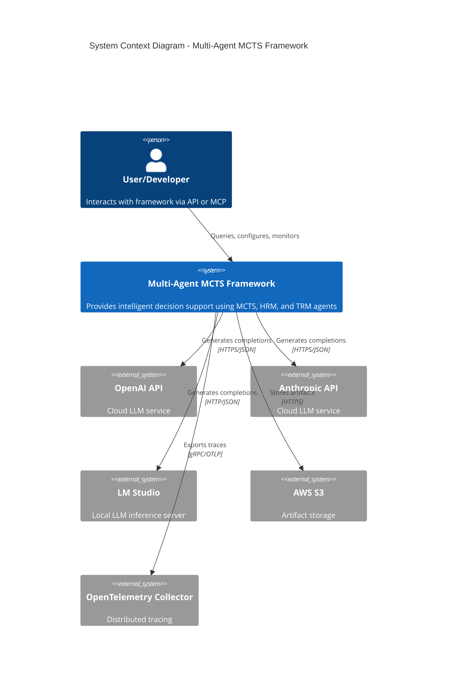
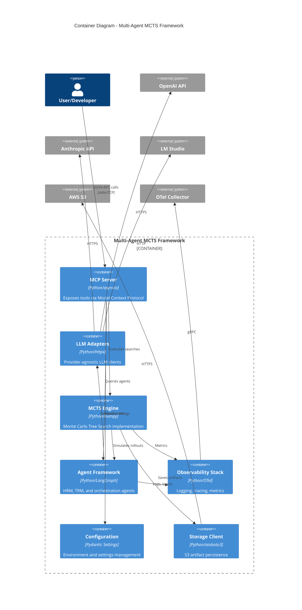
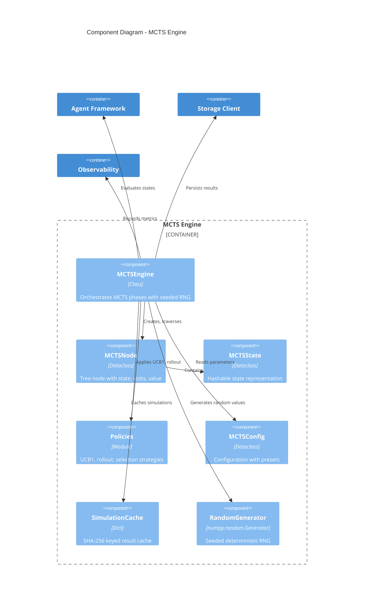
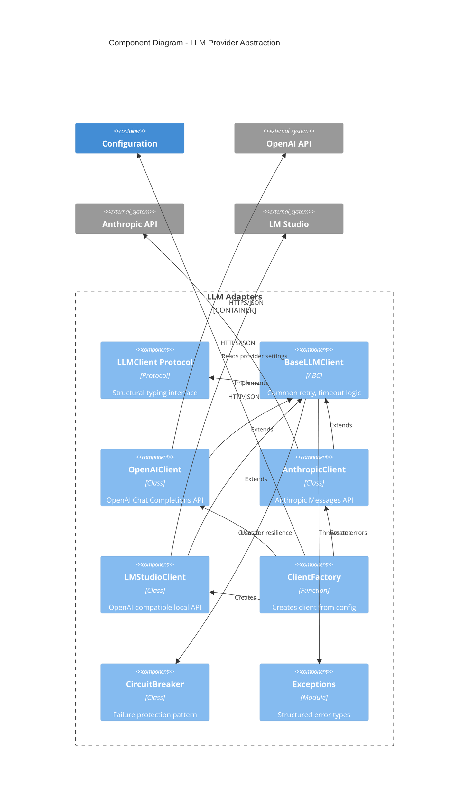
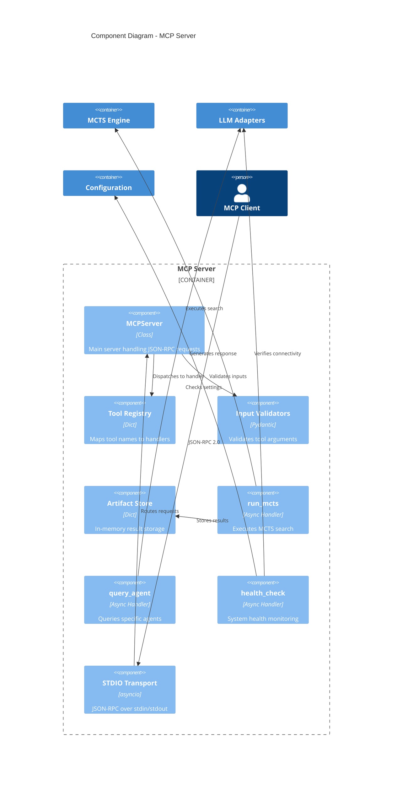
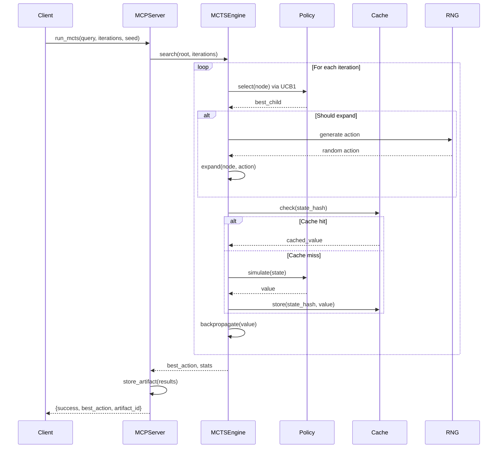
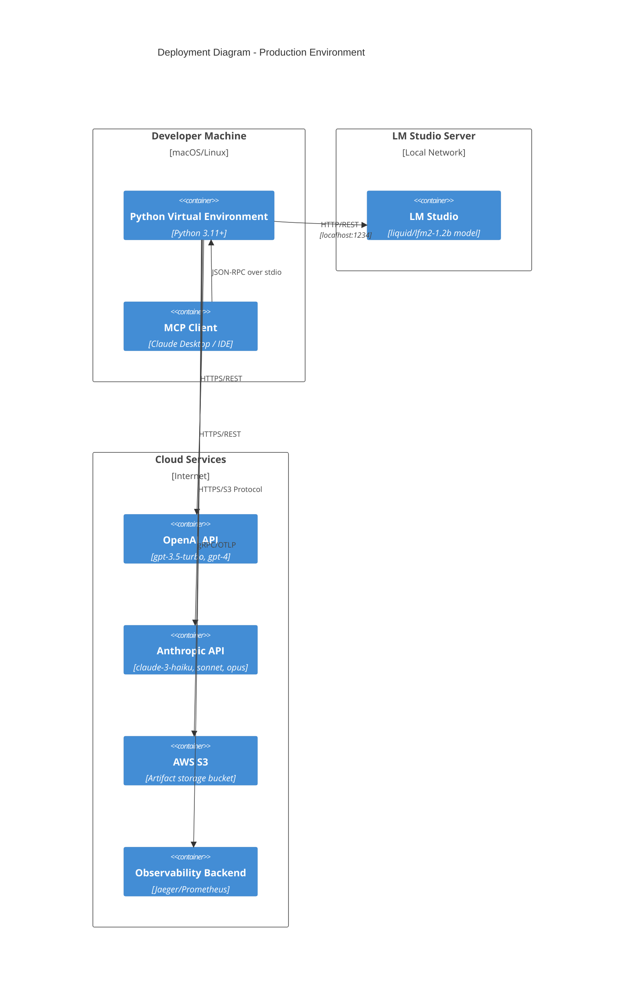
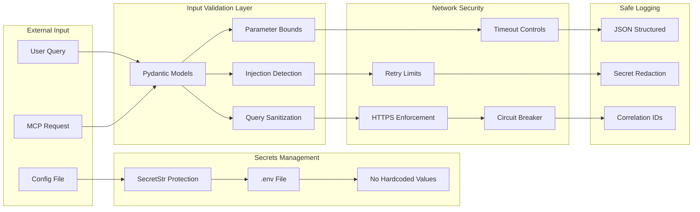

# Multi-Agent MCTS Framework Architecture

## C4 Model Diagrams

### Level 1: System Context



### Level 2: Container Diagram



### Level 3: Component Diagram - MCTS Engine



### Level 3: Component Diagram - LLM Adapters



### Level 3: Component Diagram - MCP Server



## Data Flow Diagrams

### MCTS Search Flow



### Provider Selection Flow

```mermaid
flowchart TD
    A[Load .env] --> B{LLM_PROVIDER}
    B -->|openai| C[Create OpenAIClient]
    B -->|anthropic| D[Create AnthropicClient]
    B -->|lmstudio| E[Create LMStudioClient]

    C --> F[Validate OPENAI_API_KEY]
    D --> G[Validate ANTHROPIC_API_KEY]
    E --> H[Validate LMSTUDIO_BASE_URL]

    F --> I[Configure httpx with retries]
    G --> I
    H --> I

    I --> J[Apply circuit breaker]
    J --> K[Return LLMClient instance]

    K --> L{generate() called}
    L --> M[Build request]
    M --> N[Send with timeout]
    N --> O{Success?}

    O -->|Yes| P[Parse response]
    O -->|No| Q{Retry?}
    Q -->|Yes| N
    Q -->|No| R[Raise LLMClientError]

    P --> S[Return LLMResponse]
```

## Deployment Architecture



## Security Architecture



## Technology Stack

| Layer | Technology | Purpose |
|-------|-----------|---------|
| **Runtime** | Python 3.11+ | Core language with async support |
| **Web Framework** | None (pure asyncio) | Lightweight, no overhead |
| **HTTP Client** | httpx | Async HTTP with connection pooling |
| **Validation** | Pydantic v2 | Type-safe configuration and input validation |
| **Configuration** | pydantic-settings | Environment variable management |
| **State Machine** | LangGraph | Agent orchestration and graph workflows |
| **Tracing** | OpenTelemetry SDK | Distributed tracing and metrics |
| **Storage** | aioboto3 | Async AWS S3 operations |
| **Testing** | pytest + pytest-asyncio | Async test support |
| **Linting** | ruff | Fast Python linting |
| **Type Checking** | mypy | Static type analysis |
| **CI/CD** | GitHub Actions | Automated testing and deployment |
