# Architecture Overview (C4 Views + Neural Network Diagrams)

This document provides a high-level C4 model (Context, Containers, Components, and a key Sequence) plus detailed neural network diagrams for the meta-controller implementations.

## System Context (C1)

Mermaid:

```mermaid
graph TB
  user[Developer / Operator]:::person
  system[LangGraph Multi‑Agent MCTS Framework]:::system

  subgraph External Systems
    openai[OpenAI API]
    anthropic[Anthropic API]
    lmstudio[LM Studio (Local LLM)]
    pinecone[(Pinecone Vector DB)]
    braintrust[Braintrust]
    wandb[Weights & Biases]
    s3[(S3 Object Storage)]
  end

  user -- runs demos/tests/training --> system
  system -- prompts/completions --> openai
  system -- prompts/completions --> anthropic
  system -- prompts/completions --> lmstudio
  system -- upsert/query 10D vectors --> pinecone
  system -- experiments/metrics --> braintrust
  system -- runs/metrics/artifacts --> wandb
  system -- model checkpoints/artifacts --> s3

  classDef person fill:#ffd,stroke:#333
  classDef system fill:#bdf,stroke:#333
```

Image export:


## Containers (C2)

Mermaid:

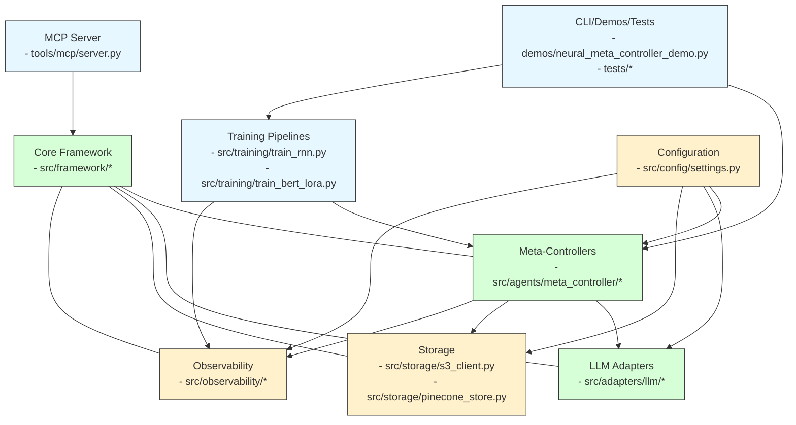

Image export:


## Components (C3)

Mermaid:

```mermaid
graph TB
  subgraph Meta‑Controller
    utils[utils.py\nnormalize_features(10D)\nfeatures_to_text()]:::code
    rnn[RNNMetaController\nGRU(hidden_dim, num_layers)\nDropout -> Linear(3)]:::code
    bert[BERTMetaController\nHF AutoModelForSeqCls\nOptional LoRA(r=4, alpha=16)]:::code
  end

  subgraph Integrations
    pstore[PineconeVectorStore\nVECTOR_DIMENSION=10\nupsert/query in namespace]:::code
    btracker[BraintrustTracker\nexperiment->log_*->summarize]:::code
    s3c[S3StorageClient (async, retries)]:::code
    llm[Adapters: OpenAI, Anthropic, LM Studio]:::code
  end

  utils --> rnn
  utils --> bert
  rnn --> pstore
  bert --> pstore
  rnn --> btracker
  bert --> btracker
  training[Training (RNN/BERT)] --> rnn
  training --> btracker
  rnn --> llm
  bert --> llm
  checkpoints((Checkpoints)) --> s3c

  classDef code fill:#f6f6ff,stroke:#333
```

Image export:


## Key Sequence (C4)

Mermaid:

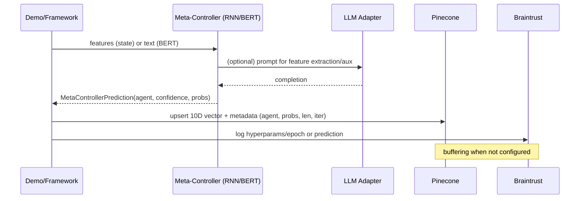

Image export:


## Neural Network Diagrams (Generated via Matplotlib)

- RNN Meta‑Controller (GRU + Dropout + Linear → 3 agents)


- BERT Meta‑Controller (Tokenizer → BERT Sequence Classification → Softmax)
  - Optional LoRA adapters: r=4, α=16, dropout=0.1, target_modules=["query","value"]


## Notes

- Feature vector is fixed 10‑D and normalized to [0,1] (see `src/agents/meta_controller/utils.py`).
- Pinecone index must be configured with dimension 10 (cosine recommended) and can use namespace per environment.
- Training integrates optional Braintrust experiment tracking and W&B for visualization.

# Multi-Agent MCTS Framework Architecture

## C4 Model Diagrams

### Level 1: System Context

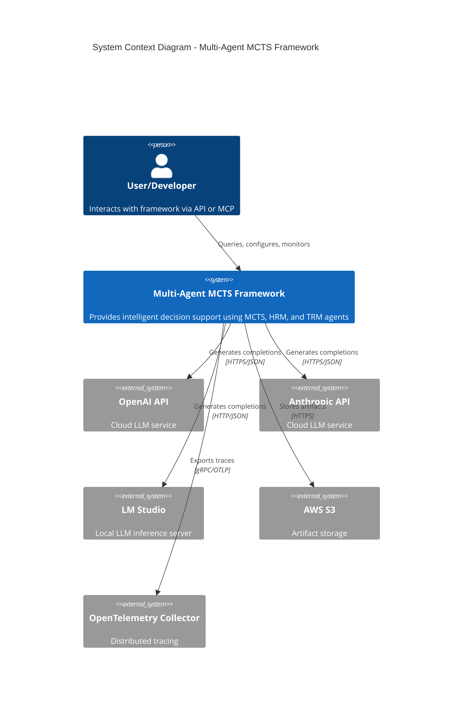

### Level 2: Container Diagram

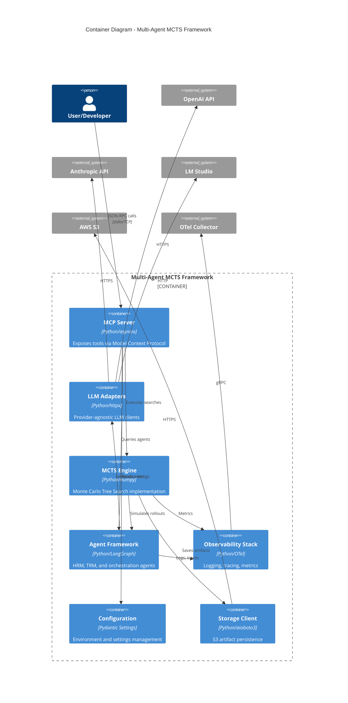

### Level 3: Component Diagram - MCTS Engine

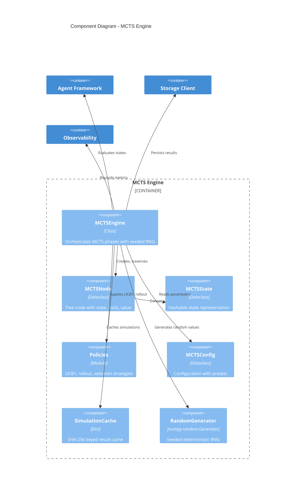

### Level 3: Component Diagram - LLM Adapters

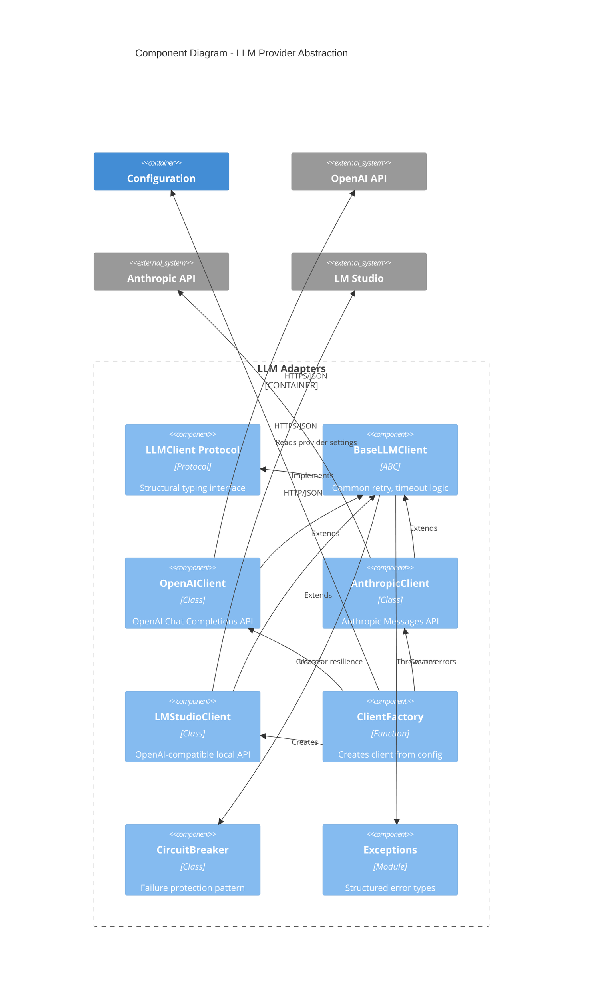

### Level 3: Component Diagram - MCP Server

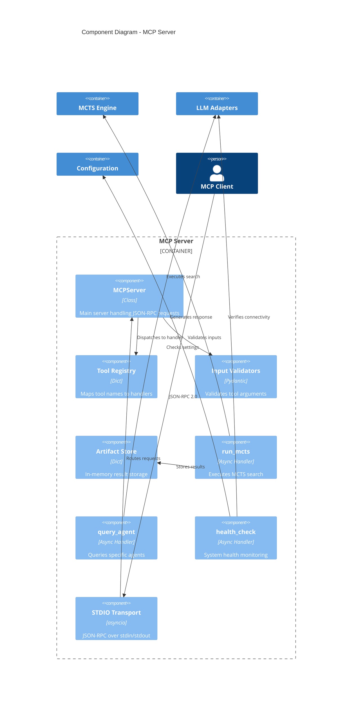

## Data Flow Diagrams

### MCTS Search Flow

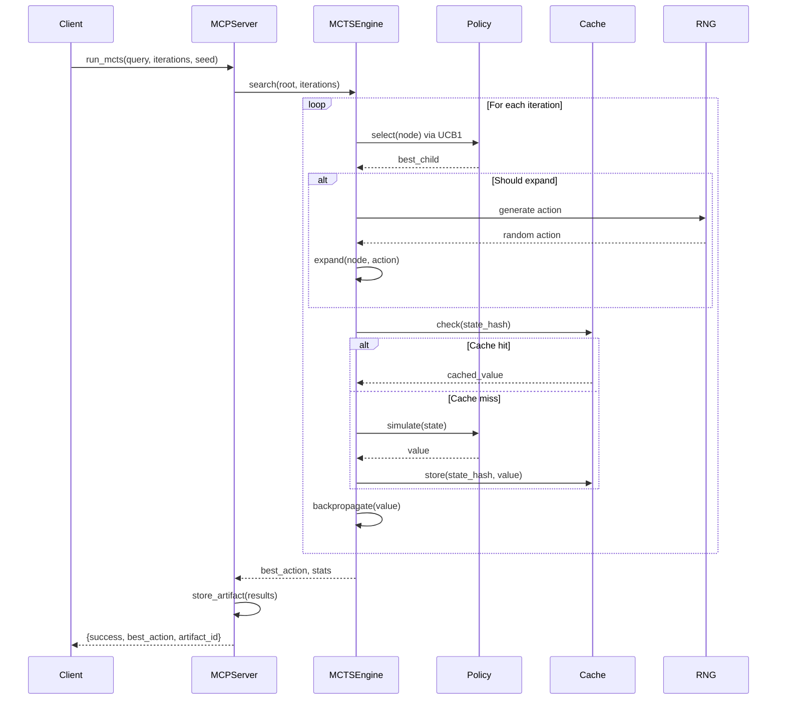

### Provider Selection Flow

```mermaid
flowchart TD
    A[Load .env] --> B{LLM_PROVIDER}
    B -->|openai| C[Create OpenAIClient]
    B -->|anthropic| D[Create AnthropicClient]
    B -->|lmstudio| E[Create LMStudioClient]

    C --> F[Validate OPENAI_API_KEY]
    D --> G[Validate ANTHROPIC_API_KEY]
    E --> H[Validate LMSTUDIO_BASE_URL]

    F --> I[Configure httpx with retries]
    G --> I
    H --> I

    I --> J[Apply circuit breaker]
    J --> K[Return LLMClient instance]

    K --> L{generate() called}
    L --> M[Build request]
    M --> N[Send with timeout]
    N --> O{Success?}

    O -->|Yes| P[Parse response]
    O -->|No| Q{Retry?}
    Q -->|Yes| N
    Q -->|No| R[Raise LLMClientError]

    P --> S[Return LLMResponse]
```

## Deployment Architecture

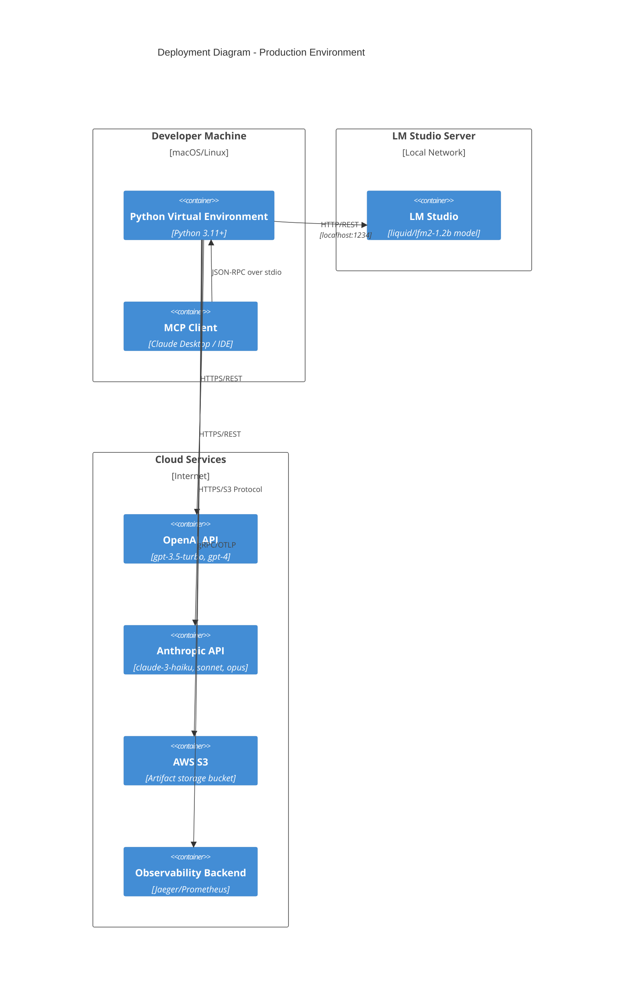

## Security Architecture

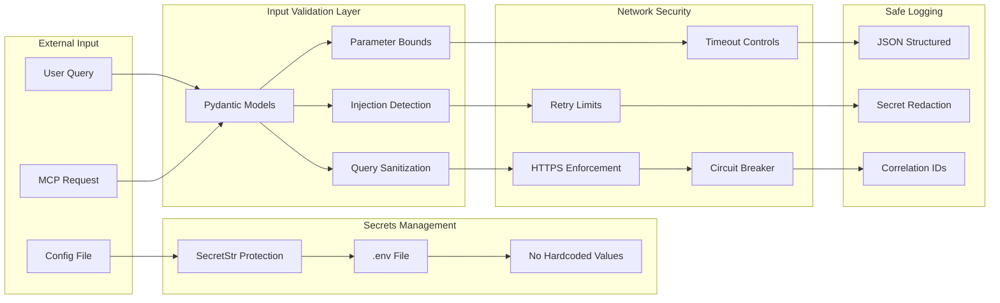

## Production Architecture

### REST API Endpoints

The production REST API provides secure, authenticated access to the Multi-Agent MCTS Framework. Built on FastAPI with OpenAPI 3.1 compliance.

#### Endpoint Summary

| Endpoint | Method | Authentication | Description |
|----------|--------|----------------|-------------|
| `/health` | GET | None | Liveness probe for load balancers |
| `/ready` | GET | None | Readiness probe for Kubernetes |
| `/metrics` | GET | None | Prometheus metrics scrape target |
| `/query` | POST | API Key Required | Main reasoning endpoint |
| `/stats` | GET | API Key Required | Client usage statistics |
| `/docs` | GET | None | Swagger UI documentation |
| `/redoc` | GET | None | ReDoc API documentation |

#### `/health` - Liveness Probe

**Request:**
```http
GET /health HTTP/1.1
Host: api.example.com
```

**Response Schema:**
```json
{
  "status": "healthy",
  "timestamp": "2025-01-15T10:30:00.000000",
  "version": "1.0.0",
  "uptime_seconds": 3600.5
}
```

**Status Codes:**
- `200 OK` - Service is healthy
- `503 Service Unavailable` - Service unhealthy

#### `/ready` - Readiness Probe

**Request:**
```http
GET /ready HTTP/1.1
Host: api.example.com
```

**Response Schema:**
```json
{
  "ready": true,
  "checks": {
    "imports_available": true,
    "authenticator_configured": true,
    "llm_client_available": true,
    "prometheus_available": true
  }
}
```

**Status Codes:**
- `200 OK` - Service ready to accept traffic
- `503 Service Unavailable` - Service not ready (fails K8s readiness check)

#### `/query` - Main Reasoning Endpoint

**Request:**
```http
POST /query HTTP/1.1
Host: api.example.com
Content-Type: application/json
X-API-Key: your-api-key-here

{
  "query": "Recommend defensive positions for night attack scenario",
  "use_mcts": true,
  "use_rag": true,
  "mcts_iterations": 200,
  "thread_id": "session_123"
}
```

**Request Schema (QueryRequest):**
```typescript
{
  query: string;           // Required: 1-10000 characters
  use_mcts?: boolean;      // Default: true - Enable MCTS simulation
  use_rag?: boolean;       // Default: true - Enable RAG retrieval
  mcts_iterations?: number; // Optional: 1-10000, override default
  thread_id?: string;      // Optional: pattern ^[a-zA-Z0-9_-]+$, max 100 chars
}
```

**Response Schema (QueryResponse):**
```json
{
  "response": "Based on analysis by multiple agents...",
  "confidence": 0.85,
  "agents_used": ["hrm", "trm", "mcts"],
  "mcts_stats": {
    "iterations": 200,
    "best_action": "recommended_action",
    "root_visits": 200
  },
  "processing_time_ms": 1523.45,
  "metadata": {
    "client_id": "client_0",
    "thread_id": "session_123",
    "rag_enabled": true
  }
}
```

**Status Codes:**
- `200 OK` - Query processed successfully
- `400 Bad Request` - Validation error (invalid input)
- `401 Unauthorized` - Missing or invalid API key
- `429 Too Many Requests` - Rate limit exceeded (includes `Retry-After` header)
- `500 Internal Server Error` - Framework processing error

#### `/stats` - Client Usage Statistics

**Request:**
```http
GET /stats HTTP/1.1
Host: api.example.com
X-API-Key: your-api-key-here
```

**Response Schema:**
```json
{
  "client_id": "client_0",
  "roles": ["user"],
  "total_requests_today": 150,
  "requests_last_hour": 25,
  "requests_last_minute": 3,
  "rate_limits": {
    "per_minute": 60,
    "per_hour": 1000,
    "per_day": 10000
  }
}
```

#### `/metrics` - Prometheus Metrics

Returns Prometheus text format metrics for scraping:

```
# HELP mcts_requests_total Total number of requests
# TYPE mcts_requests_total counter
mcts_requests_total{method="POST",endpoint="/query",status="200"} 1523

# HELP mcts_request_duration_seconds Request latency in seconds
# TYPE mcts_request_duration_seconds histogram
mcts_request_duration_seconds_bucket{method="POST",endpoint="/query",le="1.0"} 1200

# HELP mcts_active_requests Number of active requests
# TYPE mcts_active_requests gauge
mcts_active_requests 5

# HELP mcts_errors_total Total number of errors
# TYPE mcts_errors_total counter
mcts_errors_total{error_type="validation"} 23
```

#### Authentication Flow

The API uses API key authentication with SHA-256 hashing for secure key storage:

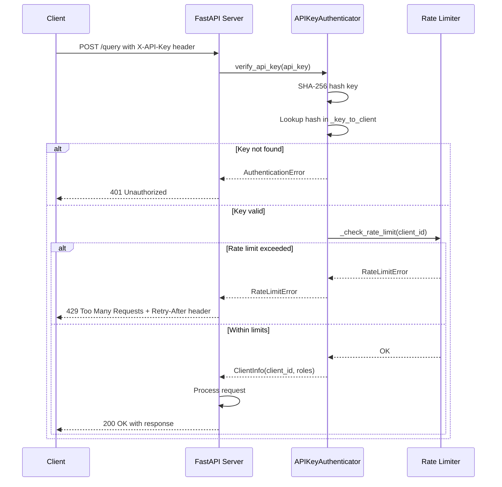

**Rate Limiting Tiers:**
- **Burst Limit**: 100 requests/second (prevents abuse)
- **Per Minute**: 60 requests (standard flow control)
- **Per Hour**: 1000 requests (sustained usage)
- **Per Day**: 10000 requests (daily quota)

**ClientInfo Structure:**
```python
@dataclass
class ClientInfo:
    client_id: str                           # Unique client identifier
    roles: Set[str] = {"user"}               # Default role set
    created_at: datetime = datetime.utcnow() # Registration timestamp
    last_access: datetime = datetime.utcnow()# Last activity
    request_count: int = 0                   # Total requests made
```

---

### Data Models

This section documents the core data structures used throughout the framework.

#### AgentState TypedDict

The central state object for LangGraph workflow management:

```python
class AgentState(TypedDict):
    """Shared state for LangGraph agent framework."""

    # Input fields
    query: str                                    # User query to process
    use_mcts: bool                                # Enable MCTS simulation
    use_rag: bool                                 # Enable RAG retrieval

    # RAG context (optional fields)
    rag_context: NotRequired[str]                 # Retrieved context string
    retrieved_docs: NotRequired[List[Dict]]       # Document metadata

    # Agent results
    hrm_results: NotRequired[Dict]                # HRM agent output
    trm_results: NotRequired[Dict]                # TRM agent output
    agent_outputs: Annotated[List[Dict], operator.add]  # Aggregated outputs

    # MCTS simulation
    mcts_root: NotRequired[MCTSNode]              # Root of MCTS tree
    mcts_iterations: NotRequired[int]             # Iterations performed
    mcts_best_action: NotRequired[str]            # Selected action
    mcts_stats: NotRequired[Dict]                 # Simulation statistics

    # Evaluation
    confidence_scores: NotRequired[Dict[str, float]]  # Per-agent scores
    consensus_reached: NotRequired[bool]          # Consensus flag
    consensus_score: NotRequired[float]           # Aggregated score

    # Control flow
    iteration: int                                # Current iteration number
    max_iterations: int                           # Maximum allowed iterations

    # Output
    final_response: NotRequired[str]              # Synthesized response
    metadata: NotRequired[Dict]                   # Response metadata
```

**Agent Output Structure:**
```python
{
    "agent": "hrm" | "trm" | "mcts",
    "response": str,          # Agent's textual response
    "confidence": float       # 0.0 to 1.0 confidence score
}
```

#### MCTSNode Data Structure

Two implementations exist: a simplified version in the main framework and a production version in `src/framework/mcts/core.py`.

**Simplified MCTSNode (langgraph_multi_agent_mcts.py):**
```python
class MCTSNode:
    state_id: str                           # Unique state identifier
    parent: Optional[MCTSNode]              # Parent node reference
    action: Optional[str]                   # Action taken to reach this node
    children: List[MCTSNode]                # Child nodes
    visits: int                             # Visit count
    value: float                            # Cumulative value
    terminal: bool                          # Terminal state flag

    def ucb1(exploration_weight: float = 1.414) -> float
    def best_child() -> Optional[MCTSNode]
    def add_child(action: str, state_id: str) -> MCTSNode
```

**Production MCTSNode (src/framework/mcts/core.py):**
```python
@dataclass
class MCTSState:
    """Hashable state representation for caching."""
    state_id: str
    features: Dict[str, Any]

    def to_hash_key() -> str  # SHA-256 hash for cache key

class MCTSNode:
    state: MCTSState                        # Hashable state object
    parent: Optional[MCTSNode]
    action: Optional[str]
    children: List[MCTSNode]
    visits: int
    value_sum: float                        # Sum of backpropagated values
    terminal: bool
    expanded_actions: set                   # Actions already expanded
    available_actions: List[str]            # All possible actions
    _rng: np.random.Generator               # Seeded RNG for determinism

    @property
    def value() -> float                    # Average value (value_sum/visits)
    @property
    def is_fully_expanded() -> bool
    def select_child(exploration_weight) -> MCTSNode
    def add_child(action, child_state) -> MCTSNode
    def get_unexpanded_action() -> Optional[str]
```

**MCTSEngine Statistics Output:**
```python
{
    "iterations": int,                      # Total iterations run
    "root_visits": int,                     # Root node visit count
    "root_value": float,                    # Root average value
    "num_children": int,                    # Direct children of root
    "best_action": str,                     # Selected best action
    "best_action_visits": int,              # Visits to best action
    "best_action_value": float,             # Value of best action
    "action_stats": Dict[str, {             # Per-action statistics
        "visits": int,
        "value": float,
        "value_sum": float,
        "num_children": int
    }],
    "total_simulations": int,               # Total simulations performed
    "cache_hits": int,                      # Cache hit count
    "cache_misses": int,                    # Cache miss count
    "cache_hit_rate": float,                # Cache efficiency ratio
    "seed": int                             # Random seed used
}
```

#### Vector Storage Schema (Pinecone 10D)

The neural meta-controller uses a fixed 10-dimensional feature vector for Pinecone vector storage:

**Feature Vector Structure (10 dimensions):**
```python
[
    hrm_confidence,        # [0] HRM agent confidence (0.0-1.0)
    trm_confidence,        # [1] TRM agent confidence (0.0-1.0)
    mcts_value,            # [2] MCTS simulation value (0.0-1.0)
    consensus_score,       # [3] Agent consensus score (0.0-1.0)
    last_agent_hrm,        # [4] One-hot: last agent was HRM (0 or 1)
    last_agent_trm,        # [5] One-hot: last agent was TRM (0 or 1)
    last_agent_mcts,       # [6] One-hot: last agent was MCTS (0 or 1)
    iteration_normalized,  # [7] Current iteration / 20 (0.0-1.0)
    query_length_normalized, # [8] Query length / 10000 (0.0-1.0)
    has_rag_context        # [9] Binary: RAG context available (0 or 1)
]
```

**MetaControllerFeatures Input Structure:**
```python
@dataclass
class MetaControllerFeatures:
    hrm_confidence: float       # 0.0-1.0
    trm_confidence: float       # 0.0-1.0
    mcts_value: float           # 0.0-1.0
    consensus_score: float      # 0.0-1.0
    last_agent: str             # 'hrm', 'trm', 'mcts', or 'none'
    iteration: int              # Current iteration number
    query_length: int           # Character count
    has_rag_context: bool       # Whether RAG context is available
```

**Pinecone Upsert Metadata:**
```python
{
    "agent": str,               # Selected agent name
    "probs": List[float],       # Probability distribution over agents
    "query_length": int,        # Original query length
    "iteration": int,           # Iteration when decision was made
    "timestamp": str            # ISO format timestamp
}
```

**Pinecone Configuration Requirements:**
- **Dimension**: 10 (fixed)
- **Metric**: Cosine similarity (recommended)
- **Namespace**: Per-environment separation (e.g., "production", "staging")
- **Index Type**: Serverless or Pod-based

#### API Request/Response Models

**QueryRequest (Pydantic Model):**
```python
class QueryRequest(BaseModel):
    query: str = Field(
        ...,
        min_length=1,
        max_length=10000,
        description="User query to process"
    )
    use_mcts: bool = Field(default=True)
    use_rag: bool = Field(default=True)
    mcts_iterations: Optional[int] = Field(
        default=None,
        ge=1,
        le=10000
    )
    thread_id: Optional[str] = Field(
        default=None,
        max_length=100,
        pattern=r'^[a-zA-Z0-9_-]+$'
    )
```

**QueryResponse (Pydantic Model):**
```python
class QueryResponse(BaseModel):
    response: str                           # Synthesized final response
    confidence: float                       # 0.0-1.0 overall confidence
    agents_used: List[str]                  # Contributing agents
    mcts_stats: Optional[Dict[str, Any]]    # MCTS simulation stats
    processing_time_ms: float               # Total processing time
    metadata: Dict[str, Any]                # Additional context
```

**ErrorResponse (Pydantic Model):**
```python
class ErrorResponse(BaseModel):
    error: bool = True
    error_code: str                         # Machine-readable code
    message: str                            # Human-readable message
    timestamp: str                          # ISO format timestamp
```

**Custom Exception Hierarchy:**
```
FrameworkError (base)
├── ValidationError      # Input validation failures
├── AuthenticationError  # API key validation failures
├── AuthorizationError   # Permission denied
├── RateLimitError       # Rate limit exceeded
├── LLMError             # LLM provider failures
├── MCTSError            # MCTS simulation failures
├── RAGError             # Vector retrieval failures
├── TimeoutError         # Operation timeouts
└── ConfigurationError   # Configuration errors
```

---

### Configuration Architecture

The framework uses a layered configuration system with Pydantic Settings v2 for type-safe environment variable management.

#### Environment Variable Hierarchy

Configuration is loaded in priority order (highest to lowest):

1. **Explicit Environment Variables** - Set in shell/container
2. **`.env` File** - Project-level configuration file
3. **Default Values** - Defined in Settings class
4. **Computed Defaults** - Validated at runtime

**Loading Mechanism:**
```python
class Settings(BaseSettings):
    model_config = SettingsConfigDict(
        env_file=".env",              # Load from .env file
        env_file_encoding="utf-8",    # UTF-8 encoding
        case_sensitive=True,          # Exact case matching
        extra="ignore",               # Ignore unknown variables
        validate_default=True,        # Validate defaults on load
    )
```

#### Core Configuration Categories

**LLM Provider Configuration:**
```bash
LLM_PROVIDER=openai|anthropic|lmstudio  # Default: openai
OPENAI_API_KEY=sk-...                    # Required if provider=openai
ANTHROPIC_API_KEY=sk-ant-...             # Required if provider=anthropic
LMSTUDIO_BASE_URL=http://localhost:1234/v1  # Required if provider=lmstudio
LMSTUDIO_MODEL=liquid/lfm2-1.2b         # Optional model identifier
```

**MCTS Configuration:**
```bash
MCTS_ITERATIONS=100          # Default: 100, Range: 1-10000
MCTS_C=1.414                 # Default: 1.414, Range: 0.0-10.0 (UCB1 constant)
SEED=42                      # Optional: Random seed for reproducibility
```

**Integration Services:**
```bash
BRAINTRUST_API_KEY=bt-...    # Optional: Experiment tracking
PINECONE_API_KEY=pc-...      # Optional: Vector storage
PINECONE_HOST=https://index-name.svc.environment.pinecone.io
```

**Storage Configuration:**
```bash
S3_BUCKET=my-bucket-name     # Optional: Artifact storage
S3_PREFIX=mcts-artifacts     # Default: mcts-artifacts
S3_REGION=us-east-1          # Default: us-east-1
```

**Network & Security:**
```bash
HTTP_TIMEOUT_SECONDS=30              # Range: 1-300
HTTP_MAX_RETRIES=3                   # Range: 0-10
MAX_QUERY_LENGTH=10000               # Range: 1-100000
RATE_LIMIT_REQUESTS_PER_MINUTE=60    # Range: 1-1000
```

**Observability:**
```bash
LOG_LEVEL=DEBUG|INFO|WARNING|ERROR|CRITICAL  # Default: INFO
OTEL_EXPORTER_OTLP_ENDPOINT=http://collector:4317  # OpenTelemetry
```

#### Settings.py Integration

The `src/config/settings.py` module provides:

**1. Type-Safe Loading:**
```python
from src.config.settings import get_settings, Settings

settings = get_settings()  # Singleton pattern, cached after first load
```

**2. Secret Protection:**
```python
# API keys use SecretStr to prevent accidental exposure
settings.OPENAI_API_KEY        # Returns SecretStr object
settings.get_api_key()         # Returns actual string value (use carefully)
settings.safe_dict()           # Returns dict with secrets masked as ***MASKED***
```

**3. Provider Validation:**
```python
@model_validator(mode="after")
def validate_provider_credentials(self) -> "Settings":
    """Ensure required API keys are provided for selected provider."""
    if self.LLM_PROVIDER == LLMProvider.OPENAI:
        if self.OPENAI_API_KEY is None:
            raise ValueError("OPENAI_API_KEY is required...")
    # Similar checks for other providers
```

**4. Format Validation:**
```python
@field_validator("OPENAI_API_KEY")
def validate_openai_key_format(cls, v):
    # Checks for placeholder values, correct prefix (sk-), minimum length
    pass

@field_validator("PINECONE_HOST")
def validate_pinecone_host(cls, v):
    # Ensures https:// prefix and pinecone.io domain
    pass

@field_validator("S3_BUCKET")
def validate_s3_bucket_name(cls, v):
    # Validates S3 bucket naming rules (3-63 chars, no special chars)
    pass
```

**5. Safe Logging:**
```python
def __repr__(self) -> str:
    """Safe string representation that doesn't expose secrets."""
    return f"Settings(LLM_PROVIDER={self.LLM_PROVIDER}, LOG_LEVEL={self.LOG_LEVEL})"
```

#### Optional Dependency Flags

The framework uses runtime import checking for optional features:

**Pattern:**
```python
try:
    from prometheus_client import Counter, Histogram
    PROMETHEUS_AVAILABLE = True
except ImportError:
    PROMETHEUS_AVAILABLE = False

# Later in code:
if PROMETHEUS_AVAILABLE:
    REQUEST_COUNT.labels(...).inc()
```

**Optional Dependencies:**
- `IMPORTS_AVAILABLE` - Core framework imports (validation models, auth)
- `PROMETHEUS_AVAILABLE` - Prometheus metrics collection
- `VALIDATION_AVAILABLE` - Input validation models
- `EXCEPTIONS_AVAILABLE` - Custom exception hierarchy
- `Chroma` / `FAISS` - Vector store implementations
- `OpenAIEmbeddings` - Embedding model support

**Graceful Degradation:**
```python
if not IMPORTS_AVAILABLE:
    raise HTTPException(status_code=500, detail="Authentication module not available")

if not PROMETHEUS_AVAILABLE:
    raise HTTPException(status_code=501, detail="Prometheus metrics not available")
```

---

### Component Interactions

This section details how the REST API integrates with the core framework and how the neural meta-controller makes routing decisions.

#### REST API to Framework Connection

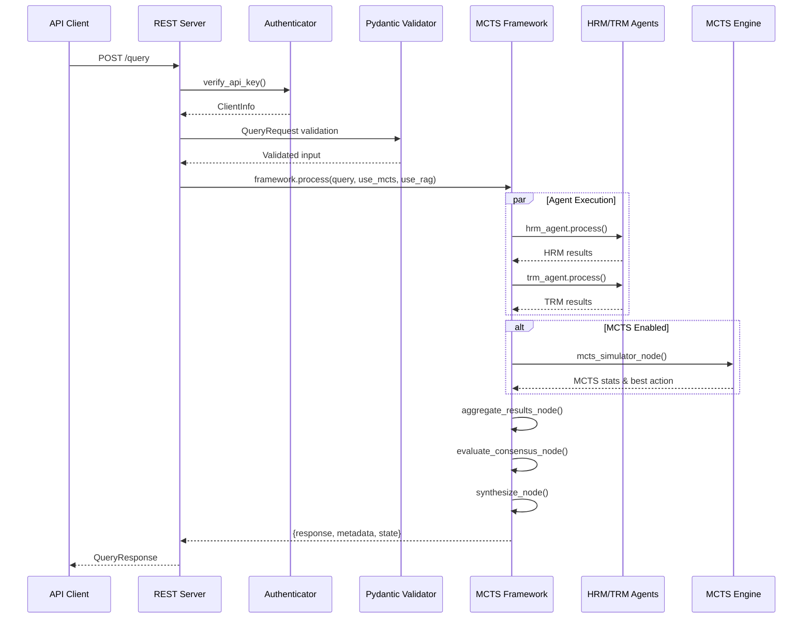

**Integration Points:**

1. **Request Validation Layer:**
   ```python
   # REST Server validates request
   validated_input = QueryInput(
       query=request.query,
       use_rag=request.use_rag,
       use_mcts=request.use_mcts,
       thread_id=request.thread_id,
   )
   ```

2. **Framework Invocation:**
   ```python
   result = await framework.process(
       query=validated_query,
       use_rag=request.use_rag,
       use_mcts=request.use_mcts,
       mcts_iterations=request.mcts_iterations,
       thread_id=request.thread_id,
   )
   ```

3. **Response Construction:**
   ```python
   return QueryResponse(
       response=result["response"],
       confidence=result["metadata"]["consensus_score"],
       agents_used=result["metadata"]["agents_used"],
       mcts_stats=result["metadata"].get("mcts_stats"),
       processing_time_ms=elapsed_time,
       metadata={"client_id": client_info.client_id, ...}
   )
   ```

#### Neural Meta-Controller Routing Decision Flow

The neural meta-controller (RNN or BERT) dynamically selects which agent to execute based on current state features:

```mermaid
flowchart TD
    A[Current AgentState] --> B[Extract Features]
    B --> C{Meta-Controller Type}

    C -->|RNN| D[normalize_features]
    D --> E[10D Feature Vector]
    E --> F[RNN Forward Pass]
    F --> G[GRU + Dropout + Linear]

    C -->|BERT| H[features_to_text]
    H --> I[Text Description]
    I --> J[BERT Tokenizer]
    J --> K[BERT Sequence Classification]

    G --> L[Softmax Output]
    K --> L

    L --> M{Agent Selection}
    M -->|P(HRM) highest| N[Execute HRM Agent]
    M -->|P(TRM) highest| O[Execute TRM Agent]
    M -->|P(MCTS) highest| P[Execute MCTS Simulation]

    N --> Q[Update State]
    O --> Q
    P --> Q

    Q --> R{Consensus Reached?}
    R -->|No| A
    R -->|Yes| S[Synthesize Response]

    subgraph Feature Extraction
        B
        D
        E
        H
        I
    end

    subgraph Neural Network
        F
        G
        J
        K
        L
    end

    subgraph Agent Execution
        N
        O
        P
    end
```

**Feature Extraction Process:**

1. **RNN Meta-Controller:**
   ```python
   # Extract 10D normalized features
   features = normalize_features(MetaControllerFeatures(
       hrm_confidence=state["confidence_scores"].get("hrm", 0.0),
       trm_confidence=state["confidence_scores"].get("trm", 0.0),
       mcts_value=state["mcts_stats"]["best_action_value"] if state.get("mcts_stats") else 0.0,
       consensus_score=state.get("consensus_score", 0.0),
       last_agent=state["agent_outputs"][-1]["agent"] if state["agent_outputs"] else "none",
       iteration=state["iteration"],
       query_length=len(state["query"]),
       has_rag_context=bool(state.get("rag_context"))
   ))
   # features -> [hrm_conf, trm_conf, mcts_val, consensus, hrm_onehot, trm_onehot, mcts_onehot, iter_norm, len_norm, has_rag]
   ```

2. **BERT Meta-Controller:**
   ```python
   # Convert to structured text
   text = features_to_text(features)
   # Example output:
   # "Agent State Features:
   #  HRM confidence: 0.800
   #  TRM confidence: 0.600
   #  MCTS value: 0.750
   #  Consensus score: 0.700
   #  Last agent used: hrm
   #  Current iteration: 2
   #  Query length: 150 characters
   #  RAG context: available"
   ```

**Routing Decision Logic:**

```python
class RNNMetaController:
    def forward(self, x):
        # x: (batch_size, 10) normalized features
        gru_out, hidden = self.gru(x.unsqueeze(1))  # Add sequence dim
        dropped = self.dropout(gru_out[:, -1, :])    # Take last output
        logits = self.fc(dropped)                    # Linear to 3 classes
        return F.softmax(logits, dim=1)              # Probability over agents

    def predict(self, features):
        probs = self.forward(features)  # [P(HRM), P(TRM), P(MCTS)]
        agent_idx = torch.argmax(probs)
        return {
            "agent": ["hrm", "trm", "mcts"][agent_idx],
            "confidence": probs[agent_idx].item(),
            "probs": probs.tolist()
        }
```

**Integration with LangGraph:**

```python
# In route_decision_node or custom routing logic
def route_with_meta_controller(state: AgentState) -> str:
    # Build features from current state
    features = extract_meta_controller_features(state)

    # Get prediction from neural controller
    prediction = meta_controller.predict(features)

    # Log decision to Pinecone for future training
    if pinecone_store:
        pinecone_store.upsert(
            vectors=[(state_id, normalize_features(features))],
            metadata={"agent": prediction["agent"], "probs": prediction["probs"]}
        )

    # Log to Braintrust for experiment tracking
    if braintrust_tracker:
        braintrust_tracker.log_prediction(prediction)

    return prediction["agent"]
```

**Confidence-Based Fallback:**

```python
def route_with_confidence_threshold(state: AgentState, threshold: float = 0.6) -> str:
    prediction = meta_controller.predict(state_features)

    if prediction["confidence"] >= threshold:
        return prediction["agent"]
    else:
        # Fallback to rule-based routing when confidence is low
        if "hrm_results" not in state:
            return "hrm"
        elif "trm_results" not in state:
            return "trm"
        else:
            return "mcts" if state["use_mcts"] else "aggregate"
```

---

### Docker Deployment Stack

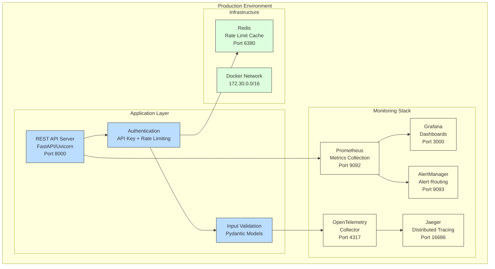

### REST API Architecture

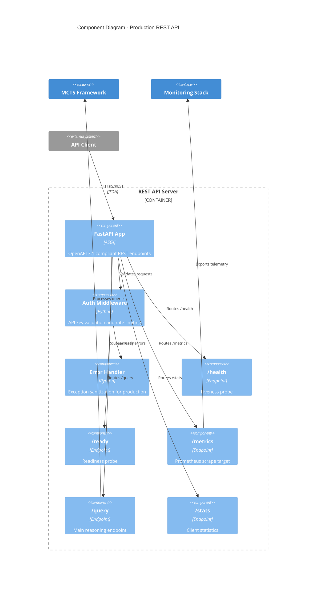

### Kubernetes Deployment

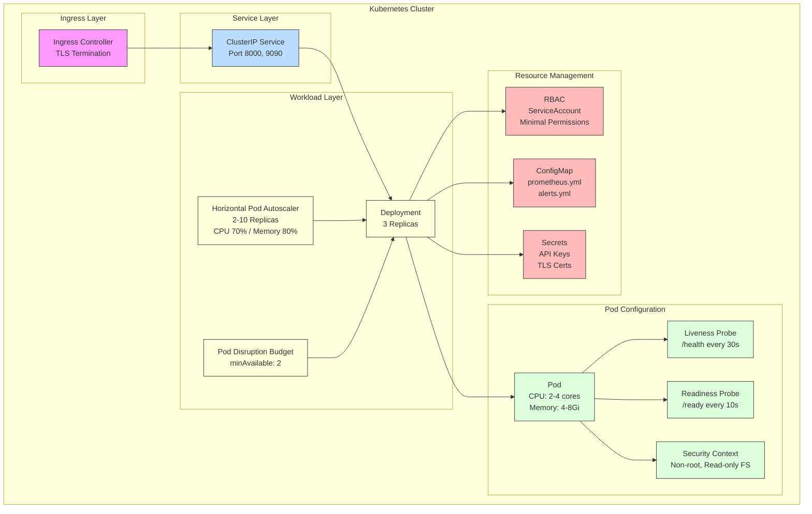

### Service Level Architecture

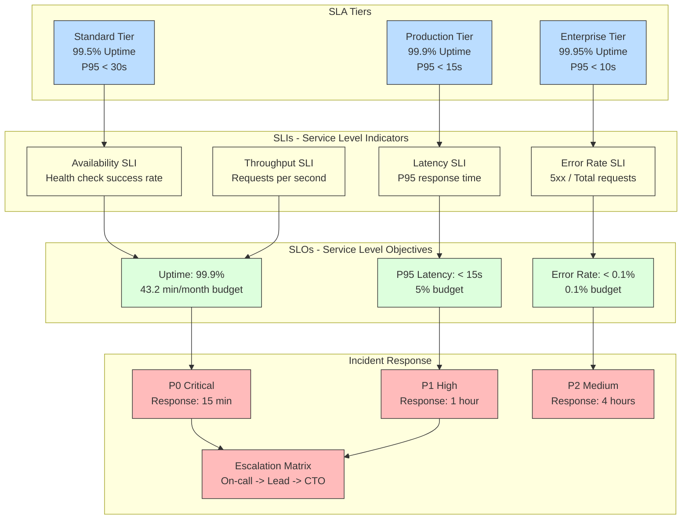

## Technology Stack

| Layer | Technology | Purpose |
|-------|-----------|---------|
| **Runtime** | Python 3.11+ | Core language with async support |
| **Web Framework** | FastAPI 0.110 | Production REST API with OpenAPI 3.1 |
| **ASGI Server** | Uvicorn 0.28 | High-performance async server |
| **HTTP Client** | httpx 0.25 | Async HTTP with connection pooling |
| **Validation** | Pydantic v2.6 | Type-safe configuration and input validation |
| **Configuration** | pydantic-settings | Environment variable management |
| **State Machine** | LangGraph 0.0.66 | Agent orchestration and graph workflows |
| **Authentication** | PyJWT 2.8 | API key and JWT token validation |
| **Rate Limiting** | Redis 7 | Distributed rate limit enforcement |
| **Containerization** | Docker + multi-stage | Security-hardened production images |
| **Orchestration** | Kubernetes | Auto-scaling, health checks, rolling updates |
| **Metrics** | Prometheus 2.48 | Time-series metrics and alerting |
| **Dashboards** | Grafana 10.2 | Visualization and monitoring |
| **Tracing** | Jaeger + OpenTelemetry | Distributed tracing and spans |
| **Storage** | aioboto3 12.3 | Async AWS S3 operations |
| **Testing** | pytest 8.1 + coverage | Comprehensive test suite with coverage |
| **Load Testing** | Custom + Hypothesis | Performance and property-based testing |
| **Chaos Testing** | Custom resilience tests | Fault injection and degradation testing |
| **Linting** | ruff 0.3.4 | Fast Python linting |
| **Type Checking** | mypy 1.9 | Static type analysis |
| **CI/CD** | GitHub Actions | Automated testing and deployment |
| **Documentation** | OpenAPI + Swagger UI | Interactive API documentation |
