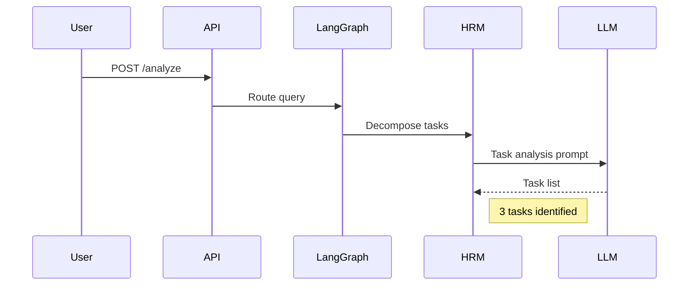

# Comprehensive Lab Exercises
## LangGraph Multi-Agent MCTS Training Program

**Purpose:** Hands-on exercises to reinforce learning across all 7 modules
**Format:** Progressive difficulty, building on existing tests and examples
**Time:** 30-40 hours total (self-paced)

---

## Table of Contents

1. [Module 1 Labs: Architecture](#module-1-labs-architecture)
2. [Module 2 Labs: Agents](#module-2-labs-agents)
3. [Module 3 Labs: E2E Flows](#module-3-labs-e2e-flows)
4. [Module 4 Labs: Tracing](#module-4-labs-tracing)
5. [Module 5 Labs: Experiments](#module-5-labs-experiments)
6. [Module 6 Labs: Python Best Practices](#module-6-labs-python-best-practices)
7. [Module 7 Labs: CI/CD](#module-7-labs-cicd)
8. [Capstone Project](#capstone-project)

---

## Module 1 Labs: Architecture

### Lab 1.1: Codebase Navigation (30 minutes)

**Objective:** Learn to navigate the codebase using architecture documentation.

**Setup:**
```bash
cd langgraph_multi_agent_mcts
git checkout feature/training-plan-implementation
```

**Tasks:**

1. **Find API Route (5 minutes)**
   - Open [docs/architecture.md](../architecture.md)
   - Locate the file containing the `/analyze` REST endpoint
   - Document: File path and line number

2. **Locate HRM Logic (5 minutes)**
   - Find where HRM performs task decomposition
   - Document: Function name and file path

3. **Find MCTS UCB1 (10 minutes)**
   - Locate the UCB1 selection algorithm implementation
   - Document: File path and the UCB1 formula used

4. **Trace Initialization (10 minutes)**
   - Find where LangSmith tracing is initialized
   - Document: Environment variables required and initialization code

**Deliverable:**
Create `lab_1_1_navigation.md` with all file paths and line numbers.

**Solution:** Available in [solutions/lab_1_1_solution.md](solutions/lab_1_1_solution.md)

---

### Lab 1.2: Trace a Sample Query (45 minutes)

**Objective:** Follow a complete query through the system and analyze the trace.

**Setup:**
```bash
# Ensure LangSmith is configured
export LANGSMITH_API_KEY="your-key-here"
export LANGSMITH_PROJECT="training-module-1"
```

**Tasks:**

1. **Run Traced Test (5 minutes)**
   ```bash
   python scripts/smoke_test_traced.py
   ```

2. **Analyze Trace (20 minutes)**
   - Open LangSmith UI: https://smith.langchain.com/
   - Find your trace (filter by project: training-module-1)
   - Answer these questions:
     * What was the total latency?
     * How many LLM calls were made?
     * What tasks did HRM identify?
     * How many TRM refinement rounds occurred?
     * Was MCTS invoked? With how many iterations?

3. **Create Sequence Diagram (20 minutes)**
   - Using the trace data, create a sequence diagram showing:
     * API Gateway → LangGraph
     * LangGraph → HRM → LLM
     * LangGraph → TRM → LLM (multiple rounds)
     * LangGraph → MCTS (if applicable)
     * Response assembly and return

**Deliverable:**
- `lab_1_2_analysis.md` with answers
- `lab_1_2_sequence_diagram.png` or Mermaid code

**Hint:** Use Mermaid for diagrams:


**Solution:** Available in [solutions/lab_1_2_solution.md](solutions/lab_1_2_solution.md)

---

### Lab 1.3: Design an Extension (30 minutes)

**Objective:** Plan how to add a new agent to the system.

**Scenario:**
You need to add a **Risk Assessment Module (RAM)** that:
- Evaluates potential risks before TRM refinement
- Only runs for queries tagged as "high-stakes"
- Outputs a risk score (0.0 - 1.0) and risk factors

**Tasks:**

1. **Architecture Modification (15 minutes)**
   - Where in the LangGraph state machine should RAM be added?
   - What changes are needed to `AgentState` TypedDict?
   - Draw the new LangGraph node diagram

2. **Conditional Logic (10 minutes)**
   - Write pseudocode for the conditional edge that determines if RAM should run
   - Consider: What criteria identify "high-stakes" queries?

3. **Tracing Strategy (5 minutes)**
   - How would you trace RAM's execution?
   - What metadata should be captured?

**Deliverable:**
`lab_1_3_extension_plan.md` with:
- Updated LangGraph diagram
- `AgentState` modifications (code)
- Conditional logic (pseudocode)
- Tracing decorator design

**Solution:** Available in [solutions/lab_1_3_solution.md](solutions/lab_1_3_solution.md)

---

## Module 2 Labs: Agents

### Lab 2.1: Modify HRM Behavior (90 minutes)

**Objective:** Extend HRM to add a new decomposition strategy.

**Current Behavior:**
HRM uses a single decomposition strategy for all queries.

**New Requirement:**
Implement **domain-aware decomposition** that uses different strategies for:
- **Tactical queries:** Focus on objectives, terrain, force composition
- **Cybersecurity queries:** Focus on threat vectors, vulnerabilities, mitigations

**Tasks:**

1. **Analyze Current Implementation (20 minutes)**
   - Read [src/agents/hrm_agent.py](../../src/agents/hrm_agent.py)
   - Identify the decomposition function
   - Review tests: [tests/components/test_hrm_agent_traced.py](../../tests/components/test_hrm_agent_traced.py)

2. **Implement Domain Detection (30 minutes)**
   - Add a function to detect query domain (tactical vs. cybersecurity)
   - Use keyword matching or LLM-based classification
   - Write unit tests for domain detection

3. **Implement Domain-Specific Decomposition (30 minutes)**
   - Create two decomposition strategies
   - Route to appropriate strategy based on domain
   - Ensure both strategies return the same output format

4. **Update Tests (10 minutes)**
   - Modify [tests/components/test_hrm_agent_traced.py](../../tests/components/test_hrm_agent_traced.py)
   - Add test cases for both domains
   - Verify LangSmith traces show domain metadata

**Deliverable:**
- Modified `hrm_agent.py` with domain-aware decomposition
- Updated tests with new test cases
- LangSmith trace screenshots showing domain metadata

**Starter Code:**
```python
def detect_domain(query: str) -> str:
    """Detect if query is tactical or cybersecurity."""
    # TODO: Implement domain detection
    pass

def decompose_tactical(query: str) -> List[str]:
    """Decompose tactical queries."""
    # TODO: Implement tactical decomposition
    pass

def decompose_cybersecurity(query: str) -> List[str]:
    """Decompose cybersecurity queries."""
    # TODO: Implement cybersecurity decomposition
    pass
```

**Solution:** Available in [solutions/lab_2_1_solution.py](solutions/lab_2_1_solution.py)

---

### Lab 2.2: Tune TRM Refinement (60 minutes)

**Objective:** Experiment with TRM refinement parameters and measure impact.

**Current Behavior:**
TRM refines for a fixed number of iterations or until convergence.

**Experiment:**
Compare refinement quality vs. latency for different configurations.

**Tasks:**

1. **Baseline Measurement (15 minutes)**
   - Run [tests/components/test_trm_agent_traced.py](../../tests/components/test_trm_agent_traced.py)
   - Record: iterations, latency, final quality (subjective 1-5 rating)

2. **Adjust Convergence Threshold (20 minutes)**
   - Modify convergence detection threshold (e.g., 5% → 10% improvement required)
   - Re-run tests, record results
   - Compare: Did this reduce iterations? Impact on quality?

3. **Set Max Iterations (15 minutes)**
   - Add a max_iterations parameter (e.g., 3, 5, 10)
   - Re-run tests, record results
   - Find optimal balance between quality and latency

4. **Document Findings (10 minutes)**
   - Create a table comparing configurations
   - Recommend optimal settings for production

**Deliverable:**
`lab_2_2_trm_tuning_report.md` with:
- Results table (config | iterations | latency | quality)
- Recommendation with justification
- LangSmith trace links for each configuration

**Solution:** Available in [solutions/lab_2_2_solution.md](solutions/lab_2_2_solution.md)

---

### Lab 2.3: Debug MCTS Behavior (90 minutes)

**Objective:** Debug an MCTS issue and optimize performance.

**Scenario:**
You notice that MCTS sometimes selects suboptimal moves. Your task is to:
1. Reproduce the issue
2. Diagnose the root cause
3. Propose and test a fix

**Tasks:**

1. **Reproduce Issue (20 minutes)**
   - Run [tests/components/test_mcts_agent_traced.py](../../tests/components/test_mcts_agent_traced.py)
   - Create a test case where MCTS selects a clearly suboptimal move
   - Document: Expected vs. actual behavior

2. **Analyze Trace (30 minutes)**
   - Examine the LangSmith trace for the failing test
   - Review MCTS tree structure: visit counts, win rates
   - Identify: Is this an exploration/exploitation imbalance?

3. **Diagnose Root Cause (20 minutes)**
   - Review UCB1 implementation
   - Check: Is exploration_constant appropriate?
   - Check: Are win rates calculated correctly?
   - Check: Is the simulation rollout biased?

4. **Propose and Test Fix (20 minutes)**
   - Implement a fix (e.g., adjust exploration_constant)
   - Re-run tests, verify improvement
   - Document: What changed and why

**Deliverable:**
`lab_2_3_mcts_debug_report.md` with:
- Issue description and reproduction steps
- Trace analysis and root cause
- Fix description and code diff
- Before/after comparison

**Hint:** Common issues:
- Exploration constant too high/low
- Insufficient iterations for complex trees
- Biased simulation rollouts

**Solution:** Available in [solutions/lab_2_3_solution.md](solutions/lab_2_3_solution.md)

---

## Module 3 Labs: E2E Flows

### Lab 3.1: Add New E2E Scenario (2 hours)

**Objective:** Implement a new end-to-end scenario from scratch.

**Scenario:**
Create a **Logistics Optimization** scenario:
- **Query:** "Optimize supply chain routing for 5 distribution centers to 20 retail locations."
- **Expected Flow:** HRM → TRM → MCTS (decision tree for routing)
- **Success Criteria:** Returns optimal routes with cost and time estimates

**Tasks:**

1. **Design Scenario (30 minutes)**
   - Define input format (query + context data)
   - Define expected output format
   - Identify: Which agents are needed (HRM-only, HRM+TRM, or full-stack)?

2. **Create Test Fixture (30 minutes)**
   - Add scenario to [tests/fixtures/tactical_scenarios.py](../../tests/fixtures/tactical_scenarios.py)
   - Include: query, expected tasks, expected solution quality metrics

3. **Implement E2E Test (45 minutes)**
   - Create new test in [tests/e2e/test_agent_specific_flows.py](../../tests/e2e/test_agent_specific_flows.py)
   - Use `@trace_e2e_test` decorator
   - Assert: HRM tasks, TRM refinement, MCTS result (if applicable)

4. **Run and Debug (15 minutes)**
   - Run test: `pytest tests/e2e/test_agent_specific_flows.py::test_logistics_optimization -v`
   - If failing, use LangSmith trace to debug
   - Iterate until passing

**Deliverable:**
- Updated `tactical_scenarios.py` with logistics scenario
- New test function `test_logistics_optimization_flow`
- Passing test with LangSmith trace link

**Starter Code:**
```python
@trace_e2e_test(scenario="logistics_optimization")
def test_logistics_optimization_flow():
    """Test logistics optimization with full-stack approach."""
    query = "Optimize supply chain routing for 5 distribution centers to 20 retail locations."

    # TODO: Run through LangGraph
    result = langgraph_app.invoke({"query": query})

    # TODO: Assert HRM tasks
    assert len(result["decomposed_tasks"]) >= 3

    # TODO: Assert TRM refinement
    assert result["refined_solution"] is not None

    # TODO: Assert MCTS result
    assert result["mcts_result"]["best_path"] is not None
```

**Solution:** Available in [solutions/lab_3_1_solution.py](solutions/lab_3_1_solution.py)

---

### Lab 3.2: Implement Custom State Transition (90 minutes)

**Objective:** Add a new state transition to the LangGraph state machine.

**Scenario:**
Add a **validation phase** after TRM refinement:
- Checks if TRM solution meets quality threshold
- If yes: proceed to MCTS (if needed) or return
- If no: loop back to TRM for additional refinement

**Tasks:**

1. **Modify AgentState (15 minutes)**
   - Add fields: `validation_passed`, `validation_score`, `refinement_attempts`
   - Update [examples/langgraph_multi_agent_mcts.py](../../examples/langgraph_multi_agent_mcts.py)

2. **Implement Validation Node (30 minutes)**
   - Create `validation_node` function
   - Calculate quality score (e.g., check for completeness, clarity)
   - Set `validation_passed` flag

3. **Add Conditional Edge (20 minutes)**
   - After TRM, route to validation_node
   - From validation_node:
     * If passed → MCTS or END
     * If failed and refinement_attempts < 3 → back to TRM
     * If failed and refinement_attempts >= 3 → END with warning

4. **Test New Flow (25 minutes)**
   - Create test case with low-quality initial solution
   - Verify: Does it loop back to TRM?
   - Verify: Does it eventually pass or hit max attempts?

**Deliverable:**
- Updated `langgraph_multi_agent_mcts.py` with validation logic
- New test case demonstrating validation loop
- LangSmith trace showing loop-back behavior

**Starter Code:**
```python
def validation_node(state: AgentState) -> AgentState:
    """Validate TRM solution quality."""
    solution = state["refined_solution"]

    # TODO: Calculate quality score
    quality_score = calculate_quality(solution)

    # TODO: Update state
    return {
        **state,
        "validation_score": quality_score,
        "validation_passed": quality_score >= 0.8,
        "refinement_attempts": state.get("refinement_attempts", 0) + 1
    }

def route_after_validation(state: AgentState) -> str:
    """Route based on validation result."""
    # TODO: Implement routing logic
    pass
```

**Solution:** Available in [solutions/lab_3_2_solution.py](solutions/lab_3_2_solution.py)

---

## Module 4 Labs: Tracing

### Lab 4.1: Instrument New Test with Tracing (60 minutes)

**Objective:** Add comprehensive LangSmith tracing to an untraced test.

**Target Test:**
Choose an untraced test from [tests/unit/](../../tests/unit/)

**Tasks:**

1. **Review Tracing Utilities (15 minutes)**
   - Read [tests/utils/langsmith_tracing.py](../../tests/utils/langsmith_tracing.py)
   - Understand: `@trace_e2e_test`, `update_run_metadata`, `add_run_tag`

2. **Add Tracing Decorator (10 minutes)**
   - Apply `@trace_e2e_test` decorator to test function
   - Add appropriate scenario tag (e.g., `scenario="hrm_unit_test"`)

3. **Add Custom Metadata (20 minutes)**
   - Inside the test, use `update_run_metadata` to capture:
     * Input parameters
     * Intermediate results
     * Performance metrics (latency, token count)

4. **Run and Verify (15 minutes)**
   - Run test with tracing enabled
   - Open LangSmith UI, find the trace
   - Verify: All metadata appears correctly

**Deliverable:**
- Updated test file with tracing
- LangSmith trace link
- Screenshot showing custom metadata

**Example:**
```python
from tests.utils.langsmith_tracing import trace_e2e_test, update_run_metadata, add_run_tag

@trace_e2e_test(scenario="hrm_decomposition_unit")
def test_hrm_decompose():
    """Test HRM task decomposition."""
    query = "Sample tactical query"

    # Decompose
    start_time = time.time()
    tasks = hrm_agent.decompose(query)
    latency = time.time() - start_time

    # Add metadata
    update_run_metadata({
        "query_length": len(query),
        "tasks_count": len(tasks),
        "latency_ms": latency * 1000
    })

    add_run_tag("unit_test")
    add_run_tag("hrm_agent")

    assert len(tasks) > 0
```

**Solution:** Available in [solutions/lab_4_1_solution.py](solutions/lab_4_1_solution.py)

---

### Lab 4.2: Create Custom Dashboard (45 minutes)

**Objective:** Build a LangSmith dashboard for monitoring specific scenarios.

**Scenario:**
Create a dashboard that shows:
- E2E latency trends over time
- Success rate by scenario type (tactical vs. cybersecurity)
- LLM token usage by agent (HRM, TRM, MCTS)

**Tasks:**

1. **Filter Traces (10 minutes)**
   - In LangSmith UI, create filters:
     * Tag: `e2e`
     * Project: `training-module-4`
     * Date range: Last 7 days

2. **Create Latency Chart (10 minutes)**
   - Chart type: Line chart
   - X-axis: Time
   - Y-axis: Total latency (ms)
   - Group by: scenario

3. **Create Success Rate Chart (15 minutes)**
   - Chart type: Bar chart
   - X-axis: Scenario type (tactical, cybersecurity)
   - Y-axis: Success rate (%)
   - Define success: No errors + validation_passed

4. **Create Token Usage Table (10 minutes)**
   - Table columns: Agent, Total tokens, Avg tokens per call
   - Filter by: phase:hrm, phase:trm, phase:mcts

**Deliverable:**
- LangSmith dashboard link (shareable)
- Screenshot of dashboard
- Brief description of insights gained

**Solution:** Available in [solutions/lab_4_2_solution.md](solutions/lab_4_2_solution.md)

---

## Module 5 Labs: Experiments

### Lab 5.1: Create Custom Dataset (90 minutes)

**Objective:** Build a LangSmith dataset for a new domain.

**Domain:**
Create a **Financial Analysis** dataset with 5 scenarios:
1. Portfolio optimization
2. Risk assessment
3. Market trend analysis
4. Fraud detection
5. Investment recommendation

**Tasks:**

1. **Design Scenarios (30 minutes)**
   - For each scenario, define:
     * Input query
     * Expected output structure
     * Success criteria (quantitative metrics)

2. **Create Dataset Script (30 minutes)**
   - Use [scripts/create_langsmith_datasets.py](../../scripts/create_langsmith_datasets.py) as template
   - Add financial_analysis_dataset with 5 examples
   - Include: inputs, expected outputs, metadata

3. **Upload to LangSmith (15 minutes)**
   - Run the script to create dataset
   - Verify in LangSmith UI: All 5 examples present

4. **Document Dataset (15 minutes)**
   - Create `financial_analysis_dataset_README.md`
   - Describe: Purpose, scenarios, evaluation criteria

**Deliverable:**
- Updated `create_langsmith_datasets.py` with financial dataset
- LangSmith dataset link
- Dataset README

**Starter Code:**
```python
def create_financial_analysis_dataset():
    """Create financial analysis evaluation dataset."""
    examples = [
        {
            "inputs": {"query": "Optimize a portfolio of 10 tech stocks for maximum Sharpe ratio."},
            "outputs": {
                "expected_tasks": ["Collect stock data", "Calculate correlations", "Optimize allocation"],
                "expected_metrics": ["sharpe_ratio", "expected_return", "volatility"]
            },
            "metadata": {"domain": "financial", "type": "optimization"}
        },
        # TODO: Add 4 more examples
    ]

    # Upload to LangSmith
    client = LangSmith()
    client.create_dataset("financial-analysis", examples=examples)
```

**Solution:** Available in [solutions/lab_5_1_solution.py](solutions/lab_5_1_solution.py)

---

### Lab 5.2: Run and Analyze Experiment (2 hours)

**Objective:** Design, run, and analyze a comparison experiment.

**Experiment:**
Compare MCTS performance for different iteration counts:
- Baseline: 50 iterations
- Config A: 100 iterations
- Config B: 200 iterations
- Config C: 500 iterations

**Evaluation:**
- Latency (ms)
- Decision quality (win probability accuracy)
- Cost (total tokens)

**Tasks:**

1. **Design Experiment (20 minutes)**
   - Use MCTS benchmark dataset (existing)
   - Define: 4 configurations with different iteration counts
   - Plan: How to measure quality (compare against known optimal solutions)

2. **Implement Experiment (40 minutes)**
   - Use [scripts/run_langsmith_experiments.py](../../scripts/run_langsmith_experiments.py) as template
   - Create experiment for each configuration
   - Run all 4 experiments on the same dataset

3. **Analyze Results (40 minutes)**
   - In LangSmith UI, compare experiment results
   - Create table: Config | Avg Latency | Avg Quality | Avg Tokens
   - Identify: Where's the sweet spot (best quality-per-latency)?

4. **Statistical Significance (20 minutes)**
   - Perform t-test: Is quality difference between configs significant?
   - Document: 95% confidence intervals

**Deliverable:**
- Experiment results table
- Statistical analysis report
- Recommendation: Optimal MCTS iteration count for production

**Hint:**
```python
from scipy.stats import ttest_ind

# Compare quality: Config A vs. Config B
quality_A = [run.quality for run in experiment_A.runs]
quality_B = [run.quality for run in experiment_B.runs]

t_stat, p_value = ttest_ind(quality_A, quality_B)
print(f"P-value: {p_value}")
if p_value < 0.05:
    print("Difference is statistically significant!")
```

**Solution:** Available in [solutions/lab_5_2_solution.md](solutions/lab_5_2_solution.md)

---

## Module 6 Labs: Python Best Practices

### Lab 6.1: Add Type Hints to Module (60 minutes)

**Objective:** Improve type safety by adding comprehensive type hints.

**Target:**
Choose an untyped or partially-typed module from [src/](../../src/)

**Tasks:**

1. **Baseline Type Check (10 minutes)**
   ```bash
   mypy src/your_module.py --strict
   ```
   - Record: How many type errors?

2. **Add Function Signatures (25 minutes)**
   - Add type hints to all function parameters and return values
   - Use appropriate types: `str`, `int`, `List[str]`, `Optional[dict]`, etc.

3. **Add Variable Annotations (15 minutes)**
   - Add type hints to class attributes
   - Add type hints to complex variables

4. **Re-run Type Check (10 minutes)**
   ```bash
   mypy src/your_module.py --strict
   ```
   - Verify: All errors resolved

**Deliverable:**
- Type-hinted module
- Before/after mypy output comparison
- Pull request with changes

**Example:**
```python
# Before
def decompose(query):
    tasks = []
    # ...
    return tasks

# After
def decompose(query: str) -> List[str]:
    tasks: List[str] = []
    # ...
    return tasks
```

**Solution:** Available in [solutions/lab_6_1_solution.py](solutions/lab_6_1_solution.py)

---

### Lab 6.2: Convert Sync to Async (90 minutes)

**Objective:** Refactor synchronous code to use async/await.

**Target:**
Convert a synchronous API endpoint to async.

**Tasks:**

1. **Identify Blocking Calls (20 minutes)**
   - Review code for:
     * LLM API calls
     * Database queries
     * External HTTP requests

2. **Convert to Async (40 minutes)**
   - Change `def` → `async def`
   - Add `await` to blocking calls
   - Use `asyncio.gather` for parallel operations

3. **Update Tests (20 minutes)**
   - Convert test functions to async
   - Use `pytest-asyncio` for async test support

4. **Benchmark Performance (10 minutes)**
   - Compare: Sync vs. async latency for 10 concurrent requests

**Deliverable:**
- Async-converted module
- Updated async tests
- Performance benchmark comparison

**Example:**
```python
# Before (sync)
def analyze_query(query: str) -> dict:
    hrm_result = hrm_agent.decompose(query)
    trm_result = trm_agent.refine(hrm_result)
    return {"hrm": hrm_result, "trm": trm_result}

# After (async)
async def analyze_query(query: str) -> dict:
    # Run HRM and TRM in parallel where possible
    hrm_result = await hrm_agent.decompose_async(query)
    trm_result = await trm_agent.refine_async(hrm_result)
    return {"hrm": hrm_result, "trm": trm_result}
```

**Solution:** Available in [solutions/lab_6_2_solution.py](solutions/lab_6_2_solution.py)

---

## Module 7 Labs: CI/CD

### Lab 7.1: Simulate CI Run Locally (45 minutes)

**Objective:** Run the full CI pipeline locally before pushing.

**Tasks:**

1. **Install CI Dependencies (5 minutes)**
   ```bash
   pip install -r requirements.txt
   pip install -r training/requirements.txt
   ```

2. **Run Linting (10 minutes)**
   ```bash
   ruff check src/ tests/
   black --check src/ tests/
   ```
   - Fix any issues found

3. **Run Type Checking (10 minutes)**
   ```bash
   mypy src/ --strict
   ```
   - Fix any type errors

4. **Run Tests (15 minutes)**
   ```bash
   pytest tests/ -v --cov=src --cov-report=term
   ```
   - Ensure coverage meets threshold (50%+)

5. **Verify Tracing (5 minutes)**
   ```bash
   LANGSMITH_TRACING_ENABLED=true pytest tests/e2e/ -v
   ```
   - Check LangSmith for traces

**Deliverable:**
- All local CI checks passing
- Screenshot of successful test run
- LangSmith trace verification

**Solution:** Available in [solutions/lab_7_1_solution.md](solutions/lab_7_1_solution.md)

---

### Lab 7.2: Set Up Local Observability (2 hours)

**Objective:** Configure a local observability stack with OpenTelemetry and Prometheus.

**Tasks:**

1. **Start Observability Stack (30 minutes)**
   ```bash
   # Use Docker Compose (if provided) or manual setup
   docker-compose up -d prometheus grafana jaeger
   ```

2. **Configure OpenTelemetry (30 minutes)**
   - Export traces to Jaeger
   - Export metrics to Prometheus
   - Configure in `src/observability/`

3. **Run Sample Workload (30 minutes)**
   ```bash
   python examples/langgraph_multi_agent_mcts.py
   ```
   - Verify traces in Jaeger: http://localhost:16686
   - Verify metrics in Prometheus: http://localhost:9090

4. **Create Grafana Dashboard (30 minutes)**
   - Open Grafana: http://localhost:3000
   - Add Prometheus data source
   - Create dashboard with:
     * Request rate
     * Average latency
     * Error rate

**Deliverable:**
- Running observability stack
- Grafana dashboard JSON export
- Screenshots of traces and metrics

**Solution:** Available in [solutions/lab_7_2_solution.md](solutions/lab_7_2_solution.md)

---

## Capstone Project

### Overview

**Objective:** Implement a significant feature or improvement demonstrating mastery of all modules.

**Duration:** 1 week (40 hours)

**Requirements:**
1. **Architecture:** Design and document the feature using C4 diagrams
2. **Implementation:** Write production-quality code with type hints
3. **Testing:** Comprehensive test coverage (unit, component, E2E)
4. **Tracing:** Full LangSmith instrumentation
5. **Experiments:** Run at least one experiment validating the feature
6. **Documentation:** README and API docs

---

### Option 1: Multi-Model Ensemble Agent

**Description:**
Implement an ensemble agent that combines predictions from multiple LLM providers (OpenAI, Anthropic, LM Studio) and uses MCTS to select the best response.

**Key Features:**
- Parallel LLM invocation
- Response quality scoring
- MCTS-based selection
- Fallback logic for provider failures

**Deliverables:**
- Ensemble agent implementation
- LangGraph integration
- E2E tests with multiple providers
- Experiment comparing ensemble vs. single-model
- Documentation

---

### Option 2: Adaptive MCTS with Neural Guidance

**Description:**
Enhance MCTS with a learned policy network that guides exploration, as described in [DEEPMIND_IMPLEMENTATION.md](../DEEPMIND_IMPLEMENTATION.md).

**Key Features:**
- Neural policy network (small transformer)
- Training loop using self-play
- Integration with existing MCTS engine
- Performance comparison: neural vs. random policy

**Deliverables:**
- Neural policy network implementation
- Training script and pipeline
- Enhanced MCTS engine
- Experiment comparing guided vs. vanilla MCTS
- Training report

---

### Option 3: Real-Time Collaborative Agent System

**Description:**
Extend the framework to support real-time collaboration where multiple users can interact with agents simultaneously, with conflict resolution and state merging.

**Key Features:**
- WebSocket API for real-time updates
- Multi-user state management
- Conflict resolution using MCTS
- User permission levels

**Deliverables:**
- WebSocket API implementation
- Multi-user state machine
- E2E tests for concurrent users
- Observability for multi-user scenarios
- User guide

---

### Evaluation Rubric

| Criteria | Weight | Description |
|----------|--------|-------------|
| **Architecture** | 15% | Clear C4 diagrams, well-justified design decisions |
| **Code Quality** | 25% | Type-safe, async, passes all lints |
| **Testing** | 20% | Comprehensive coverage, E2E scenarios |
| **Tracing** | 15% | Full LangSmith instrumentation with metadata |
| **Experiments** | 15% | Rigorous evaluation with statistical analysis |
| **Documentation** | 10% | Clear README, API docs, usage examples |

**Minimum Passing:** 70% overall

---

### Submission

1. **Code:** Submit as PR to training repository
2. **Documentation:** Include in `docs/capstone/`
3. **Presentation:** 15-minute demo + Q&A
4. **Report:** 5-page written report covering design, implementation, and results

---

## Conclusion

These labs provide hands-on experience with every aspect of the LangGraph Multi-Agent MCTS framework. Complete all labs to build expertise and prepare for the capstone project.

**Questions?** Contact instructors or post in the training forum.

**Solutions:** Available in [solutions/](solutions/) directory (accessible after attempting each lab).
